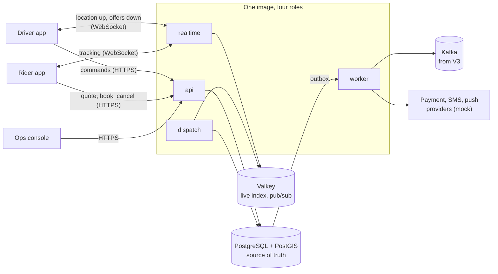
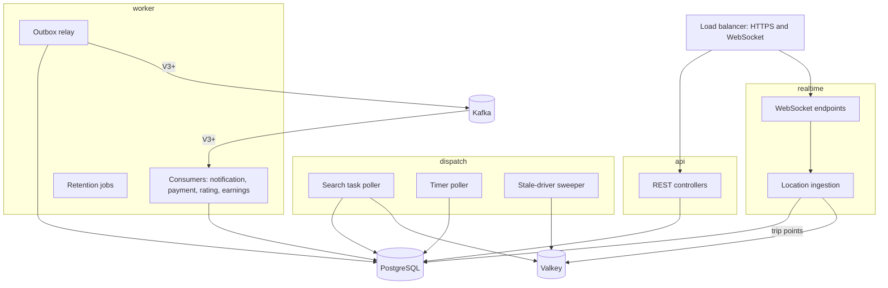
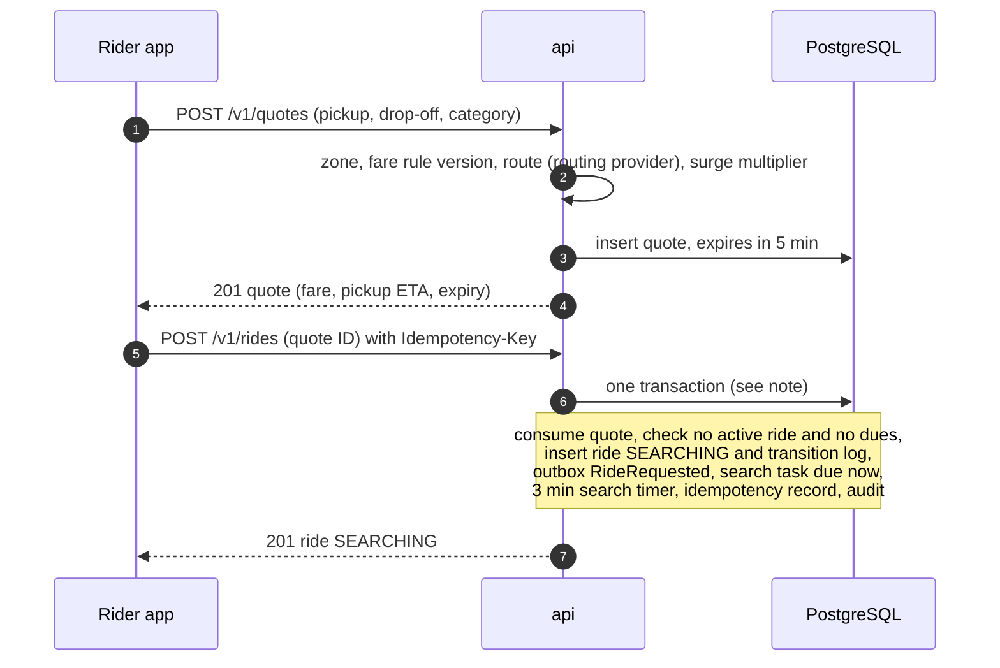
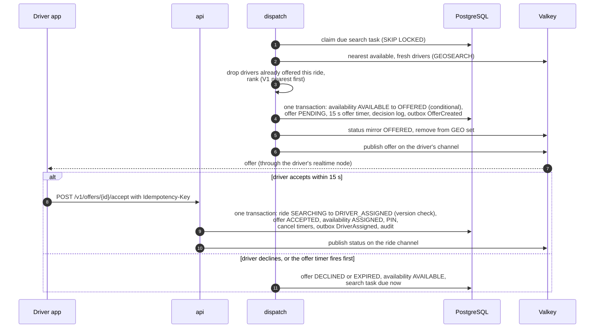
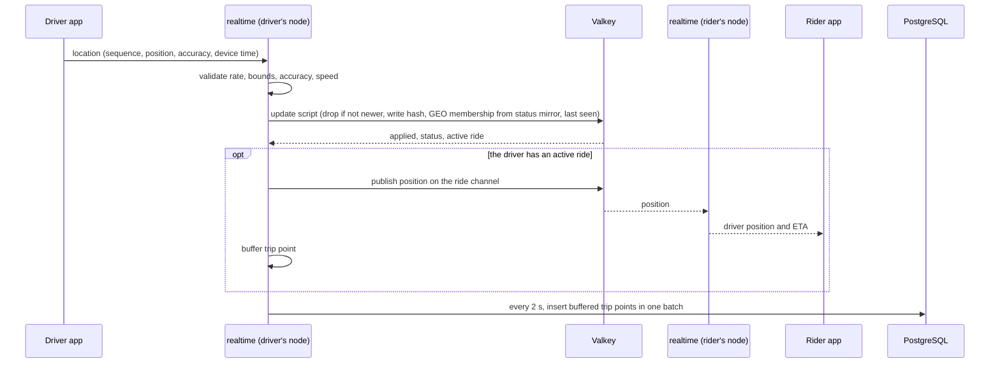
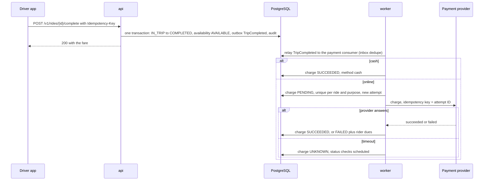
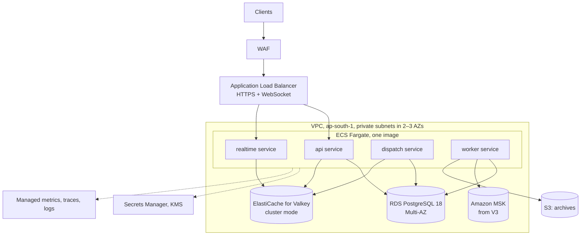

# Architecture (HLD) — Ride-Hailing Platform

| | |
|---|---|
| Phase | 3 — High-level design |
| Status | Approved 2026-10-02; refined by the [LLD](low-level-design.md) and the [architecture review](architecture-review.md) |
| Inputs | [Requirements](requirements.md), [ADR-001 to ADR-018](decisions/README.md), [design spikes](../spikes/README.md) |
| Deep dives | [Ride lifecycle](ride-lifecycle.md) · [Dispatch](dispatch-design.md) · [Location system](location-system.md) |
| Next | [LLD](low-level-design.md) · [OpenAPI](openapi.yaml) · [implementation plan](implementation-plan.md) |

Numbers marked **(assumed)** are introduced in this document and stay open for challenge. [Appendix B](#appendix-b--assumptions-introduced-here) lists them all.

## Contents

1. [At a glance](#1-at-a-glance)
2. [System context](#2-system-context)
3. [Architecture drivers](#3-architecture-drivers)
4. [Logical architecture](#4-logical-architecture)
5. [Data architecture](#5-data-architecture)
6. [Key flows](#6-key-flows)
7. [Ride lifecycle, dispatch and location](#7-ride-lifecycle-dispatch-and-location)
8. [Pricing and surge](#8-pricing-and-surge)
9. [Events and messaging](#9-events-and-messaging)
10. [API design](#10-api-design)
11. [Consistency and concurrency](#11-consistency-and-concurrency)
12. [Failure handling](#12-failure-handling)
13. [Scalability](#13-scalability)
14. [Security and privacy](#14-security-and-privacy)
15. [Observability](#15-observability)
16. [Deployment](#16-deployment)
17. [Testing strategy](#17-testing-strategy)
18. [Evolution path](#18-evolution-path)
19. [Technology summary](#19-technology-summary)
- [Appendix A — Extension points](#appendix-a--extension-points)
- [Appendix B — Assumptions introduced here](#appendix-b--assumptions-introduced-here)
- [Appendix C — Open questions for the LLD](#appendix-c--open-questions-for-the-lld)

---

## 1. At a glance

- **What it is:** a ride-hailing and dispatch platform for one city first (Bengaluru), built as a real-time distributed system. Requirements: [requirements.md](requirements.md).
- **Shape:** one codebase and one container image, run in four roles: `api`, `realtime`, `dispatch` and `worker` ([ADR-001](decisions/ADR-001-architecture-style.md)). Locally one process runs all four.
- **Stores:**
  - PostgreSQL 18 + PostGIS is the source of truth for everything except live positions ([ADR-003](decisions/ADR-003-postgresql-postgis.md)).
  - Valkey holds live positions and routes pushes to open connections ([ADR-004](decisions/ADR-004-live-location-index.md), [ADR-006](decisions/ADR-006-realtime-transport.md)).
  - Kafka arrives in V3 for side effects and the location stream ([ADR-007](decisions/ADR-007-message-broker.md)).
- **The core flow depends only on PostgreSQL and Valkey.** Quote → book → dispatch → assign → trip → complete never waits on Kafka, the payment provider or a notification provider. Everything else runs asynchronously and may lag (NFR-7).
- **Correctness comes from the database, not from distributed locks:**
  - conditional updates with version checks and partial unique indexes for the invariants ([ADR-010](decisions/ADR-010-state-machines.md));
  - durable timers and dispatch tasks ([ADR-005](decisions/ADR-005-durable-timers.md), [ADR-011](decisions/ADR-011-dispatch-protocol.md));
  - a transactional outbox ([ADR-008](decisions/ADR-008-outbox-and-events.md));
  - idempotency keys ([ADR-009](decisions/ADR-009-idempotency-and-identifiers.md)).
- **Sized from measurements:** the spikes put the cloud tier at:
  - ~0.3 cores of Valkey for the live index;
  - ~0.3 cores of PostgreSQL for timers at 10× load;
  - four `realtime` nodes of ~0.75 GB for 80,000 connections.

## 2. System context

| Actor or system | Interaction | Protocol |
|---|---|---|
| Rider: simulator or demo web app | Quotes, bookings, cancellation, tracking, paying dues, ratings | HTTPS (REST), WebSocket |
| Driver: simulator or demo web app | Online and offline, location stream, offers, ride commands, earnings | HTTPS (REST), WebSocket |
| Operations staff and admins: web console | Live map, ride timelines, suspensions, refunds, rule changes, event replays | HTTPS (REST), WebSocket for the live map |
| Payment provider (mock) | Charges, refunds, status checks, signed webhooks | HTTPS |
| Routing provider (mock, then OSRM) | Route distance and duration, ETA matrices | In-process (mock), HTTP (OSRM) |
| SMS and push providers (mock) | One-time codes and notifications | In-process (mock) |

The simulator drives the system only through the public APIs, so load tests and demos exercise the real code paths.

## 3. Architecture drivers

| Driver | What it forces |
|---|---|
| NFR-1: a driver never has two active rides or two live offers | Claims decided by PostgreSQL in one local transaction; Ride and Dispatch stay in one deployable (ADR-001) |
| ~400 location updates per booking (requirements §7) | Live positions outside PostgreSQL (ADR-004); a separate `realtime` role |
| NFR-5: update to rider's screen within 1 s | One Valkey round trip per update; push through Valkey pub/sub (ADR-006) |
| NFR-4: first offer within 2 s | Dispatch work claimed from PostgreSQL within ~250 ms; a candidate search costs ~1 ms (S-1) |
| NFR-7: timers survive crashes, booking survives a broker outage | Timers and dispatch tasks live in PostgreSQL (ADR-005, ADR-011); the core flow doesn't use Kafka |
| C-1: 8 GB development laptop | One local process, Compose profiles, Kafka's native image |
| Portfolio fit (C-2) | Thin payments (ADR-014), no workflow engine, conventions shared with the sibling projects |

## 4. Logical architecture

### 4.1 Modules

Each module is a package with a public API (Java interfaces and DTOs), its own PostgreSQL schema and its own domain events. No module reads or writes another module's tables (ADR-001); ArchUnit tests enforce it (ADR-002).

| Module | Owns | Publishes | Calls |
|---|---|---|---|
| `identity` | Users, roles, one-time codes, refresh tokens | — | `notification` (send code) |
| `rider` | Profiles, saved places, payment methods | — | — |
| `driver` | Drivers, vehicles, verification, suspension | `DriverVerified`, `DriverSuspended`, `DriverReinstated` | — |
| `geography` | Cities, service areas, zones, ride categories per city | — | — |
| `pricing` | Fare rules, surge rules and multipliers, quotes | — | `geography`, routing provider, `location` (supply near the pickup) |
| `ride` | Rides, transition log, ride PINs | `RideRequested`, `DriverAssigned`, `DriverUnassigned`, `DriverArrived`, `TripStarted`, `TripCompleted`, `RideCancelled`, `RideNotMatched` | `pricing` (consume quote), `payment` (dues check) |
| `dispatch` | Driver availability, offers, search tasks, dispatch decisions | `DriverWentOnline`, `DriverWentOffline`, `OfferCreated`, `OfferAccepted`, `OfferDeclined`, `OfferExpired` | `ride` (assign, unassign), `location` (candidates, status mirror), `driver` (eligibility) |
| `location` | Live index (Valkey), trip routes | Location stream (V3) | — |
| `payment` | Charges, attempts, refunds, provider webhooks, rider dues, driver earnings view | `ChargeSucceeded`, `ChargeFailed`, `RefundSucceeded` | Payment provider |
| `notification` | Notifications and their deliveries | — | SMS and push providers |
| `rating` | Ratings and rolling averages | `RatingSubmitted` | `ride` (was the ride completed?) |
| `operations` | No tables | — | Public APIs of all modules |
| `audit` | Append-only audit log | — | — |
| `platform` | Outbox, inbox, timers, idempotency keys, leases | — | Used by every module |

### 4.2 Runtime roles

Every role contains all modules; a role decides which entry points (controllers, pollers, consumers) are switched on.

| Role | Runs | Scales with | From |
|---|---|---|---|
| `api` | REST endpoints for all actors: quotes, bookings, ride commands, admin and ops | Requests/s | V1 |
| `realtime` | WebSocket endpoints; location ingestion (validation, live index, tracking fan-out, trip points); pushes | Open connections, messages/s | V2 (in V1, location arrives over REST in `api`) |
| `dispatch` | Search tasks, ranking, reservations and offers; timer pollers; stale-driver sweeper; surge computation (V4) | Bookings/s, timers/s | V1 |
| `worker` | Outbox relay; event consumers (notifications, payments, ratings, earnings); retention and partition maintenance | Events/s | V1 |

## 5. Data architecture

### 5.1 PostgreSQL

| Schema | Main tables | Notes |
|---|---|---|
| `identity` | users, otp_challenges, refresh_tokens | Refresh tokens stored as hashes |
| `rider` | riders, saved_places, payment_methods | Payment methods hold mock provider references only |
| `driver` | drivers, vehicles, driver_status_changes | |
| `geography` | cities, service_areas, zones, city_categories | PostGIS polygons; zones are H3 cells plus special-area polygons ([ADR-012](decisions/ADR-012-pricing-and-zones.md)) |
| `pricing` | fare_rules (versioned), surge_rules, surge_multipliers, quotes | Quotes are immutable and single-use |
| `ride` | rides, ride_transitions | Partial unique indexes: one active ride per driver and per rider |
| `dispatch` | driver_availability, offers, search_tasks, dispatch_decisions | Partial unique indexes: one pending offer per driver and per ride |
| `payment` | charges, charge_attempts, refunds, provider_webhooks, driver_earnings | Unique `(ride, purpose)` per charge |
| `notification` | notifications, deliveries | |
| `rating` | ratings, rating_summaries | |
| `location` | trip_points, partitioned by day | Partitions dropped after 90 days ([ADR-016](decisions/ADR-016-trip-routes.md)) |
| `audit` | audit_log, partitioned by month | Append-only |
| `platform` | outbox, inbox, timers, idempotency_keys, leases | Shared infrastructure tables |

Conventions:
- UUIDv7 keys; a `version` column on every aggregate; `timestamptz` in UTC; money as `bigint` paise plus a currency code.
- READ COMMITTED isolation with conditional updates. Rows are locked in a fixed order (ride → driver → offer → driver availability) to avoid deadlocks. Search tasks and timers are claimed by their pollers first and removed by everyone else without waiting, so no transaction waits for one while holding another lock ([LLD §6](low-level-design.md#6-concurrency-rules)).
- Connection pools per role, sized so their sum stays below the server limit.
- A read replica for operations and history queries from V6.

### 5.2 Valkey

| Key or channel | Type | Content | Written by | Cleanup |
|---|---|---|---|---|
| `{city}:drv:<driverId>` | Hash | Last position, sequence, time, status mirror with its version, active ride, category | `realtime` (position), `dispatch` (status) | Replaced by a 10-min tombstone when the driver goes offline |
| `{city}:geo:<category>` | GEO set | Available drivers | Update script, `dispatch` | Sweeper removes drivers silent for 30 s |
| `{city}:geo:online` | GEO set | Every online driver, for the operations map (V2) | Update script | Removed when the driver goes offline |
| `{city}:seen` | Sorted set | Last update time per driver | Update script | Sweeper |
| `{city}:epoch` | String | When the city's index was (re)started; guards the sweeper after a loss | Reconciler | — |
| `drv:<driverId>` | Pub/sub channel | Offers and driver status | `dispatch`, `api` | — |
| `rdr:<riderId>` | Pub/sub channel | Ride status for the rider | `api`, `dispatch` | — |
| `ride:<rideId>` | Pub/sub channel | Driver position during the ride | `realtime` | — |
| `wsticket:<id>` | String | One-time WebSocket ticket | `api` | 60 s TTL **(assumed)** |
| `rl:<scope>:<id>` | Counter | Rate-limit buckets | All roles | Window TTL |
| `{city}:surge` | Hash | Current multiplier per zone (V4) | `dispatch` | 2 min TTL |

Valkey holds only data that can be rebuilt or lost: positions refill from updates within 4 s, the status mirror is re-synced from PostgreSQL every 30 s **(assumed)**, and tickets and rate-limit counters can simply be lost.

### 5.3 Kafka (from V3)

| Topic | Key | Content | Retention | Consumers |
|---|---|---|---|---|
| `rides.events` | Ride ID | Ride lifecycle events | 7 days | notification, payment, rating, earnings, analytics |
| `dispatch.events` | Ride ID | Offers and their outcomes | 7 days | Analytics, ops timeline |
| `drivers.events` | Driver ID | Online and offline, verification, suspension | 7 days | Analytics |
| `payments.events` | Ride ID | Charge and refund outcomes | 7 days | notification, analytics |
| `location.updates` | Driver ID | Accepted location updates | 24 h | Trip-route archiver (designed-for tier), analytics |
| `<topic>.dlq.<consumer>` | As source | Messages a consumer gave up on | 14 days | Ops replay |

12 partitions per topic at the cloud tier **(assumed)**. Retention values **(assumed)**.

### 5.4 Caches

| Cached object | Source of truth | Where | Freshness | When stale or lost |
|---|---|---|---|---|
| Live positions | Driver updates | Valkey | Replaced every 4 s | Rebuilt within one interval |
| Availability mirror | `dispatch.driver_availability` | Valkey hash and GEO membership | Written after each commit; reconciled every 30 s | A stale driver is a wasted candidate; the reservation fails safely |
| Surge multipliers | `pricing.surge_rules` (V1), `pricing.surge_multipliers` (V4) | In-process, Valkey from V4 | 60 s; at once on the node that changed a rule | The quote locks the multiplier |
| City, zone and category config | `geography` | In-process | Reloaded on change | A short window of old config |
| Route results (V4) | Routing provider | Valkey, by H3 resolution-9 cell pair | 10 min **(assumed)** | Recomputed |

Fare and fee rules aren't cached: each quote reads the version in effect with one indexed query, so the database clock alone decides when a published version takes effect (changed in phase 5; [LLD §10.4](low-level-design.md#104-creating-a-quote)).

### 5.5 Retention

| Data | Store | Retention | Rebuildable |
|---|---|---|---|
| Rides, transitions, charges, audit | PostgreSQL | 3 years **(assumed)** | No |
| Quotes | PostgreSQL | Used: 30 days; unused: 24 h after expiry **(assumed)** | No |
| Dispatch decisions | PostgreSQL | 30 days **(assumed)** | No |
| Timers, search tasks | PostgreSQL | Until fired or cancelled | No |
| Idempotency keys | PostgreSQL | 24 h | No; expiry is safe |
| Outbox | PostgreSQL | 7 days after publishing | Replay source |
| Live positions | Valkey | Until replaced | Yes |
| Trip routes | PostgreSQL; object storage at the designed-for tier | 90 days | No |
| Location stream | Kafka | 24 h | No; analytics only |

## 6. Key flows

### 6.1 Quote and booking

### 6.2 Dispatch and acceptance

### 6.3 Location update and tracking

### 6.4 Completion and payment

### 6.5 Cancellations and reassignment

| Situation | Outcome |
|---|---|
| Rider cancels while searching | `CANCELLED_BY_RIDER`, no fee; a pending offer is withdrawn and the driver released |
| Rider cancels after assignment | `CANCELLED_BY_RIDER`; free within 2 min of assignment or if the driver is more than 5 min late, otherwise a cancellation fee |
| Driver cancels before arriving | Ride returns to `SEARCHING` with priority; that driver is excluded |
| Assigned driver unreachable for 2 min **(assumed)** | Same as above, and the driver is taken offline |
| Driver marks no-show after waiting 5 min | `CANCELLED_BY_DRIVER` (reason `NO_SHOW`), no-show fee |
| Nobody accepts within 3 min | `DRIVER_NOT_FOUND` |
| Operations cancel | `CANCELLED_BY_SYSTEM` with a reason |

Full rules, fees and edge cases: [ride-lifecycle.md](ride-lifecycle.md).

## 7. Ride lifecycle, dispatch and location

The three areas where this project goes deep have their own documents:

- **[Ride lifecycle](ride-lifecycle.md):**
  - the ride state machine (9 states, 13 transitions) with owners, preconditions, side effects and events;
  - the separate charge and refund state machines;
  - fee rules, offline driver commands and race handling on the ride.
- **[Dispatch](dispatch-design.md):**
  - the driver availability state machine and search tasks;
  - candidate search and ranking strategies;
  - the sequential offer protocol with reservation at offer time;
  - the ten race scenarios from the brief;
  - hotspots, batch matching (V4) and back-to-back trips (designed for).
- **[Location system](location-system.md):**
  - ingestion and validation, ordering and duplicates, freshness and silent drivers;
  - the live index and status mirror, tracking fan-out;
  - trip routes, privacy, failure modes and capacity.

## 8. Pricing and surge

Decisions in [ADR-012](decisions/ADR-012-pricing-and-zones.md).

- **Quotes are upfront and immutable.** A quote covers pickup, drop-off and category, and records the fare rule version, route distance and duration, surge multiplier, fare breakdown, pickup ETA and expiry (5 min). Booking consumes the quote exactly once.
- **Fare formula (FR-PR2):** `max(minimum, (base + per_km × km + per_min × min) × surge) + booking_fee`, then tax. All arithmetic is in paise, rounded up to whole rupees once, at the end.
- **Rules are versioned** per city and category, with an effective-from time. Publishing a version never changes existing quotes.
- **Zones** are H3 resolution-7 cells (~5 km²). Special areas such as the airport and railway stations are PostGIS polygons that take precedence.
- **Surge:**
  - V1: admin rules give a multiplier per zone and time window.
  - V4: computed every minute per zone from demand (open searches plus recent quotes) against supply (available drivers), mapped through a configured step table, changing by at most 0.2 per minute and capped at 2.0×.
  - The multiplier a quote used is locked in, so a surge change between quote and booking can't change the price.
- **Abuse limits:** quote requests are rate-limited per rider, and the rider sees the multiplier before booking.

## 9. Events and messaging

### 9.1 Commands, events and queries

| Kind | Meaning | Examples | Transport |
|---|---|---|---|
| Command | A request to change state; may be refused | `BookRide`, `AcceptOffer`, `CancelRide`, `StartTrip`, `CompleteTrip` | HTTPS with an idempotency key; in-process calls between modules |
| Event | A fact that already happened; never refused | `RideRequested`, `DriverAssigned`, `TripCompleted`, `ChargeFailed` | Outbox → in-process consumers (V1–V2) → Kafka (V3+) |
| Query | Reads state, changes nothing | `GetRide`, `GetRideHistory`, `GetQuote`, `GetEarnings` | HTTPS GET; module query APIs |

### 9.2 Outbox and delivery

Decisions in [ADR-008](decisions/ADR-008-outbox-and-events.md):

- Every state change writes its events to `platform.outbox` in the same transaction.
- A relay holding a lease publishes rows in ID order and marks them published.
- Delivery is **at least once**. No component claims exactly-once delivery.
- Each consumer records processed event IDs in `platform.inbox` in the same transaction as its effects, so duplicates do nothing (ADR-009).
- Ordering is guaranteed per aggregate (one ride, one driver) and nowhere else:
  - the relay preserves per-aggregate order;
  - Kafka keys events by aggregate ID;
  - every event carries the aggregate's version.
- Pushes to clients through Valkey pub/sub are a separate, best-effort path (ADR-006): sent right after commit, with clients resyncing on reconnect.

### 9.3 Event envelope

| Field | Meaning |
|---|---|
| `event_id` | UUIDv7; the deduplication key |
| `event_type`, `event_version` | e.g. `DriverAssigned`, `1` |
| `aggregate_type`, `aggregate_id`, `aggregate_version` | Which ride or driver, and its version after the change |
| `occurred_at` | Commit time (UTC) |
| `producer` | Module and role |
| `correlation_id` | The ride ID for ride flows, otherwise the originating request ID |
| `causation_id` | The command or event that caused this event |
| `trace_parent` | W3C trace context, so a trace continues across the outbox and Kafka |
| `payload` | Event-specific JSON, defined by a JSON Schema in the repository |

Versioning: adding optional fields keeps the version. A breaking change publishes `event_version + 1` alongside the old version until every consumer has moved, then retires the old one.

### 9.4 Event catalog (summary)

| Event | Producer | Consumers |
|---|---|---|
| `RideRequested` | ride | analytics |
| `OfferCreated`, `OfferAccepted`, `OfferDeclined`, `OfferExpired`, `OfferWithdrawn` | dispatch | ops timeline, analytics, acceptance-rate read model |
| `DriverAssigned`, `DriverUnassigned`, `DriverArrived`, `TripStarted` | ride | notification, ops timeline |
| `TripCompleted` | ride | payment (charge), rating (open window), earnings, notification |
| `RideCancelled` | ride | payment (fees), notification |
| `RideNotMatched` | ride | notification, analytics |
| `ChargeSucceeded`, `ChargeFailed`, `RefundSucceeded` | payment | notification, analytics |
| `DriverWentOnline`, `DriverWentOffline`, `DriverSuspended`, `DriverReinstated` | dispatch, driver | notification (why a driver went offline), analytics. Dispatch acts on a suspension in the same transaction, not through the event |
| `RatingSubmitted` | rating | analytics; rating summaries are updated in the rating's own transaction |

Schemas and examples: [schemas/events/](schemas/events/); catalog with payload fields in [LLD §15](low-level-design.md#15-events). Surge demand in V4 is counted from the database rather than by a consumer, so it keeps working while Kafka is down.

### 9.5 Multi-step operations and compensation

No operation uses a distributed transaction or two-phase commit.

| Operation | How it holds together | Compensation if a later step fails |
|---|---|---|
| Book → dispatch → assign | One database: booking and assignment are local transactions; dispatch is a durable task | Search timeout ends the ride as `DRIVER_NOT_FOUND` |
| Complete → charge | Choreographed by `TripCompleted`; the charge is idempotent per ride and purpose | A failed charge becomes rider dues; mistakes are refunded |
| Cancel → fee | Choreographed by `RideCancelled` | Operations waive by refunding |
| Reassignment | Orchestrated by the ride state machine | — |

## 10. API design

### 10.1 Conventions

- REST with JSON over HTTPS, versioned in the path (`/v1`). Within a version, changes are additive only. The OpenAPI spec is written in the LLD and enforced by contract tests.
- Commands that change a ride, an offer, a driver's status, a payment or a rating require an `Idempotency-Key` header (ADR-009). Sign-in, quotes, location updates, WebSocket tickets and webhooks are exempt, because a repeat is harmless or deduplicated another way ([LLD §5.1](low-level-design.md#51-idempotency-adr-009)).
- Errors use RFC 9457 `application/problem+json` with a stable `code`, for example `QUOTE_EXPIRED`, `ACTIVE_RIDE_EXISTS`, `DUES_OUTSTANDING`, `OFFER_NO_LONGER_AVAILABLE`, `INVALID_TRANSITION`, `WRONG_PIN`, `IDEMPOTENCY_KEY_REUSED`, `RATE_LIMITED`, `OUTSIDE_SERVICE_AREA`.
- Timestamps are ISO-8601 in UTC. Money is `{ "amount_paise": 18900, "currency": "INR" }`.
- Lists use cursor pagination (`cursor`, `limit`) ordered by `(created_at, id)`.
- Authentication is a bearer JWT (ADR-015). Self-service endpoints use `/me`, so no user can name another user's ID. Rate-limited calls return `429` with `Retry-After`.

### 10.2 Resources

| Area | Endpoints |
|---|---|
| Sign-in | `POST /v1/auth/otp`, `POST /v1/auth/token`, `POST /v1/auth/refresh`, `POST /v1/auth/logout` |
| Rider | `GET`/`PATCH /v1/riders/me`; `/v1/riders/me/places`; `/v1/riders/me/payment-methods`; `GET /v1/riders/me/rides`, `GET /v1/riders/me/active-ride`; `GET /v1/riders/me/dues`, `POST /v1/riders/me/dues/pay` |
| Quotes and rides | `POST /v1/quotes`; `POST /v1/rides`; `GET /v1/rides/{id}`; `POST /v1/rides/{id}/cancel` (rider or driver; outcome depends on actor and state); `POST /v1/rides/{id}/arrive`, `/start` (with PIN), `/complete`, `/no-show` (driver); `POST /v1/rides/{id}/rating`; `GET /v1/rides/{id}/receipt`; `GET /v1/rides/{id}/route` (V2) |
| Driver | `GET /v1/drivers/me`; `POST /v1/drivers/me/online` (vehicle), `POST /v1/drivers/me/offline`; `POST /v1/drivers/me/location` (V1 live updates; from V2 offline replays only); `GET /v1/drivers/me/offer` (resync); `GET /v1/drivers/me/active-ride`; `POST /v1/offers/{id}/accept`, `/decline`; `GET /v1/drivers/me/rides`, `GET /v1/drivers/me/earnings` |
| Real time | `POST /v1/realtime/tickets`, then `wss://…/ws?ticket=…` |
| Operations | `GET /v1/ops/rides`, `GET /v1/ops/rides/{id}/timeline`, `POST /v1/ops/rides/{id}/cancel`; `GET /v1/ops/drivers`, `POST /v1/ops/drivers/{id}/suspend`, `/reinstate`; `GET /v1/ops/payments`, `POST /v1/ops/charges/{id}/refunds`; `GET /v1/ops/flags`, `POST /v1/ops/flags/{id}/resolve`; `GET /v1/ops/invariants` (V2); dead letters and replay (V3) |
| Admin | `/v1/admin/cities` (with service area, special areas and categories), `/fare-rules`, `/fee-rules`, `/surge-rules`, `/drivers`, `/vehicles` |
| Webhooks | `POST /v1/webhooks/payments/{provider}` (signed) |

The complete contract is [openapi.yaml](openapi.yaml).

### 10.3 WebSocket messages

| Direction | Type | Fields |
|---|---|---|
| Driver → server | `location` | `seq`, `lat`, `lon`, `accuracy_m`, `heading_deg`, `speed_mps`, `device_time` |
| Driver → server | `offer_seen` | `offer_id` |
| Server → driver | `offer` | `offer_id`, `ride_id`, pickup and drop-off summary, fare, `expires_at`, `expires_in_ms` |
| Server → driver | `offer_withdrawn`, `driver_status`, `ride_status` | IDs, `status`, `version`, reason |
| Server → rider | `ride_status` | `ride_id`, `status`, `version`, driver and vehicle summary |
| Server → rider | `driver_position` | `lat`, `lon`, `heading_deg`, `seq`, `eta_s` |
| Operations ↔ server | `ops_viewport`, `ops_snapshot` | City and bounding box; drivers in it every 2 s |
| Server → any | `reconnect` | `after_ms` (used when draining a node) |

Every pushed message carries a version or sequence number, and clients ignore anything older than what they hold (ADR-006). Schemas: [schemas/websocket/](schemas/websocket/). Frames stay under 1 KB, so offline replays go over HTTPS ([LLD §14](low-level-design.md#14-realtime-v2)).

## 11. Consistency and concurrency

### 11.1 Consistency model

| Data | Source of truth | Consistency |
|---|---|---|
| Ride state | `ride.rides` | Strong; changes serialized per ride by version |
| Offers, reservations | `dispatch.offers`, `dispatch.driver_availability` | Strong |
| Driver availability for matching | PostgreSQL (truth), Valkey (hint) | The hint lags commits by milliseconds; the claim is strong |
| Live positions | Valkey | Eventual; the newest sequence number wins |
| Trip routes | `location.trip_points` | Eventual (batched every 2 s); gaps tolerated |
| Quotes | `pricing.quotes` | Strong, immutable |
| Surge multipliers | `pricing` | Eventual (≤ 1 min); locked into quotes |
| Charges and refunds | `payment` | Strong locally; the provider is eventual (unknown outcomes) |
| Rider dues | `payment` | Strong; checked inside the booking transaction |
| Notifications, ratings, earnings | Their modules | Eventual, at least once |
| Analytics | Kafka and its consumers | Eventual |

### 11.2 Invariants

| Invariant | Primary mechanism | Backstop |
|---|---|---|
| A driver holds at most one live offer | Conditional update `AVAILABLE → OFFERED` on `driver_availability` | Partial unique index on pending offers per driver |
| A ride has at most one pending offer | Search task claimed with `SKIP LOCKED`; one attempt at a time | Partial unique index on pending offers per ride |
| A driver has at most one active ride | Availability state machine | Partial unique index on active rides per driver |
| A ride has at most one driver | Conditional `SEARCHING → DRIVER_ASSIGNED` with version | Single `driver_id` column |
| A rider has at most one active ride | Check in the booking transaction | Partial unique index on active rides per rider |
| A quote is used once | Conditional update when consuming it | Unique `ride_id` on the quote |
| No double charge | Charge unique per `(ride, purpose)`; provider idempotency key | Inbox dedupe of the triggering event |
| Only allowed transitions | Transition table in code and conditional `UPDATE … WHERE status = ? AND version = ?` | Transition log |

No distributed locks are used. One relay per outbox runs under a PostgreSQL lease with a fencing token, the pattern from the Job Scheduler. Everything else is conditional updates, unique indexes and `SKIP LOCKED`.

### 11.3 The ten race scenarios

| # | Scenario (from the brief) | Resolution | Detail |
|---|---|---|---|
| 1 | Two riders' searches pick the same driver | One conditional update wins; the other search moves to its next candidate | [Dispatch §6](dispatch-design.md#6-race-scenarios) |
| 2 | Two dispatch workers pick the same driver | Same as 1 | Dispatch §6 |
| 3 | A driver accepts two requests at once | Impossible: one live offer per driver | Dispatch §6 |
| 4 | Rider cancels while the driver accepts | Version check on the ride: the first commit wins, the other gets a clear answer | [Ride lifecycle §8](ride-lifecycle.md#8-races-on-a-ride) |
| 5 | Driver cancels while the trip starts | Version check: one transition wins | Ride lifecycle §8 |
| 6 | Completion is retried after payment succeeded | Idempotency key replays the response; the charge is unique per ride | Ride lifecycle §8 |
| 7 | The same event is delivered twice | Inbox dedupe in the consumer's transaction | ADR-008 |
| 8 | Two components update the same ride | Only the ride module writes rides; version check serializes the rest | Ride lifecycle §8 |
| 9 | An older location update arrives after a newer one | Per-driver sequence check in the update script | [Location §3](location-system.md#3-ordering-duplicates-and-late-updates) |
| 10 | Driver loses connectivity after accepting | Reassigned after 2 min of silence; late commands get `409` | Ride lifecycle §8 |

## 12. Failure handling

### 12.1 Failures

| Failure | Detection | Behaviour | Recovery | What users see |
|---|---|---|---|---|
| PostgreSQL primary down | Health checks, connection errors | Commands fail fast with `503`; location updates and tracking continue (Valkey) | Multi-AZ failover (~1–2 min); timers and tasks resume where they were | "Try again"; live tracking keeps working |
| Valkey down or failing over | Command errors, latency alarms | No new candidates (search tasks back off and retry); pushes pause; rate limits fail open, except sign-in, which fails closed | Replica promotion; positions refill within 4 s; mirror reconciled within 30 s | Slower matching; apps fall back to polling ride state every 5 s |
| Kafka down (V3+) | Producer errors, outbox age | Outbox rows wait; booking, dispatch and assignment are unaffected | Relay catches up | Late notifications and charges |
| A `dispatch` node crashes | Missing heartbeats, ECS health | Its claimed tasks and timers roll back | Other nodes claim them on their next poll (≤ 250 ms) | Nothing noticeable |
| A `realtime` node crashes | Load balancer health checks | Its connections drop; ≤ 2 s of buffered trip points lost | Clients reconnect elsewhere with backoff and resync | A short gap on the map |
| Payment provider timeout or outage | Timeouts, circuit breaker | Charge marked `UNKNOWN`; status checks with backoff; no blind retry | Status check or webhook resolves it; operations review after 24 h | Payment shown as "processing" |
| Notification provider failure | Errors | Retries with backoff, then dead letter | Operations re-drive | A late SMS or push; in-app status is unaffected |
| Driver app disconnects | No updates, socket closed | Offers time out; after 2 min the assigned ride is reassigned | App reconnects, resyncs, replays queued commands | Rider sees "finding you a new driver" |
| Rider app disconnects | Socket closed | Nothing changes server-side | Reconnect and resync | — |
| Network partition from PostgreSQL | Timeouts | The same as PostgreSQL down for that node | — | — |
| Duplicate, delayed or out-of-order events | Inbox, versions | Ignored or applied in version order | — | — |
| Consumer crash mid-event | Offset or outbox not acknowledged | Redelivered | Inbox makes the replay harmless | — |
| Partial deployment (mixed versions) | — | Old and new code run together safely | Expand-then-contract migrations; additive event changes | — |

### 12.2 Retries

| Where | Policy |
|---|---|
| Client → API | Retry network errors, `5xx` and `429` with the **same** idempotency key; exponential backoff with full jitter from 0.5 s to 8 s, at most 5 attempts **(assumed)**; honour `Retry-After` |
| Load balancer | Never retries |
| Application → PostgreSQL | Only deadlock and serialization errors, up to 3 times; statement timeout 2 s on request paths **(assumed)** |
| Application → payment provider | Charges are never retried blindly: a timeout becomes `UNKNOWN` and triggers status checks at 10 s, 30 s, 2 min and 10 min, then hourly for 24 h **(assumed)**. Circuit breaker per provider; connect timeout 1 s, read 3 s **(assumed)** |
| Notifications → providers | 5 attempts with backoff from 1 s to 5 min, then dead letter |
| Event consumers | 3 attempts in place with backoff, then the dead-letter topic (V3) or a failed state (V1–V2); the poison message is set aside so its partition keeps moving |
| Outbox relay | Retries forever with backoff; alert when the oldest unpublished row is older than 60 s |
| Timers | A failing handler rolls back and fires again on the next poll; after 10 failures the timer is parked and alerted **(assumed)** |

Bulkheads: separate connection pools per role and per external provider, so a slow provider can't take database connections from the booking path.

## 13. Scalability

### 13.1 Growth

| Online drivers | What runs | First thing to watch |
|---|---|---|
| 10 | One process on a laptop | Nothing |
| 1,000 (laptop tier) | One process; one Valkey; PostgreSQL in Docker | Laptop memory (C-1) |
| 100,000 (2× cloud tier, a few cities) | Roles as separate services: ~8 `realtime`, 2–4 `dispatch`, 2 `api`, 2 `worker` nodes; Valkey cluster with a shard per big city; Kafka with 12–24 partitions; one PostgreSQL primary (~2,000 writes/s) plus a replica | WebSocket memory per node; Valkey command time per city shard |
| 1,000,000 (2× designed-for) | Gateway extracted (V5; Netty or Go); Valkey shards per city or region within a city; PostgreSQL partitioned by city group; dispatch owners per city for batch matching; one region per country | `GEOSEARCH` cost in the densest city; PostgreSQL write volume; Kafka partitions |

### 13.2 City as the partition key

City is the natural shard key, because no ride needs a driver from another city:
- Valkey keys carry the `{city}` hash tag.
- Dispatch tasks and decisions are per city.
- Surge zones belong to a city.
- At the designed-for tier, PostgreSQL is partitioned by city group.

Cross-city rides (airport outside city limits, intercity) belong to the pickup city.

### 13.3 Hotspots

A stadium exit, an airport wave or New Year's Eve puts many searches in a few zones (10× demand in one zone for 15 min is the hotspot test, requirements §7). The problem is contention, not throughput. Mitigations:

1. A reserved driver leaves the GEO set right after commit, so later searches don't see them.
2. A failed reservation costs one `UPDATE` that changed no row; a search tries at most 5 candidates before rescheduling itself 1 s later **(assumed)**.
3. Search tasks are claimed by priority and then age, so reassigned rides and older searches go first.
4. Surge raises the price in the zone and draws drivers in (V4).
5. Quotes are shed before bookings under load: they're 5–10× more frequent and have their own rate-limit buckets.
6. Batch matching for dense zones is evaluated in V4 ([dispatch §8](dispatch-design.md#8-batch-matching-v4-experiment)).

### 13.4 Multi-region (designed for, not built)

- **Ownership:** each region owns a set of cities, and a ride never crosses regions. Identity is global, with a replicated user directory.
- **Data:** rides, offers and payments replicate asynchronously to a standby region. Live positions don't replicate, because they rebuild.
- **Region failure:** its cities fail over to the standby, and rides in flight resume from replicated state with an RPO of seconds; that loss window is documented as accepted.
- **Constraint today:** keeping city in every key, topic and table keeps this path open.

## 14. Security and privacy

| Concern | Design |
|---|---|
| Authentication | Phone number + one-time code, short-lived JWT access tokens and rotating refresh tokens ([ADR-015](decisions/ADR-015-identity.md)). WebSocket handshakes use one-time tickets |
| Authorization | Role and ownership checks in every application service (FR-I2). Riders reach only their rides; drivers only rides offered or assigned to them; operations and admin are separate roles |
| Location privacy | A rider's node subscribes to the ride channel only while the ride is active, and positions are published only then (FR-L5). Reading a trip route as operations staff is audited (FR-A2). No idle-driver history (Q17) |
| In transit | TLS at the load balancer; TLS to RDS, ElastiCache and MSK inside the VPC |
| At rest | KMS encryption for RDS, ElastiCache, MSK and S3 |
| Secrets | AWS Secrets Manager in the cloud; local `.env` never committed |
| Rate limits | Valkey token buckets **(assumed)**: one-time codes 5 per phone per hour; quotes 30 per rider per minute; bookings 10 per rider per minute; location 1 update per driver per second (extra updates dropped); admin APIs 60 per user per minute |
| Input validation | Schema and bounds checks at every boundary; coordinates must fall inside a service area |
| Abuse | Implausible-speed and accuracy flags on location (spoofing signals); one-time-code throttling; quote limits against scraping |
| Audit | Append-only log of state changes, money operations, rule changes and all operations or admin actions (FR-A1) |
| Personal data in logs | Phone numbers masked; positions logged only at debug level and only with a ride ID |

## 15. Observability

Decisions in [ADR-017](decisions/ADR-017-observability.md).

- **Logs:** structured JSON with `trace_id`, `span_id`, `request_id`, `correlation_id`, role, module, and ride or driver ID when known.
- **Traces:** OpenTelemetry across HTTP, the outbox (trace context stored on the row), Kafka headers, WebSocket offers (trace ID in the message) and timers (span links from creation to firing).
- **Metrics:** RED metrics per endpoint, plus:

| Metric | Type | Labels |
|---|---|---|
| `ride_requests_total` | Counter | `city`, `category` |
| `ride_assignment_seconds` | Histogram: booking → assignment | `city` |
| `dispatch_first_offer_seconds` | Histogram: booking → first offer | `city` |
| `offers_total` | Counter | `outcome` (accepted, declined, expired, withdrawn) |
| `rides_not_matched_total` | Counter | `city` |
| `location_updates_total` | Counter | `result` (applied, stale, duplicate, poor_accuracy, implausible, rate_limited, offline) |
| `location_pipeline_seconds` | Histogram: receive → indexed and published | — |
| `live_drivers` | Gauge | `city`, `category`, `status` |
| `active_rides` | Gauge | `city`, `status` |
| `websocket_connections` | Gauge | `kind` (driver, rider, ops) |
| `payment_charges_total` | Counter | `outcome` |
| `notification_deliveries_total` | Counter | `channel`, `outcome` |
| `outbox_oldest_unpublished_seconds`, `timers_overdue_seconds` | Gauge | — |
| `kafka_consumer_lag` (V3) | Gauge | `consumer`, `topic` |

Label rule: city, category, status and outcome only. Ride, driver or zone IDs never become labels; they go in logs and traces.

| SLO | Target | Alert |
|---|---|---|
| Booking availability | 99.9% per 30 days | Multi-window burn rate |
| Booking and driver command latency | p99 ≤ 300 ms | Burn rate on a latency SLI |
| First offer | p95 ≤ 2 s when candidates exist | Burn rate |
| Location freshness | p95 ≤ 1 s | Burn rate |
| Platform health | — | Outbox age > 60 s; overdue timers > 5 s; consumer lag > 60 s; no-driver-found rate doubling; payment failure rate > 5%; Valkey p99 > 10 ms |

Alert rules are unit-tested with `promtool`, as in the sibling projects. The operations timeline (FR-O1) is built from ride transitions, the dispatch decision log and the outbox.

## 16. Deployment

### 16.1 Local

`docker compose up` starts the default profile in the 4 GB Colima VM: PostgreSQL + PostGIS, Valkey and the application running all roles. Other parts start through profiles.

| Profile | Adds | Memory **(assumed)** |
|---|---|---|
| default | PostgreSQL + PostGIS and the app (all roles); Valkey from V2 | ~1.5 GB |
| `kafka` (V3+) | Kafka, native single-node image | ~0.3 GB |
| `observability` | Grafana LGTM all-in-one | ~1 GB |
| `routing` (V4) | OSRM with a Bengaluru extract | ~1 GB |
| `simulator` (V2+) | Simulator and demo web app | ~0.3 GB |

Seed data loads at startup: Bengaluru service area and zones, categories, fare rules, fees, 2,000 drivers with vehicles, riders and admin accounts.

### 16.2 AWS

Decisions in [ADR-018](decisions/ADR-018-aws-deployment.md).

Environments are created with Terraform for a test or demo and destroyed afterwards, under a budget alarm.

### 16.3 Delivery pipeline

GitHub Actions runs:
1. Build, then unit, ArchUnit and Testcontainers integration tests.
2. OpenAPI and event-schema contract tests.
3. Build the image and push it to ECR.
4. `terraform plan`, then `terraform apply` behind manual approval.
5. ECS rolling deploy.

Zero-downtime rules:
- Database migrations expand, then contract.
- Events change additively.
- `realtime` nodes drain over ~30 s (ADR-006), with a load balancer deregistration delay to match.

## 17. Testing strategy

| Level | What | Tools |
|---|---|---|
| Unit | State machines, fare calculation, ranking, validation | JUnit 5 |
| Integration | Conditional updates, `SKIP LOCKED` claims, Valkey scripts, consumers, provider adapters | Testcontainers: PostgreSQL + PostGIS, Valkey, Kafka |
| Architecture | Module boundaries, dependency direction | ArchUnit |
| Contract | OpenAPI requests and responses, event JSON Schemas, WebSocket messages | Schema validation in tests |
| End to end | Quote → booking → offer → accept → arrive → start → complete → charge → rating, through public APIs | Scripted demo (V1), simulator (V2+) |
| Concurrency | The ten race scenarios, run hundreds of times in parallel, asserting the NFR-1 invariants afterwards | JUnit with executors and repeated runs |
| Failure | Stop or pause PostgreSQL, Valkey and Kafka; provider timeouts; duplicated, delayed and reordered events | Testcontainers pause/stop, Toxiproxy |
| Load | Laptop tier on every release candidate; cloud tier in V6 | Simulator + k6 |
| Chaos (V8) | Killed tasks, dropped and delayed traffic, broker and cache outages | Toxiproxy, ECS task stops, AWS FIS **(assumed)** |

The implementation plan maps these to each version.

## 18. Evolution path

| Version | Architectural change | Reference |
|---|---|---|
| V1 | All modules; REST; outbox delivered in-process; search tasks, timers and invariants in PostgreSQL; location over REST into an in-memory live index | Requirements §8, [LLD §1.3](low-level-design.md#13-runtime-roles) |
| V2 | `realtime` role, Valkey live index and pub/sub, trip routes, simulator, live map | ADR-004, ADR-006, ADR-016 |
| V3 | Kafka; the relay publishes the outbox; consumers move to Kafka; location stream; dead letters and replay; spike S-4 | ADR-007, ADR-008 |
| V4 | ETA ranking via the routing provider (OSRM), computed surge, batch-matching experiment, back-to-back trip design | ADR-011, ADR-012, ADR-013 |
| V5 | Extract `realtime` and location ingestion as a gateway if measurements justify it; then notifications | ADR-001, ADR-006 |
| V6 | Second city, city partitioning, read replica, cloud-tier load and hotspot tests | §13 |
| V7 | Terraform on AWS, CI/CD, autoscaling, dashboards and alerts | ADR-018 |
| V8 | Fault injection against NFR-7 | §12 |

## 19. Technology summary

| Concern | Choice | ADR |
|---|---|---|
| Architecture | Modular monolith, four runtime roles | [ADR-001](decisions/ADR-001-architecture-style.md) |
| Language and framework | Java 25, Spring Boot 4.1, plain JDBC, Flyway, ArchUnit | [ADR-002](decisions/ADR-002-java-spring-boot-jdbc.md) |
| Source of truth | PostgreSQL 18 + PostGIS | [ADR-003](decisions/ADR-003-postgresql-postgis.md) |
| Live positions | Valkey GEO sets, sharded by city | [ADR-004](decisions/ADR-004-live-location-index.md) |
| Timers | PostgreSQL table, `SKIP LOCKED` pollers | [ADR-005](decisions/ADR-005-durable-timers.md) |
| Client transport | WebSocket streams, HTTPS commands, Valkey pub/sub routing | [ADR-006](decisions/ADR-006-realtime-transport.md) |
| Broker | Apache Kafka (KRaft), from V3 | [ADR-007](decisions/ADR-007-message-broker.md) |
| Events | Transactional outbox, envelope, versioning | [ADR-008](decisions/ADR-008-outbox-and-events.md) |
| Idempotency and IDs | Idempotency keys, inbox, provider keys, sequence numbers | [ADR-009](decisions/ADR-009-idempotency-and-identifiers.md) |
| State machines | Hand-built transition tables, versioned conditional updates | [ADR-010](decisions/ADR-010-state-machines.md) |
| Dispatch | Search tasks in PostgreSQL, sequential offers, reservation at offer time | [ADR-011](decisions/ADR-011-dispatch-protocol.md) |
| Pricing and zones | Upfront quotes, versioned rules, H3 resolution-7 zones | [ADR-012](decisions/ADR-012-pricing-and-zones.md) |
| Routing | `RoutingProvider`: mock, then self-hosted OSRM | [ADR-013](decisions/ADR-013-routing-provider.md) |
| Payments | Thin `PaymentProvider`, mock provider, charge after the trip | [ADR-014](decisions/ADR-014-payments.md) |
| Identity | In-house phone sign-in, JWT access and refresh tokens | [ADR-015](decisions/ADR-015-identity.md) |
| Trip routes | PostgreSQL daily partitions, 90-day retention | [ADR-016](decisions/ADR-016-trip-routes.md) |
| Observability | OpenTelemetry, Prometheus, Grafana, Tempo, Loki | [ADR-017](decisions/ADR-017-observability.md) |
| Cloud | AWS ap-south-1: ECS Fargate, RDS, ElastiCache for Valkey, MSK, Terraform | [ADR-018](decisions/ADR-018-aws-deployment.md) |
| Code layout | A package per module, verified boundaries, a migration history per module | [ADR-019](decisions/ADR-019-module-layout-and-boundaries.md) |
| Valkey access | Lettuce, scripts by `EVALSHA`, sharded pub/sub | [ADR-020](decisions/ADR-020-valkey-access.md) |
| Simulator | Go, public APIs only, OSRM routes recorded for replay | [ADR-021](decisions/ADR-021-simulator.md) |
| Demo web app | React, MapLibre, self-hosted OpenStreetMap tiles | [ADR-022](decisions/ADR-022-demo-web-app.md) |

---

## Appendix A — Extension points

| Extension | Where it plugs in | Status |
|---|---|---|
| Ranking strategies (ETA, weighted score, ML) | `CandidateRanker` in dispatch | V1 nearest; V4 ETA |
| Offer policies (batch matching, parallel offers) | `OfferPolicy` in dispatch | V1 sequential; V4 experiment |
| Back-to-back trips | Availability state `FINISHING` and a queued next ride | Designed in V4 |
| Pricing components (airport fees, promotions, corporate rates) | Ordered `FareComponent` list per city and category | Designed for |
| Scheduled rides | `scheduled_at` on the ride; a timer creates the search task | Designed for |
| Multiple stops, changing the destination mid-trip | Route legs on the quote; re-quote on change | Designed for |
| Payment providers (for example the Payment Orchestrator) | `PaymentProvider` | Mock only |
| Routing providers | `RoutingProvider` | Mock, then OSRM |
| Notification channels | `NotificationProvider` | Log-only mocks |
| Ride categories and new vehicle types | Configuration per city | Built |
| Shared rides | Would replace the one-active-ride rule and the route model | Not planned |

## Appendix B — Assumptions introduced here

| Item | Value |
|---|---|
| Search schedule | Retry every 5 s; radius 2 km, +1 km per retry, up to 6 km; at most 5 candidates tried per attempt |
| Assigned driver unreachable | 2 min without updates → reassignment and offline |
| Status mirror reconciliation | Every 30 s per city |
| Trip point batches | Every 2 s or 500 points |
| Kafka | 12 partitions per topic; 7-day retention for events, 24 h for location |
| Retention | Rides, charges and audit 3 years; used quotes 30 days, unused quotes 24 h after expiry; dispatch decisions 30 days; outbox 7 days after publishing |
| WebSocket tickets | Single use, 60 s |
| Tokens | Access 15 min; refresh 30 days, rotating |
| Rate limits | See §14 |
| Client retries | Full-jitter backoff 0.5–8 s, 5 attempts |
| Timeouts | DB statement 2 s on request paths; provider connect 1 s, read 3 s |
| Payment status checks | 10 s, 30 s, 2 min, 10 min, then hourly for 24 h |
| Timer parking | After 10 handler failures |
| Surge (V4) | Recomputed every 60 s; change ≤ 0.2 per minute; cap 2.0× |
| Route cache (V4) | 10 min per H3 resolution-9 cell pair |
| Local memory per profile | See §16.1 |

## Appendix C — Open questions for the LLD

All eight are answered in the LLD ([Appendix B](low-level-design.md#appendix-b--answers-to-the-hlds-open-questions)).

1. Exact tables, columns, indexes and partial indexes, with Flyway migrations.
2. Module API signatures, including how Dispatch calls Ride inside one transaction and the fixed lock order.
3. OpenAPI document and the problem `code` list.
4. JSON Schemas for every event and WebSocket message.
5. Valkey scripts as Valkey Functions (`FUNCTION LOAD`) or `EVALSHA` scripts.
6. Fare rule representation: typed columns or a versioned JSON document.
7. Simulator design (language, road network, demand model) and the demo web app's stack and map tiles.
8. Implementation plan: phases within V1, and which tests come in each phase.
