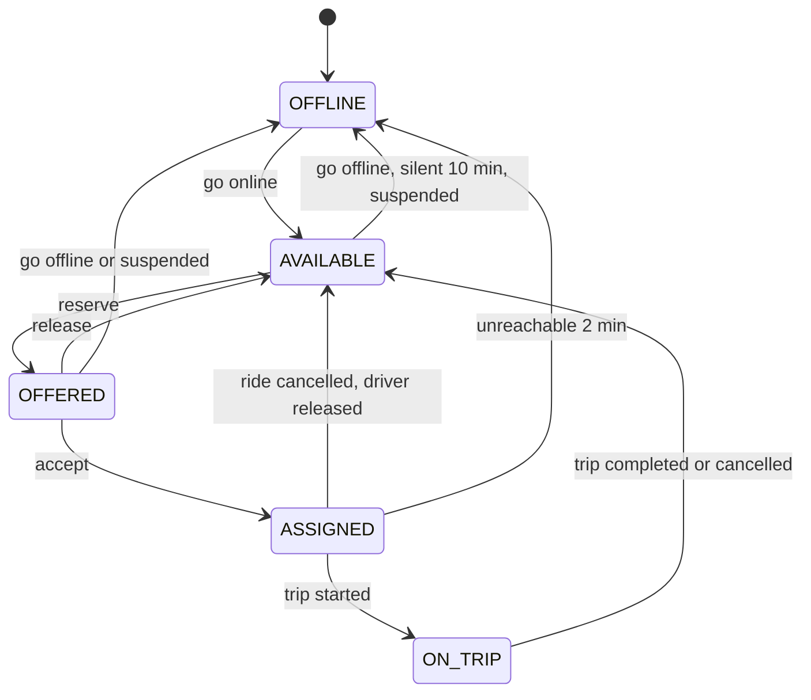

# Dispatch design

| | |
|---|---|
| Part of | [HLD](architecture.md) §7 |
| Status | Draft for approval |
| Decisions | [ADR-011](decisions/ADR-011-dispatch-protocol.md) (protocol), [ADR-004](decisions/ADR-004-live-location-index.md) (candidates), [ADR-005](decisions/ADR-005-durable-timers.md) (timers), [ADR-001](decisions/ADR-001-architecture-style.md) (one transaction for assignment) |
| Requirements | FR-DS1–FR-DS6, NFR-1, NFR-4, NFR-7 |

## 1. Goals

- Offer each booking to a nearby, available driver who was heard from recently: the first offer within 2 s (p95) when one exists (NFR-4).
- Never break the invariants (NFR-1): one live offer per driver, one pending offer per ride, one active ride per driver, one driver per ride.
- Survive any crash without losing a search, an offer or a timer (NFR-7), and keep working while Kafka is down.
- Make the strategy replaceable (FR-DS2) and every decision explainable (FR-DS6).

Dispatch is driven by **search tasks in PostgreSQL**, not by broker events, so the booking path depends only on PostgreSQL and Valkey ([ADR-011](decisions/ADR-011-dispatch-protocol.md)).

## 2. Driver availability

`dispatch.driver_availability` holds one row per online driver: the source of truth for whether a driver can take an offer. Valkey mirrors it as a hint ([location §6](location-system.md#6-live-index-and-status-mirror)).



"Reserve" is the offer reservation (§4); "release" means the offer was declined, expired or withdrawn (§5).

| Field | Meaning |
|---|---|
| `driver_id`, `city`, `category`, `vehicle_id` | Who, where and with which vehicle the driver went online |
| `status` | `AVAILABLE`, `OFFERED`, `ASSIGNED` or `ON_TRIP`; going offline deletes the row and records the session |
| `offer_id`, `ride_id` | The live offer, or the ride in progress |
| `version` | Incremented on every change |
| `consecutive_expired` | Offers left to expire in a row |

Rules:
- Going offline is refused in `ASSIGNED` and `ON_TRIP` (FR-D3). In `OFFERED` it declines the offer first.
- Suspension (FR-D5) withdraws a live offer at once. A ride in progress continues, and the driver goes offline when it ends.
- After 3 offers expire in a row, the driver is taken offline and told why **(assumed)**. This keeps unresponsive drivers from slowing every search.

## 3. Search tasks

`dispatch.search_tasks` holds one row per ride in `SEARCHING`: `ride_id` (primary key), `city`, `category`, `pickup`, `priority`, `attempt`, `radius_m`, `due_at`.

- **Created** in the booking transaction (due now) and when a driver is released before arrival (due now, priority 1).
- **Paused** while an offer is pending: `due_at` is `NULL`.
- **Due again** at once when the offer is declined, expires or is withdrawn.
- **Deleted** when the ride leaves `SEARCHING`.
- **Claimed** by every `dispatch` node every 250 ms, and again at once when the batch was full:

  ```sql
  SELECT … FROM dispatch.search_tasks
  WHERE due_at <= now()
  ORDER BY priority DESC, due_at
  LIMIT 20
  FOR UPDATE SKIP LOCKED
  ```

  `SKIP LOCKED` means only one node works on a ride at a time, with no leader. Spike S-2 measured this pattern for timers.

## 4. One search attempt

One transaction per claimed task:

1. **Check the ride** is still `SEARCHING`; otherwise delete the task.
2. **Find candidates:** the Valkey query script ([ADR-004](decisions/ADR-004-live-location-index.md)) returns up to 20 available drivers of the category within `radius_m`, heard from in the last 30 s, nearest first.
3. **Exclude** drivers already offered this ride, whatever the outcome (FR-DS3).
4. **Rank** with the city's `CandidateRanker` (§7).
5. **Reserve** the best candidate, trying at most 5 in rank order:

   ```sql
   UPDATE dispatch.driver_availability
   SET status = 'OFFERED', offer_id = ?, version = version + 1
   WHERE driver_id = ? AND status = 'AVAILABLE' AND category = ?
   ```

   On the first update that changes a row, in the same transaction:
   - insert the offer as `PENDING` with `expires_at` = now + 15 s;
   - create the offer timer;
   - write the decision record;
   - pause the task;
   - add `OfferCreated` to the outbox.
6. **If no reservation succeeded:** add 1 to `attempt`, widen `radius_m` by 1 km (up to 6 km) and set `due_at` to now + 5 s. If candidates existed but every reservation lost a race, use now + 1 s instead. Write the decision record.
7. **After commit:** update the Valkey status mirror (status `OFFERED`, removed from the GEO set) and publish the offer on `drv:{driverId}` (ADR-006).

Latency budget for the first offer when a candidate exists:

| Step | Time |
|---|---|
| Wait for the next claim | ≤ 250 ms |
| Valkey query (S-1: 0.19 ms inside the server at cloud density) | ~1 ms |
| Reservation transaction | 2–5 ms |
| Push | 1–5 ms |
| **Total** | **~0.3 s, against a 2 s target** |

The search timeout (3 min, T3 in the [ride lifecycle](ride-lifecycle.md#3-transitions)) is a separate timer, so it fires even if every dispatch node is busy or down.

## 5. Offers

| Status | Reached by |
|---|---|
| `PENDING` | Reservation (§4) |
| `ACCEPTED` | The driver accepts before `expires_at` (T2) |
| `DECLINED` | The driver declines |
| `EXPIRED` | The offer timer fires while still `PENDING` |
| `WITHDRAWN` | The rider cancels, the search times out, the driver goes offline or is suspended, or operations cancel the ride |

- **Leaving `PENDING` without acceptance** releases the driver: availability goes back to `AVAILABLE`, the mirror re-adds them to the GEO set at their last position, and the ride's task is due at once.
- **Acceptance** follows the lock order ride → offer → availability ([ride lifecycle §1](ride-lifecycle.md#1-principles)) and needs both the offer still `PENDING` and `expires_at > now()`.
- **Delivery:**
  - The offer is pushed on the driver's channel.
  - The app also fetches `GET /v1/drivers/me/offer` on every connect, so a lost push costs at most the 15 s window.
  - The message carries the remaining milliseconds, computed on the server, so a wrong device clock can't shorten or lengthen the countdown.

## 6. Race scenarios

| # | Race (from the brief) | Source of truth | Mechanism | Retry and recovery |
|---|---|---|---|---|
| 1 | Two riders' searches pick the same driver | `driver_availability` | The conditional `AVAILABLE → OFFERED` update changes the row for one of them; partial unique index on pending offers per driver as backstop | The loser moves to its next candidate in the same transaction |
| 2 | Two dispatch nodes work on the same ride | `search_tasks` | `FOR UPDATE SKIP LOCKED`: one node holds the task; partial unique index on pending offers per ride as backstop | The other node skips the row |
| 3 | A driver accepts two requests at once | `driver_availability` | Impossible: a driver holds at most one live offer, so a second accept can only be for an old offer, which gets `409` | — |
| 7 | The same event arrives twice | `platform.inbox` | Consumers record event IDs in the same transaction as their effects. Dispatch isn't event-driven: the task's primary key is the ride ID, so a duplicate `RideRequested` can't create a second search | — |
| 9 | An older location update arrives after a newer one | Valkey driver hash | Per-driver sequence check in the update script ([location §3](location-system.md#3-ordering-duplicates-and-late-updates)) | Dropped |
| — | Accept at the moment the offer expires | `offers` | The accept requires `expires_at > now()`; the expiry handler requires `PENDING`; one wins | Loser gets `409` or does nothing |
| — | A dispatch node crashes mid-attempt | `search_tasks`, `driver_availability` | The transaction rolls back, so no half-made offer exists | Another node claims the task within 250 ms |

Scenarios 4, 5, 6, 8 and 10 concern the ride itself and are in the [ride lifecycle §8](ride-lifecycle.md#8-races-on-a-ride).

## 7. Ranking strategies

`CandidateRanker.rank(request, candidates) → ranked candidates`. A candidate carries driver ID, distance, heading, speed and last-seen time, plus from V4 the ETA, acceptance rate and idle time.

| Strategy | Version | Ranks by |
|---|---|---|
| `NearestDriverRanker` | V1 | Straight-line distance |
| `EtaRanker` | V4 | Road ETA from the routing provider's matrix for the 10 nearest ([ADR-013](decisions/ADR-013-routing-provider.md)) |
| `WeightedScoreRanker` | V4 | Weighted sum of ETA, acceptance rate, idle time and heading; weights per city |
| An ML ranker | Future | Same interface; evaluated offline on simulator replays first |

- The strategy is configured per city and can be split by a percentage of rides. Each decision record names the strategy and its version, so strategies can be compared on real outcomes.
- Offer policy is a separate interface, `OfferPolicy`: V1 is sequential, and batch matching (§8) is the V4 experiment.

## 8. Batch matching (V4 experiment)

Greedy sequential matching gives each request the best driver at that moment. In a dense zone that is globally poor: two nearby riders can end up with one short and one long pickup.

- **Window:** collect the searching rides and available drivers of a city section every 2 s.
- **Solve:** build an ETA cost matrix and solve the assignment problem: Hungarian algorithm up to ~200 × 200, greedy-with-regret above that.
- **Commit:** create all the window's offers in one transaction.
- **Ownership:** one owner per city section, through a PostgreSQL lease with a fencing token per city or Kafka partition assignment. This is the first place where city ownership is needed.
- **Adoption test:** run against the simulator on hotspot scenarios. Keep it only if mean pickup ETA in dense zones drops by at least 10% **(assumed)** without hurting the match rate.

## 9. Hotspots

When demand in one zone is 10× normal (requirements §7), many searches chase the same few drivers. Dispatch handles that contention as follows:

- Reserved drivers leave the GEO set right after commit, so later searches don't see them.
- A lost reservation costs one `UPDATE` that changed no row; at most 5 tries per attempt, then a 1 s pause.
- Tasks are taken by priority, then age: reassigned rides first, then oldest searches.
- Surge (V4) raises prices in the zone and draws drivers towards it.
- Batch matching (§8) is the structural fix if the experiment proves it.

## 10. Back-to-back trips (designed for, V4)

- **Eligibility:** a driver whose current trip will end within 3 min (by routing ETA) becomes `FINISHING` and can receive offers near the drop-off.
- **Invariant:** "one active ride per driver" becomes "one active ride plus at most one queued ride".
- **Model:** a `next_ride_id` on the availability row and a second partial unique index.
- **Status:** designed, not built.

## 11. Decision log (FR-DS6)

`dispatch.dispatch_decisions` records one row per attempt, kept 30 days **(assumed)** as JSONB. It feeds the "why didn't this ride get a driver?" view in the operations timeline. Each row holds:
- ride, attempt, radius, strategy and version;
- the top 20 candidates with distances and scores;
- exclusion counts by reason and the result of each reservation try;
- the chosen driver, outcome and duration.

## 12. Failure behaviour

| Failure | Behaviour |
|---|---|
| Valkey unavailable | Candidate searches fail; the task retries after 1, 2, 4 … up to 10 s; pending offers still expire through PostgreSQL timers |
| Offer push lost | The driver doesn't see the offer and it expires after 15 s; on reconnect the app fetches any pending offer |
| Status mirror write fails after commit | The reconciler fixes it within 30 s; until then the driver may look available and a reservation fails harmlessly |
| A `dispatch` node crashes | Its transaction rolls back; another node claims the task |
| PostgreSQL unavailable | Dispatch stops until failover. Search timers fire late afterwards, so a ride may end `DRIVER_NOT_FOUND` if the outage lasted more than 3 min, which is accepted |

## 13. Metrics

| Metric | Meaning |
|---|---|
| `dispatch_first_offer_seconds` | Booking to first offer (SLO, NFR-4) |
| `ride_assignment_seconds` | Booking to assignment |
| `dispatch_search_attempts_total{outcome}` | Offered, no candidates, all reservations lost |
| `dispatch_reservation_conflicts_total` | Lost reservation races: the contention signal |
| `offers_total{outcome}` | Accepted, declined, expired, withdrawn |
| `rides_not_matched_total{city}` | Searches that timed out |
| `search_tasks_due` | Tasks waiting to be claimed (backlog) |
