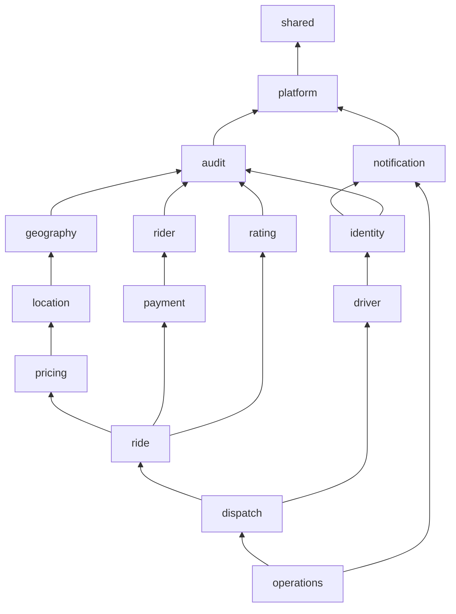
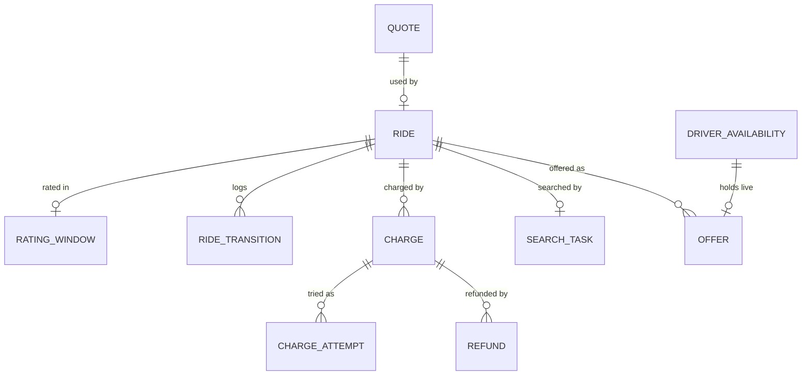

# Low-level design — Ride-Hailing Platform

| | |
|---|---|
| Phase | 4 — Low-level design |
| Status | Approved 2026-10-02. Each phase re-reads its sections before coding and records changes here |
| Inputs | [Requirements](requirements.md) · [HLD](architecture.md) (approved 2026-10-02) · [Ride lifecycle](ride-lifecycle.md) · [Dispatch](dispatch-design.md) · [Location system](location-system.md) · [ADRs](decisions/README.md) |
| Contracts | [OpenAPI](openapi.yaml) · [event schemas](schemas/events/) · [WebSocket schemas](schemas/websocket/) |
| Next | [Implementation plan](implementation-plan.md) · [Architecture review](architecture-review.md) |

V1 is specified completely. V2–V4 are specified to the level of tables, scripts, algorithms and interfaces; each phase re-reads its section before coding and records any change here. V5–V8 keep the decisions in the HLD and get detail when they start (requirements §2). Numbers marked **(assumed)** are new here; [Appendix A](#appendix-a--assumptions-introduced-here) lists them.

## Contents

1. [Code organization](#1-code-organization)
2. [Modules and dependencies](#2-modules-and-dependencies)
3. [Domain model](#3-domain-model)
4. [Database schema](#4-database-schema)
5. [Platform mechanisms](#5-platform-mechanisms)
6. [Concurrency rules](#6-concurrency-rules)
7. [Ride transitions](#7-ride-transitions)
8. [Dispatch](#8-dispatch)
9. [Location and the live index](#9-location-and-the-live-index)
10. [Pricing](#10-pricing)
11. [Payments](#11-payments)
12. [Identity and security](#12-identity-and-security)
13. [REST API](#13-rest-api)
14. [Realtime (V2)](#14-realtime-v2)
15. [Events](#15-events)
16. [Observability](#16-observability)
17. [Testing](#17-testing)
18. [Simulator and demo web app (V2)](#18-simulator-and-demo-web-app-v2)
19. [Later versions](#19-later-versions)
20. [Configuration reference](#20-configuration-reference)
- [Appendix A — Assumptions introduced here](#appendix-a--assumptions-introduced-here)
- [Appendix B — Answers to the HLD's open questions](#appendix-b--answers-to-the-hlds-open-questions)

---

## 1. Code organization

Decisions in [ADR-019](decisions/ADR-019-module-layout-and-boundaries.md).

### 1.1 Repository layout

```text
build.gradle.kts, settings.gradle.kts, gradlew, gradle/wrapper/
docker-compose.yml                profiles: default, kafka, observability, routing, simulator
docker/postgres/Dockerfile        postgres:18 + the PGDG postgresql-18-postgis-3 package (ADR-003)
src/main/java/com/ridehailing/
  RideHailingApplication.java
  shared/                         value types every module may use (open module)
  platform/                       roles, web conventions, security plumbing, ids and clock, idempotency,
                                  outbox, inbox, timers, leases, jobs, rate limits
  audit/ identity/ rider/ driver/ geography/ location/ pricing/
  ride/ dispatch/ payment/ notification/ rating/ operations/
src/main/resources/
  application.yml, application-local.yml
  db/migration/<module>/V<n>__<description>.sql
  db/seed/                        local and demo seed data (Bengaluru), loaded in the local profile only
  valkey/*.lua                    live-index, mirror, sweep, snapshot and rate-limit scripts (V2)
src/test/java/com/ridehailing/
  architecture/                   module, schema-ownership and coding rules
  support/                        Testcontainers set-up, fixtures, test clock, API client
  <module>/                       unit and integration tests per module
  concurrency/                    the race scenarios (§17.2)
  contract/                       OpenAPI, event and WebSocket schema tests
scripts/demo.sh                   V1 scripted demo (FR-S1)
simulator/                        Go simulator (V2, ADR-021)
web/                              demo web app (V2, ADR-022)
docs/                             design documents, openapi.yaml, schemas/
spikes/                           throwaway measurements (not product code)
```

### 1.2 Inside a module

| Package | Contents | Rules |
|---|---|---|
| `com.ridehailing.<module>` | The module's API: `…Api` interfaces, command and view records, enums, service-provider interfaces | The only package other modules may import |
| `….domain` | Aggregates, state machines, policies (fees, fares, ranking) | Plain Java: no Spring, no SQL, no I/O |
| `….app` | Application services: one method per command or query; transaction boundaries; role and ownership checks | Transactions start here and nowhere else |
| `….db` | Repositories on `JdbcClient`, row mappers | SQL names only the module's own schema; reads end in `list()`, `optional()` or `single()`, because a `stream()` keeps its pooled connection until it is closed |
| `….web` | `@ApiController` classes, request and response records | No business logic |
| `….jobs` | Pollers, consumers and scheduled jobs | Each declares its role (§1.3) |

### 1.3 Runtime roles

- `ride.roles` (environment `RIDE_ROLES`): a comma-separated subset of `api`, `realtime`, `dispatch`, `worker`. Default: all four. An empty or unknown value fails startup.
- `@ApiController` = `@RestController` + `@ConditionalOnRole(API)`. Every handler in one declares who may call it, with `@AllowedRoles` or `@PublicEndpoint` (§12.4). Jobs use `@RoleComponent(DISPATCH)` and similar. An ArchUnit rule rejects a bare `@RestController` or `@Scheduled` method.
- **Background loops** (relay, pollers, recurring jobs) run on virtual threads that put their role in the logging context. They start with the application unless `ride.workers.autostart=false`, which tests use to drive each loop step by step, and they stop before the connection pool closes.
- Port 8080 serves the public REST API (role `api`) and WebSockets (role `realtime`, V2). Port 8081 serves management: health, info (active roles), Prometheus metrics.
- **V1 runs on PostgreSQL alone** (ADR-001): the live index, rate limiter and push bus use in-memory implementations of their ports (§9.2, §5.8). Those implementations are only correct inside one process, so startup fails if `ride.location.store=memory` is combined with a role set that doesn't include both `api` and `dispatch`. Tests that start a single role to check its wiring turn the check off with `ride.location.single-process-check=false` (phase 6).

### 1.4 Conventions

| Topic | Rule |
|---|---|
| Identifiers | UUIDv7 generated in the application by `Ids.newId()` in `shared`, so IDs exist before the insert and tests can fix them. Monotonic per JVM: a 12-bit counter below the millisecond (RFC 9562, method 3), and 62 random bits from `SecureRandom`. Key columns also default to `uuidv7()` for rows written by SQL, such as seed data |
| Time | The **database clock** decides everything compared in SQL: due timers, expiries, leases. The **application clock** is UTC with microsecond ticks (matching `timestamptz`) and evaluates domain windows measured in minutes (free cancellation, no-show wait). All timestamps are stored in UTC; days for earnings use the city's time zone (`Asia/Kolkata`) |
| Money | `Money(long paise, Currency)`; INR only; integer arithmetic; percentages in basis points (`tax_bp = 500` is 5%); one rounding step, up to whole rupees, at the end of a fare calculation (§10.2) |
| Coordinates | `GeoPoint(lat, lon)` as doubles, validated to WGS 84 ranges; stored as `lat`/`lon` columns. Distances by haversine with Earth radius 6,371,008.8 m. PostGIS types only for polygons and spatial queries |
| JSON | Jackson 3; `snake_case`; ISO-8601 UTC timestamps; null fields omitted; unknown request fields ignored |
| Validation | Jakarta Bean Validation on request records; domain rules in `domain` |
| Logs | JSON (ECS) in containers, plain text locally. Context: `request_id`, `correlation_id`, `trace_id`, `span_id`, `role`, `module`, and `ride_id` or `driver_id` when known |
| Transactions | `READ COMMITTED`. `statement_timeout` 2 s, the HLD's request-path value, set on every pooled connection when it opens, so jobs get it too; work that needs longer, such as a heavy migration, raises it with `SET LOCAL` for its own transaction. Deadlocks (`40P01`) and serialization failures (`40001`) are retried up to 3 times by `Transactions.execute` when it started the transaction; nothing else is retried automatically |

### 1.5 Local runs, image and CI

- **Local:** `docker compose up` starts PostgreSQL + PostGIS and the application with all roles, in the `local` profile, so seed data, the fixed sign-in code and in-memory signing keys apply (§4.9, §12). Profiles add Valkey (V2 default), Kafka, observability, routing and the simulator as their versions arrive (HLD §16.1). Host ports: the API on 8080, management on 8081, PostgreSQL on **5434**, because the sibling projects' stacks use 5432 and 5433.
- **Without Compose:** `./gradlew bootTestRun` starts the application with the `local` profile against a PostgreSQL + PostGIS container that Testcontainers starts and stops with it.
- **Tests** use Testcontainers with the same PostgreSQL image, built from `docker/postgres/Dockerfile` on first use and cached by Docker. The siblings' embedded PostgreSQL has no PostGIS, so it isn't used. On macOS with Colima, Testcontainers needs `docker.host` pointing at Colima's socket (in `~/.testcontainers.properties`), and the build sets `TESTCONTAINERS_DOCKER_SOCKET_OVERRIDE=/var/run/docker.sock` so the cleanup container can mount the socket inside the VM; the same setting is correct on Linux CI.
- **Image:** two stages (JDK 25 build, JRE 25 run), layered jar, non-root user, `-XX:MaxRAMPercentage=75 -XX:+ExitOnOutOfMemoryError`.
- **CI (GitHub Actions):** compile with `-Werror`; unit, architecture, integration and contract tests; build the image; start `docker compose` and wait for readiness. Terraform jobs arrive in V7.

## 2. Modules and dependencies

Decisions in [ADR-019](decisions/ADR-019-module-layout-and-boundaries.md).

### 2.1 Allowed dependencies

| Module | May depend on | Why |
|---|---|---|
| `shared` | — | Open module: `Money`, `GeoPoint`, `Actor`, `UserRole`, `Page`, `CityId`, `Ids`, phone masking |
| `platform` | `shared` | Infrastructure used by every module |
| `audit` | `platform`, `shared` | Every module writes audit entries |
| `notification` | `platform`, `shared` | One-time-code SMS for identity; consumes events as JSON |
| `identity` | `notification`, `audit`, `platform`, `shared` | Sends one-time codes |
| `rider` | `rating`, `audit`, `platform`, `shared` | The rider's own rating in their profile (added in phase 10) |
| `driver` | `identity`, `geography`, `rating`, `audit`, `platform`, `shared` | Admins create a driver's user; a driver's city and vehicles' categories must exist there (added in phase 4); the driver's rating in admin views (added in phase 11) |
| `geography` | `audit`, `platform`, `shared` | Owns cities, areas, zones, categories and the `RoutingProvider` |
| `rating` | `audit`, `platform`, `shared` | Opens rating windows from `TripCompleted` (JSON) |
| `location` | `geography`, `notification`, `platform`, `shared` | City bounds; live index; the "driver arriving" notification (V2) |
| `pricing` | `geography`, `location`, `audit`, `platform`, `shared` | Zones, routes, pickup ETA estimate |
| `payment` | `rider`, `geography`, `audit`, `platform`, `shared` | Payment methods; the city's time zone for earnings days (added in phase 9); consumes ride events as JSON |
| `ride` | `pricing`, `payment`, `rider`, `rating`, `location`, `audit`, `platform`, `shared` | Consume quote, check dues, payment method, rider snapshot, arrival distance |
| `dispatch` | `ride`, `driver`, `rating`, `location`, `geography`, `audit`, `platform`, `shared` | Assignment, eligibility, driver snapshot, candidates, policies |
| `operations` | `ride`, `dispatch`, `driver`, `payment`, `notification`, `rating`, `location`, `audit`, `platform`, `shared` | Read models and orchestrated operations commands; the driver's rating in suspension answers (added in phase 11) |

The graph is acyclic. Two runtime calls go against it, both by design (ADR-019):
- **Events** travel as JSON (§15), so payment, notification and rating consume ride events without depending on `ride`.
- **`RideDispatchParticipant`** is declared in `ride` and implemented in `dispatch` (§2.3).



The diagram shows the main edges; the table is complete.

### 2.2 Module APIs

Signatures are indicative; records are in each module's API package. Every method that changes state requires a surrounding transaction (`Propagation.MANDATORY`) when another module calls it, so the caller's transaction and lock order apply (§6).

```java
// ride: queries for everyone, assignment for dispatch, operations commands
public interface RideQueries {                          // histories, active rides and receipts are ride's own endpoints (§13.6)
    Optional<RideView> find(UUID rideId);
    Page<RideView> list(RideFilter filter, Cursor cursor, int limit);   // operations' list (phase 11)
    List<TransitionView> transitions(UUID rideId);
}
public interface RideAssignment {                       // dispatch only
    Optional<SearchingRide> lockIfSearching(UUID rideId);   // SELECT … FOR SHARE (§8.3)
    AssignedRide assign(AssignDriver command);              // T2, ride part (§8.4)
    void unassignUnreachable(UUID rideId, UUID driverId);   // T7 (§8.9)
}
public interface RideOperations {                       // operations only
    RideView cancelBySystem(UUID rideId, Actor ops, String reason, Optional<FeeRequest> fee);  // T13
    Page<FlagView> flags(FlagFilter filter, Cursor cursor, int limit);
    List<FlagView> flagsOfRide(UUID rideId);
    FlagView resolveFlag(UUID flagId, Actor ops, String resolution);   // 409 FLAG_ALREADY_RESOLVED
}
public interface RideDispatchParticipant {              // declared by ride, implemented by dispatch
    Duration searchStarted(SearchStarted search);           // T1, T6, T7; answers the city's search timeout (phase 7)
    void searchStopped(UUID rideId, String reason);         // T3, T4, T13 while SEARCHING
    void driverReleased(UUID rideId, UUID driverId, DriverRelease release);  // T6–T8, T10–T13
    void tripStarted(UUID rideId, UUID driverId);           // T9
}

// dispatch
public interface DispatchApi {
    DriverStatusView goOnline(UUID driverId, UUID vehicleId);
    DriverStatusView goOffline(UUID driverId);
    DriverStatusView status(UUID driverId);                 // GET /v1/drivers/me and the location endpoint (phase 6)
    Optional<OfferView> currentOffer(UUID driverId);        // marks the offer seen (§8.5)
    void markOfferSeen(UUID offerId, UUID driverId);        // WebSocket acknowledgement (V2)
    RideView accept(UUID offerId, UUID driverId);           // T2
    OfferView decline(UUID offerId, UUID driverId);
    void driverSuspended(UUID driverId, Actor ops);         // operations, in the suspension's transaction (§8.8)
    void driverReinstated(UUID driverId);
}
public interface DispatchQueries {                      // operations (phase 11)
    List<DecisionView> decisions(UUID rideId);
    List<OfferRecord> offers(UUID rideId);
    Page<DriverStatusView> drivers(String cityId, AvailabilityStatus status, Cursor cursor, int limit);
}

// location
public interface LiveIndex { … }                            // §9.1
public interface LocationIngestion {
    BatchResult accept(String city, String category, UUID driverId, List<LocationUpdate> updates);   // V1 REST via dispatch, V2 WebSocket
}

// pricing
public interface PricingApi {
    QuoteView quote(UUID riderId, QuoteRequest request);
    ConsumedQuote consume(UUID quoteId, UUID riderId, UUID rideId);     // conditional update (§7.2); with the fare's breakdown (phase 12)
    FeeRuleView feeRule(UUID feeRuleId);
}

// payment
public interface PaymentApi {
    Money outstandingDues(UUID riderId);                    // checked in the booking transaction
    RidePayments ofRide(UUID rideId);                       // charges with their attempts, and refunds (timeline)
    Page<ChargeView> charges(ChargeFilter filter, Cursor cursor);        // operations
    RefundView refund(UUID chargeId, Money amount, String reason, Actor ops);
    EarningsView earnings(UUID driverId, LocalDate from, LocalDate to);
}

// rider, driver, geography, rating, identity, notification, audit
public interface RiderApi {
    Optional<PaymentMethodView> paymentMethod(UUID riderId, Optional<UUID> methodId);  // default when empty
    Optional<PaymentMethodView> onlineMethod(UUID riderId, UUID preferredId);  // the method to charge (§11.10, phase 9)
    RiderSnapshot snapshot(UUID riderId);                   // first name; the rating comes from RatingApi (phase 10)
}
public interface DriverApi {
    Eligibility lockEligibility(UUID driverId, UUID vehicleId);   // driver row FOR SHARE (§6.1)
    DriverSnapshot snapshot(UUID driverId, UUID vehicleId);       // first name and vehicle; the rating from RatingApi
    Optional<DriverProfile> profile(UUID driverId);               // GET /v1/drivers/me, served by dispatch (§13.3)
    boolean suspend(UUID driverId, Actor ops, String reason);     // driver FOR UPDATE; false if suspended already (§8.8)
    boolean reinstate(UUID driverId, Actor ops, String reason);
    Optional<AdminDriverView> admin(UUID driverId);               // the admin view, with the rating (phase 11)
    List<UUID> suspended(String cityId);                          // I8
}
public interface GeographyApi {
    Optional<CityView> city(String cityId);                 // cached; currency and time zone
    boolean offers(String cityId, String category);         // an active city category
    Optional<CategorySettings> settings(String cityId, String category);   // dispatch settings, such as radius_max_m (phase 5)
    Optional<Location> locate(GeoPoint point);              // service area and zone in one query (§10.1)
    Optional<BoundingBox> bounds(String cityId);            // envelope of the city's bounds, for location validation (phase 6)
    boolean isZone(String cityId, String zoneId);           // an H3 resolution-7 cell or an active area:<code>
}
public interface RoutingProvider {
    Optional<Route> route(GeoPoint from, GeoPoint to, ZonedDateTime departure);   // empty: no route
    DurationMatrix matrix(List<GeoPoint> origins, List<GeoPoint> destinations);  // V4, for ETA ranking
}
public interface RatingApi {
    RatingSummary summary(UUID userId, Party party);
    Map<UUID, RatingSummary> summaries(Collection<UUID> userIds, Party party);   // admin lists (phase 11)
}
public interface IdentityApi { UUID ensureUser(String phone, Set<UserRole> roles); }  // creates, or adds the roles; joins the caller's transaction
public interface NotificationApi {
    void sendOneTimeCode(String phone, String code);       // synchronous, never stored (§12.1)
    List<NotificationView> ofRide(UUID rideId);             // with their deliveries (timeline, phase 11)
}
public interface AuditLog {
    void record(AuditEntry entry);                          // joins the caller's transaction
    List<AuditRecord> entries(String entityType, Collection<String> entityIds);   // oldest first (timeline, phase 11)
}

// platform
public interface Outbox { void append(DomainEvent event); }    // joins the caller's transaction
public interface EventLog { List<EventEnvelope> byPartitionKey(UUID key); }   // oldest first (timeline, phase 11)
public interface EventConsumer { String name(); Set<String> eventTypes(); void handle(EventEnvelope event); }  // §5.3
public interface FailedDeliveries { boolean redrive(String consumer, UUID eventId); }
public interface Timers {
    void schedule(TimerKind kind, UUID aggregateId, Instant dueAt, Map<String, Object> payload);
    int cancel(TimerKind kind, UUID aggregateId);           // never waits (§6.2)
}
public interface TimerHandler { TimerKind kind(); void fire(DueTimer timer); }               // §5.4
public interface Idempotency {
    ResponseEntity<?> execute(IdempotentCall call, Supplier<? extends ResponseEntity<?>> command);
}
public interface Leases {                                   // §5.5
    OptionalLong acquire(String name, String holder, Duration ttl);
    boolean renew(String name, String holder, long token, Duration ttl);
    void release(String name, String holder, long token);
}
public interface RecurringJob { String name(); Role role(); Duration interval(); void run(); }  // §5.7
public interface Poller { String name(); Role role(); int threads(); Duration interval(); boolean poll(); }  // §5.7 (phase 7)
public interface InvariantCheck { String id(); List<String> violations(String cityId); }     // §17.3 (phase 7)
public interface Transactions { <T> T execute(Supplier<T> work); void afterCommit(Runnable action); }  // §1.4; afterCommit: phase 7, §16.1
public interface RateLimiter { RateDecision tryAcquire(String limit, String key); }          // §5.8
public interface AccessTokens { AccessToken issue(UUID userId, Set<UserRole> roles); }      // §12.2
public record Caller(UUID userId, Set<UserRole> roles) { }   // a controller parameter (§12.4)
```

### 2.3 The dispatch participant

The ride module owns the ride state machine; dispatch owns offers, availability and search tasks. When a ride transition must change dispatch state, the ride's application service calls `RideDispatchParticipant` after updating the ride row, inside the same transaction:

| Ride transition | Participant call | Dispatch effect |
|---|---|---|
| T1 book | `searchStarted` | Insert the search task, due now |
| T3 search timeout, T4 rider cancels while searching, T13 from `SEARCHING` | `searchStopped` | Withdraw the pending offer if any and release its driver; remove the task and the offer timer |
| T6 driver cancels before arrival | `driverReleased(AVAILABLE, DRIVER_CANCELLED)` then `searchStarted(priority 1)` | Release the driver, count the cancellation, reset the task due now |
| T7 driver unreachable | `driverReleased(OFFLINE, UNREACHABLE)` then `searchStarted(priority 1)` | Driver offline, session closed, task due now |
| T8, T10, T11, T12, T13 after assignment | `driverReleased(AVAILABLE or OFFLINE, reason)` | `OFFLINE` when the driver was suspended during the ride |
| T9 trip starts | `tripStarted` | Availability `ASSIGNED → ON_TRIP` |

T2 (acceptance) runs the other way round: it starts in dispatch, which calls `RideAssignment.assign` first so that the ride row is locked before the offer (§6.1).

Phase 7 details: `searchStarted` answers the search timeout from the city's dispatch settings (`geography.city_categories`), which dispatch reads; `ride` doesn't depend on `geography`, and the ride schedules its own `SEARCH_TIMEOUT` with it.

Phase 8 details:

- `driverReleased(ride, driver, reason)` takes only the reason (`RIDER_CANCELLED`, `DRIVER_CANCELLED`, `NO_SHOW`, `COMPLETED`, `OPS_CANCELLED`, `UNREACHABLE`); dispatch decides the target. `UNREACHABLE` goes `OFFLINE` with that session reason; a driver with `offline_after_ride` set goes `OFFLINE` with reason `SUSPENDED`; everyone else goes `AVAILABLE`. `DRIVER_CANCELLED` adds 1 to `driver_stats.cancelled_after_accept`.
- Both calls lock the availability row after the ride row (§6.1) and expect it `ASSIGNED` or `ON_TRIP` for this ride. Anything else is logged as a broken invariant and left alone, since I4 reports it.
- `RideAssignment.unassignUnreachable` answers whether it unassigned: `false` when the ride is no longer `DRIVER_ASSIGNED` to that driver, including a driver who has arrived (T7 starts only from `DRIVER_ASSIGNED`).
- For I4 and I6 (§17.3), operations reads both sides through APIs: `DispatchApi.busyDrivers(city)` and `dispatchWork(city)`, `RideQueries.drivenRides(city)`, `statuses(rides)` and `endedWithSearchTimer(city)`. A new platform method `Timers.scheduled(kind, aggregates)` answers which aggregates have a timer of a kind, so neither module reads `platform.timers`.

## 3. Domain model

### 3.1 Aggregates

| Module | Aggregate (table) | Identity | Lifecycle | Invariants it protects |
|---|---|---|---|---|
| identity | User (`users`) | UUID; unique phone (E.164) | `ACTIVE`, `DISABLED` | One user per phone |
| identity | One-time-code challenge | UUID | Created → consumed or expired | 5 attempts, 5 min |
| identity | Refresh token | UUID; family | Issued → rotated or revoked | Reuse of a rotated token revokes its family (§12.2) |
| rider | Rider (`riders`) | User ID | — | At most 10 saved places; exactly one cash method |
| driver | Driver (`drivers`) | User ID | Verification `PENDING`, `VERIFIED`, `REJECTED`; suspended flag | Only verified, unsuspended drivers with an active own vehicle go online |
| driver | Vehicle | UUID; unique plate | Active flag | Belongs to one driver |
| geography | City | Code (`blr`) | Active flag | Categories and dispatch policies per city |
| pricing | Fare rule, fee rule | UUID; `(city, category, version)` | Versions with `effective_from` | A published version never changes |
| pricing | Quote | UUID | Created → used or expired | Immutable; used once by one ride |
| ride | Ride (`rides`) | UUID (= correlation ID) | [Ride lifecycle](ride-lifecycle.md#2-states) | One active ride per rider and per driver; one driver per ride; allowed transitions only |
| dispatch | Driver availability | Driver ID | [Dispatch §2](dispatch-design.md#2-driver-availability) | One live offer per driver; one active ride per driver |
| dispatch | Offer | UUID | `PENDING` → `ACCEPTED`, `DECLINED`, `EXPIRED`, `WITHDRAWN` | One pending offer per ride and per driver; a driver is offered a ride at most once |
| dispatch | Search task | Ride ID | Due, paused, removed | At most one per ride |
| payment | Charge, with attempts | UUID; unique `(ride, purpose)` | [Ride lifecycle §6](ride-lifecycle.md#6-charges-and-refunds) | No double charge; refunds never exceed the charge |
| payment | Refund | UUID | `PENDING` → `SUCCEEDED`, `FAILED`, `UNKNOWN` | |
| notification | Notification, with deliveries | UUID | Delivery `PENDING` → `SENT`, `DEAD` | One notification per event, recipient and kind |
| rating | Rating window, ratings | Ride ID | Open 7 days after completion | One rating per side per ride |
| audit | Audit entry | UUID | Append-only | Never updated or deleted, except whole expired partitions |

### 3.2 Value objects and enums (in `shared` or the owning module's API)

`Money`, `GeoPoint`, `CityId`, `ZoneId` (H3 cell or `area:<code>`), `CategoryCode` (`AUTO`, `MINI`, `SEDAN`, `XL`, configurable), `Actor` (type `RIDER`, `DRIVER`, `OPS`, `ADMIN`, `SYSTEM` + ID), `RideStatus`, `AvailabilityStatus`, `OfferStatus`, `ChargeStatus`, `ChargePurpose`, `Party` (`RIDER`, `DRIVER`), `DriverRelease` (target `AVAILABLE` or `OFFLINE`, reason).

### 3.3 Core records and how they link

Links between modules are IDs without foreign keys (ADR-019).



## 4. Database schema

One schema per module, owned by it (ADR-019). Conventions: UUID keys; `version` on every aggregate; `timestamptz` in UTC; money in `bigint` paise; status columns as `text` with `CHECK` constraints, which are easier to extend than PostgreSQL enums; no foreign keys across schemas. Every module's first migration creates its schema and records its owner (`COMMENT ON SCHEMA`).

### 4.1 platform

```sql
CREATE TABLE platform.outbox (
  id                bigint GENERATED ALWAYS AS IDENTITY PRIMARY KEY,
  event_id          uuid        NOT NULL UNIQUE,
  event_type        text        NOT NULL,
  event_version     int         NOT NULL,
  aggregate_type    text        NOT NULL,
  aggregate_id      uuid        NOT NULL,
  aggregate_version bigint      NOT NULL,
  partition_key     uuid        NOT NULL,           -- Kafka key (V3): the ride for ride, offer and payment events
  occurred_at       timestamptz NOT NULL,
  producer          text        NOT NULL,
  correlation_id    text        NOT NULL,
  causation_id      text,
  trace_parent      text,
  payload           jsonb       NOT NULL,
  published_at      timestamptz
);
CREATE INDEX outbox_unpublished ON platform.outbox (id) WHERE published_at IS NULL;
CREATE INDEX outbox_by_key ON platform.outbox (partition_key, id);            -- ride timeline, replay
CREATE INDEX outbox_published ON platform.outbox (published_at) WHERE published_at IS NOT NULL;

CREATE TABLE platform.inbox (
  consumer     text        NOT NULL,
  event_id     uuid        NOT NULL,
  processed_at timestamptz NOT NULL DEFAULT now(),
  PRIMARY KEY (consumer, event_id)
);
CREATE INDEX inbox_processed ON platform.inbox (processed_at);                -- retention

CREATE TABLE platform.failed_deliveries (            -- V1–V2 dead letters; Kafka topics from V3
  consumer     text        NOT NULL,
  event_id     uuid        NOT NULL,
  outbox_id    bigint      NOT NULL,
  attempts     int         NOT NULL,
  last_error   text        NOT NULL,
  failed_at    timestamptz NOT NULL,
  redriven_at  timestamptz,
  PRIMARY KEY (consumer, event_id)
);

CREATE TABLE platform.timers (
  id           uuid        PRIMARY KEY DEFAULT uuidv7(),
  kind         text        NOT NULL,                 -- OFFER_EXPIRY, SEARCH_TIMEOUT
  aggregate_id uuid        NOT NULL,
  payload      jsonb       NOT NULL DEFAULT '{}',
  due_at       timestamptz NOT NULL,
  attempts     int         NOT NULL DEFAULT 0,
  last_error   text,
  parked_at    timestamptz,
  trace_parent text,
  created_at   timestamptz NOT NULL DEFAULT now()
);
CREATE INDEX timers_due ON platform.timers (due_at) WHERE parked_at IS NULL;
CREATE INDEX timers_by_aggregate ON platform.timers (aggregate_id, kind);
ALTER TABLE platform.timers SET (autovacuum_vacuum_scale_factor = 0, autovacuum_vacuum_threshold = 1000,
                                 autovacuum_vacuum_cost_delay = 0);    -- churns by design (ADR-005)

CREATE TABLE platform.idempotency_keys (
  principal             text        NOT NULL,        -- user ID, or the webhook provider
  key                   text        NOT NULL CHECK (length(key) BETWEEN 1 AND 255),
  request_hash          bytea       NOT NULL,        -- SHA-256 of the operation (method and path) and the body
  response_status       int         NOT NULL,        -- 0 while the owning transaction runs
  response_content_type text,                        -- set for problem responses
  response_location     text,
  response_body         text,
  created_at            timestamptz NOT NULL DEFAULT now(),
  expires_at            timestamptz NOT NULL,
  PRIMARY KEY (principal, key)
);
CREATE INDEX idempotency_expiry ON platform.idempotency_keys (expires_at);

CREATE TABLE platform.leases (                       -- a row is created by its first acquisition
  name       text PRIMARY KEY,                       -- outbox-relay, job:<name>, reconciler:<city>, city-owner:<city>
  holder     text,
  token      bigint NOT NULL DEFAULT 0,              -- fencing token, +1 on every acquisition
  expires_at timestamptz
);
```

### 4.2 audit

```sql
CREATE TABLE audit.audit_log (
  id             uuid        NOT NULL,
  occurred_at    timestamptz NOT NULL,
  actor_type     text        NOT NULL CHECK (actor_type IN ('RIDER','DRIVER','OPS','ADMIN','SYSTEM')),
  actor_id       text,
  action         text        NOT NULL,               -- ride.cancel, driver.suspend, fare_rule.publish, route.read …
  entity_type    text        NOT NULL,
  entity_id      text        NOT NULL,
  reason         text,
  request_id     text,
  correlation_id text,
  before_state   jsonb,
  after_state    jsonb,
  PRIMARY KEY (occurred_at, id)
) PARTITION BY RANGE (occurred_at);                  -- monthly partitions (audit_log_yyyy_mm), kept 2 months ahead
CREATE INDEX audit_by_entity ON audit.audit_log (entity_type, entity_id, occurred_at);
-- Append-only: a trigger raises on UPDATE and DELETE. Dropping a whole expired partition is still possible.
CREATE FUNCTION audit.reject_change() RETURNS trigger LANGUAGE plpgsql AS
  $$ BEGIN RAISE EXCEPTION 'audit_log is append-only'; END $$;
CREATE TRIGGER audit_append_only BEFORE UPDATE OR DELETE ON audit.audit_log
  FOR EACH ROW EXECUTE FUNCTION audit.reject_change();
```

### 4.3 identity, rider, driver

```sql
CREATE TABLE identity.users (
  id         uuid PRIMARY KEY DEFAULT uuidv7(),
  phone      text NOT NULL UNIQUE CHECK (phone ~ '^\+[1-9][0-9]{7,14}$'),
  roles      text[] NOT NULL CHECK (roles <@ ARRAY['RIDER','DRIVER','OPS','ADMIN'] AND cardinality(roles) > 0),
  status     text NOT NULL DEFAULT 'ACTIVE' CHECK (status IN ('ACTIVE','DISABLED')),
  created_at timestamptz NOT NULL DEFAULT now(),
  version    int NOT NULL DEFAULT 0
);
CREATE TABLE identity.otp_challenges (
  id          uuid PRIMARY KEY,
  phone       text NOT NULL,
  code_hmac   bytea NOT NULL,                        -- HMAC-SHA256(challenge ID and code, server secret); never the code
  attempts    smallint NOT NULL DEFAULT 0,
  expires_at  timestamptz NOT NULL,
  consumed_at timestamptz,
  request_ip  inet,
  created_at  timestamptz NOT NULL DEFAULT now()
);
CREATE INDEX otp_by_phone ON identity.otp_challenges (phone, created_at DESC);
CREATE TABLE identity.refresh_tokens (
  id         uuid PRIMARY KEY,
  family_id  uuid NOT NULL,
  parent_id  uuid,                                   -- the token this one replaced; NULL at sign-in
  user_id    uuid NOT NULL REFERENCES identity.users (id),
  token_hash bytea NOT NULL UNIQUE,                  -- SHA-256 of a 256-bit random token
  issued_at  timestamptz NOT NULL,
  expires_at timestamptz NOT NULL,
  rotated_at timestamptz,
  revoked_at timestamptz
);
CREATE INDEX refresh_by_family ON identity.refresh_tokens (family_id);
CREATE INDEX refresh_by_parent ON identity.refresh_tokens (parent_id) WHERE parent_id IS NOT NULL;
CREATE INDEX refresh_expiry ON identity.refresh_tokens (expires_at);           -- retention

CREATE TABLE rider.riders (
  user_id    uuid PRIMARY KEY,
  first_name text, last_name text, email text,
  default_payment_method_id uuid,
  created_at timestamptz NOT NULL DEFAULT now(),
  updated_at timestamptz NOT NULL DEFAULT now(),
  version    int NOT NULL DEFAULT 0
);
CREATE TABLE rider.saved_places (
  id         uuid PRIMARY KEY,
  rider_id   uuid NOT NULL REFERENCES rider.riders (user_id),
  label      text NOT NULL CHECK (length(label) BETWEEN 1 AND 40),
  name       text NOT NULL CHECK (length(name) <= 200),
  lat        double precision NOT NULL CHECK (lat BETWEEN -90 AND 90),
  lon        double precision NOT NULL CHECK (lon BETWEEN -180 AND 180),
  created_at timestamptz NOT NULL DEFAULT now(),
  UNIQUE (rider_id, label)
);
CREATE TABLE rider.payment_methods (
  id           uuid PRIMARY KEY,
  rider_id     uuid NOT NULL REFERENCES rider.riders (user_id),
  type         text NOT NULL CHECK (type IN ('CASH','CARD','UPI')),
  provider_ref text,                                 -- mock token; never a card number
  display      text NOT NULL,                        -- "Visa •• 4242", "ri***@okbank", "Cash"
  active       boolean NOT NULL DEFAULT true,
  created_at   timestamptz NOT NULL DEFAULT now(),
  CHECK ((type = 'CASH') = (provider_ref IS NULL))
);
CREATE UNIQUE INDEX one_cash_method ON rider.payment_methods (rider_id) WHERE type = 'CASH';

CREATE TABLE driver.drivers (
  id                uuid PRIMARY KEY,                -- the driver's user ID
  city_id           text NOT NULL,
  first_name        text NOT NULL, last_name text,
  verification      text NOT NULL DEFAULT 'PENDING' CHECK (verification IN ('PENDING','VERIFIED','REJECTED')),
  suspended         boolean NOT NULL DEFAULT false,
  suspension_reason text,
  created_at        timestamptz NOT NULL DEFAULT now(),
  updated_at        timestamptz NOT NULL DEFAULT now(),
  version           int NOT NULL DEFAULT 0
);
CREATE TABLE driver.vehicles (
  id         uuid PRIMARY KEY,
  driver_id  uuid NOT NULL REFERENCES driver.drivers (id),
  category   text NOT NULL,
  plate      text NOT NULL UNIQUE,
  make text NOT NULL, model text NOT NULL, colour text NOT NULL,
  active     boolean NOT NULL DEFAULT true,
  created_at timestamptz NOT NULL DEFAULT now(),
  version    int NOT NULL DEFAULT 0
);
CREATE TABLE driver.status_changes (                 -- verification and suspension history
  id          uuid PRIMARY KEY,
  driver_id   uuid NOT NULL REFERENCES driver.drivers (id),
  kind        text NOT NULL CHECK (kind IN ('VERIFICATION','SUSPENSION','REINSTATEMENT')),
  from_value  text, to_value text NOT NULL,
  reason      text, actor_id text NOT NULL,
  occurred_at timestamptz NOT NULL
);
```

### 4.4 geography and pricing

```sql
CREATE TABLE geography.cities (
  id         text PRIMARY KEY CHECK (id ~ '^[a-z]{3,8}$'),      -- also the Valkey hash tag: {blr}
  name       text NOT NULL,
  time_zone  text NOT NULL,                                     -- Asia/Kolkata
  currency   char(3) NOT NULL,
  bounds     geometry(Polygon, 4326) NOT NULL,                  -- bounding box for location validation
  active     boolean NOT NULL DEFAULT true,
  version    int NOT NULL DEFAULT 0
);
CREATE TABLE geography.service_areas (
  id      uuid PRIMARY KEY,
  city_id text NOT NULL REFERENCES geography.cities (id),
  area    geometry(MultiPolygon, 4326) NOT NULL CHECK (ST_IsValid(area)),
  active  boolean NOT NULL DEFAULT true
);
CREATE INDEX service_areas_gist ON geography.service_areas USING gist (area) WHERE active;
CREATE TABLE geography.special_areas (               -- zones that take precedence over H3 cells
  id       uuid PRIMARY KEY,
  city_id  text NOT NULL REFERENCES geography.cities (id),
  code     text NOT NULL UNIQUE,                     -- BLR-AIRPORT
  name     text NOT NULL,
  kind     text NOT NULL CHECK (kind IN ('AIRPORT','STATION','STADIUM','OTHER')),
  area     geometry(MultiPolygon, 4326) NOT NULL CHECK (ST_IsValid(area)),
  priority int NOT NULL DEFAULT 0,                   -- highest wins where areas overlap
  active   boolean NOT NULL DEFAULT true
);
CREATE INDEX special_areas_gist ON geography.special_areas USING gist (area) WHERE active;
CREATE TABLE geography.categories (code text PRIMARY KEY, name text NOT NULL, seats smallint NOT NULL);
CREATE TABLE geography.city_categories (
  city_id          text NOT NULL REFERENCES geography.cities (id),
  category         text NOT NULL REFERENCES geography.categories (code),
  active           boolean NOT NULL DEFAULT true,
  offer_ttl_s      int NOT NULL DEFAULT 15  CHECK (offer_ttl_s BETWEEN 5 AND 60),
  search_timeout_s int NOT NULL DEFAULT 180 CHECK (search_timeout_s BETWEEN 30 AND 900),
  radius_start_m   int NOT NULL DEFAULT 2000,
  radius_step_m    int NOT NULL DEFAULT 1000,
  radius_max_m     int NOT NULL DEFAULT 6000,
  ranker           text NOT NULL DEFAULT 'nearest',  -- nearest, eta, weighted (V4)
  version          int NOT NULL DEFAULT 0,
  PRIMARY KEY (city_id, category),
  CHECK (radius_start_m <= radius_max_m)
);

CREATE TABLE pricing.fare_rules (
  id             uuid PRIMARY KEY,
  city_id        text NOT NULL,
  category       text NOT NULL,
  version        int NOT NULL,
  effective_from timestamptz NOT NULL,
  base_paise     bigint NOT NULL CHECK (base_paise >= 0),
  per_km_paise   bigint NOT NULL CHECK (per_km_paise >= 0),
  per_min_paise  bigint NOT NULL CHECK (per_min_paise >= 0),
  minimum_paise  bigint NOT NULL CHECK (minimum_paise >= 0),
  booking_fee_paise bigint NOT NULL CHECK (booking_fee_paise >= 0),
  tax_bp         int NOT NULL CHECK (tax_bp BETWEEN 0 AND 5000),
  commission_bp  int NOT NULL CHECK (commission_bp BETWEEN 0 AND 5000),
  currency       char(3) NOT NULL,
  created_by     uuid NOT NULL,
  created_at     timestamptz NOT NULL DEFAULT now(),
  UNIQUE (city_id, category, version)
);
CREATE INDEX fare_rules_current ON pricing.fare_rules (city_id, category, effective_from DESC);
CREATE TABLE pricing.fee_rules (                     -- versioned like fare rules (ADR-012)
  id                     uuid PRIMARY KEY,
  city_id                text NOT NULL,
  category               text NOT NULL,
  version                int NOT NULL,
  effective_from         timestamptz NOT NULL,
  cancellation_fee_paise bigint NOT NULL CHECK (cancellation_fee_paise >= 0),
  no_show_fee_paise      bigint NOT NULL CHECK (no_show_fee_paise >= 0),
  free_cancel_window_s   int NOT NULL DEFAULT 120,
  late_grace_s           int NOT NULL DEFAULT 300,
  pickup_wait_s          int NOT NULL DEFAULT 300,
  commission_bp          int NOT NULL CHECK (commission_bp BETWEEN 0 AND 5000),
  currency               char(3) NOT NULL,
  created_by             uuid NOT NULL,
  created_at             timestamptz NOT NULL DEFAULT now(),
  UNIQUE (city_id, category, version)
);
CREATE TABLE pricing.surge_rules (                   -- V1: admin-set multipliers by zone and time window
  id           uuid PRIMARY KEY,
  city_id      text NOT NULL,
  zone_id      text NOT NULL,                        -- H3 cell or area:<code>
  days_of_week smallint[] NOT NULL CHECK (days_of_week <@ ARRAY[1,2,3,4,5,6,7]::smallint[]),
  start_local  time NOT NULL,
  end_local    time NOT NULL,                        -- may wrap past midnight
  multiplier   numeric(3,2) NOT NULL CHECK (multiplier BETWEEN 1.00 AND 2.00),
  active       boolean NOT NULL DEFAULT true,
  created_by   uuid NOT NULL,
  created_at   timestamptz NOT NULL DEFAULT now(),
  version      int NOT NULL DEFAULT 0
);
CREATE INDEX surge_rules_by_zone ON pricing.surge_rules (city_id, zone_id) WHERE active;
CREATE TABLE pricing.quotes (
  id                uuid PRIMARY KEY,
  rider_id          uuid NOT NULL,
  city_id           text NOT NULL,
  category          text NOT NULL,
  pickup_lat double precision NOT NULL, pickup_lon double precision NOT NULL,
  dropoff_lat double precision NOT NULL, dropoff_lon double precision NOT NULL,
  pickup_zone       text NOT NULL,
  distance_m        int NOT NULL CHECK (distance_m >= 0),
  duration_s        int NOT NULL CHECK (duration_s >= 0),
  route_source      text NOT NULL CHECK (route_source IN ('MOCK','OSRM','MOCK_FALLBACK')),
  fare_rule_id      uuid NOT NULL,
  fee_rule_id       uuid NOT NULL,
  surge_multiplier  numeric(3,2) NOT NULL,
  surge_source      text NOT NULL CHECK (surge_source IN ('NONE','RULE','COMPUTED')),
  base_paise bigint NOT NULL, distance_paise bigint NOT NULL, time_paise bigint NOT NULL,
  surge_paise bigint NOT NULL, minimum_topup_paise bigint NOT NULL, booking_fee_paise bigint NOT NULL,
  tax_paise bigint NOT NULL, rounding_paise bigint NOT NULL, total_paise bigint NOT NULL,
  commission_paise  bigint NOT NULL,
  currency          char(3) NOT NULL,
  pickup_eta_s      int,                             -- NULL when no driver is within the maximum radius
  created_at        timestamptz NOT NULL,
  expires_at        timestamptz NOT NULL,
  used_by_ride_id   uuid UNIQUE,
  used_at           timestamptz
);
CREATE INDEX quotes_retention ON pricing.quotes (created_at);
CREATE INDEX quotes_by_zone ON pricing.quotes (city_id, pickup_zone, created_at);   -- surge demand (V4)
```

The fare breakdown is stored as typed columns, not a JSON document, because the formula is fixed by FR-PR2 and typed columns get `CHECK` constraints. Extensions (airport fee, promotions) arrive as ordered `FareComponent`s with their own rows when they are built (ADR-012).

- **Categories are reference data,** inserted by a geography migration (`AUTO` 3 seats, `MINI` 4, `SEDAN` 4, `XL` 6); no endpoint creates them. Cities, areas and city categories come from the admin API, or from seeds locally.
- **PostGIS** is created by geography's second migration, `WITH SCHEMA public`, so every module's connections find its types and functions on the default search path. The migration sets `statement_timeout = 0` and `search_path = geography, public` locally (§4.9).
- **Geometries travel as GeoJSON:** `ST_GeomFromGeoJSON` in, `ST_AsGeoJSON` out. A malformed or invalid shape (`ST_IsValid` false) is `422 INVALID_GEOMETRY`.

### 4.5 ride

```sql
CREATE TABLE ride.rides (
  id                    uuid PRIMARY KEY,
  rider_id              uuid NOT NULL,
  city_id               text NOT NULL,
  category              text NOT NULL,
  quote_id              uuid NOT NULL UNIQUE,
  pickup_lat double precision NOT NULL, pickup_lon double precision NOT NULL,
  dropoff_lat double precision NOT NULL, dropoff_lon double precision NOT NULL,
  pickup_zone           text NOT NULL,
  distance_m            int NOT NULL,                -- quoted route
  duration_s            int NOT NULL,
  fare_paise            bigint NOT NULL,
  commission_paise      bigint NOT NULL,
  fare_breakdown        jsonb,                       -- the quote's, for the receipt (phase 12); null on rides booked before
  currency              char(3) NOT NULL,
  fee_rule_id           uuid NOT NULL,
  payment_method_id     uuid NOT NULL,
  payment_method_type   text NOT NULL CHECK (payment_method_type IN ('CASH','CARD','UPI')),
  status                text NOT NULL CHECK (status IN ('SEARCHING','DRIVER_ASSIGNED','DRIVER_ARRIVED','IN_TRIP',
                          'COMPLETED','CANCELLED_BY_RIDER','CANCELLED_BY_DRIVER','CANCELLED_BY_SYSTEM','DRIVER_NOT_FOUND')),
  version               int NOT NULL DEFAULT 0,
  search_generation     int NOT NULL DEFAULT 1,      -- +1 each time the ride re-enters SEARCHING
  driver_id             uuid,
  vehicle_id            uuid,
  offer_id              uuid,
  rider_snapshot        jsonb NOT NULL,              -- first name and rating at booking (NFR-10: no phone)
  driver_snapshot       jsonb,                       -- first name, rating, vehicle at assignment
  pin                   char(4),                     -- shown only to the rider; never logged or published
  pin_attempts          smallint NOT NULL DEFAULT 0,
  promised_pickup_eta_s int,
  requested_at          timestamptz NOT NULL,
  assigned_at           timestamptz, arrived_at timestamptz, started_at timestamptz,
  completed_at          timestamptz, ended_at timestamptz,
  start_device_time     timestamptz, complete_device_time timestamptz,      -- offline commands (V2)
  cancelled_by          text CHECK (cancelled_by IN ('RIDER','DRIVER','SYSTEM')),
  cancel_reason         text,
  fee_purpose           text CHECK (fee_purpose IN ('CANCELLATION_FEE','NO_SHOW_FEE')),
  fee_paise             bigint,
  reassign_count        int NOT NULL DEFAULT 0,
  CHECK (status NOT IN ('DRIVER_ASSIGNED','DRIVER_ARRIVED','IN_TRIP','COMPLETED') OR driver_id IS NOT NULL),
  CHECK ((fee_purpose IS NULL) = (fee_paise IS NULL))
);
CREATE UNIQUE INDEX one_active_ride_per_rider ON ride.rides (rider_id)
  WHERE status IN ('SEARCHING','DRIVER_ASSIGNED','DRIVER_ARRIVED','IN_TRIP');
CREATE UNIQUE INDEX one_active_ride_per_driver ON ride.rides (driver_id)
  WHERE status IN ('DRIVER_ASSIGNED','DRIVER_ARRIVED','IN_TRIP');
CREATE INDEX rides_rider_history ON ride.rides (rider_id, requested_at DESC, id);
CREATE INDEX rides_driver_history ON ride.rides (driver_id, requested_at DESC, id) WHERE driver_id IS NOT NULL;
CREATE INDEX rides_active ON ride.rides (city_id, status, requested_at)
  WHERE status IN ('SEARCHING','DRIVER_ASSIGNED','DRIVER_ARRIVED','IN_TRIP');
CREATE INDEX rides_by_zone ON ride.rides (city_id, pickup_zone, requested_at);        -- surge demand (V4)
CREATE INDEX rides_newest ON ride.rides (requested_at DESC, id DESC);                 -- operations' list (phase 11)
CREATE INDEX rides_by_status ON ride.rides (status, requested_at DESC, id DESC);

CREATE TABLE ride.transitions (
  id          uuid PRIMARY KEY,
  ride_id     uuid NOT NULL REFERENCES ride.rides (id),
  version     int NOT NULL,                          -- the ride's version after the transition
  from_status text,
  to_status   text NOT NULL,
  command     text NOT NULL,                         -- BOOK, ACCEPT, SEARCH_TIMEOUT, CANCEL, ARRIVE, …
  actor_type  text NOT NULL,
  actor_id    text,
  reason      text,
  occurred_at timestamptz NOT NULL,
  device_time timestamptz,
  request_id  text,
  UNIQUE (ride_id, version)
);

CREATE TABLE ride.flags (                            -- the operations review queue
  id          uuid PRIMARY KEY,
  ride_id     uuid NOT NULL REFERENCES ride.rides (id),
  kind        text NOT NULL CHECK (kind IN ('ARRIVED_FAR','DRIVER_CANCELLED_AT_PICKUP','PIN_LOCKED',
                                            'OFFLINE_CONFLICT','STUCK')),
  details     jsonb NOT NULL DEFAULT '{}',
  created_at  timestamptz NOT NULL,
  resolved_at timestamptz, resolved_by uuid, resolution text
);
CREATE UNIQUE INDEX one_open_flag_per_kind ON ride.flags (ride_id, kind) WHERE resolved_at IS NULL;
CREATE INDEX flags_open ON ride.flags (created_at) WHERE resolved_at IS NULL;
```

### 4.6 dispatch

```sql
CREATE TABLE dispatch.driver_availability (            -- one row per driver, kept while offline
  driver_id           uuid PRIMARY KEY,
  city_id             text NOT NULL,
  status              text NOT NULL CHECK (status IN ('OFFLINE','AVAILABLE','OFFERED','ASSIGNED','ON_TRIP')),
  category            text,
  vehicle_id          uuid,
  offer_id            uuid,
  ride_id             uuid,
  consecutive_expired smallint NOT NULL DEFAULT 0,
  offline_after_ride  boolean NOT NULL DEFAULT false,      -- suspended during a ride
  online_since        timestamptz,
  status_changed_at   timestamptz NOT NULL,
  version             bigint NOT NULL DEFAULT 0,           -- monotonic for the driver's lifetime (§9.4)
  CHECK ((status = 'OFFERED') = (offer_id IS NOT NULL)),
  CHECK ((status IN ('ASSIGNED','ON_TRIP')) = (ride_id IS NOT NULL)),
  CHECK ((status = 'OFFLINE') = (online_since IS NULL)),
  CHECK (status = 'OFFLINE' OR (category IS NOT NULL AND vehicle_id IS NOT NULL))
);
CREATE INDEX availability_online ON dispatch.driver_availability (city_id, status) WHERE status <> 'OFFLINE';

CREATE TABLE dispatch.driver_sessions (
  id             uuid PRIMARY KEY,
  driver_id      uuid NOT NULL,
  city_id        text NOT NULL,
  vehicle_id     uuid NOT NULL,
  category       text NOT NULL,
  online_at      timestamptz NOT NULL,
  offline_at     timestamptz,
  offline_reason text CHECK (offline_reason IN ('DRIVER','SILENT','UNREACHABLE','UNRESPONSIVE','SUSPENDED'))
);
CREATE INDEX sessions_by_driver ON dispatch.driver_sessions (driver_id, online_at DESC);

CREATE TABLE dispatch.offers (
  id           uuid PRIMARY KEY,
  ride_id      uuid NOT NULL,
  driver_id    uuid NOT NULL,
  attempt      int NOT NULL,
  status       text NOT NULL CHECK (status IN ('PENDING','ACCEPTED','DECLINED','EXPIRED','WITHDRAWN')),
  rank         smallint NOT NULL,
  distance_m   int NOT NULL,
  eta_s        int,                                  -- V4 ETA ranking
  created_at   timestamptz NOT NULL,
  expires_at   timestamptz NOT NULL,
  seen_at      timestamptz,                          -- first fetch or WebSocket acknowledgement
  responded_at timestamptz,
  end_reason   text,                                 -- DRIVER_OFFLINE, RIDER_CANCELLED, SEARCH_TIMEOUT, OPS_CANCELLED, SUSPENDED
  version      int NOT NULL DEFAULT 0
);
CREATE UNIQUE INDEX one_pending_offer_per_driver ON dispatch.offers (driver_id) WHERE status = 'PENDING';
CREATE UNIQUE INDEX one_pending_offer_per_ride ON dispatch.offers (ride_id) WHERE status = 'PENDING';
CREATE UNIQUE INDEX one_offer_per_ride_and_driver ON dispatch.offers (ride_id, driver_id);    -- FR-DS3

CREATE TABLE dispatch.search_tasks (
  ride_id    uuid PRIMARY KEY,
  city_id    text NOT NULL,
  category   text NOT NULL,
  pickup_lat double precision NOT NULL, pickup_lon double precision NOT NULL,
  priority   smallint NOT NULL DEFAULT 0,             -- 1 for reassigned rides
  attempt    int NOT NULL DEFAULT 0,
  radius_m   int NOT NULL,
  due_at     timestamptz,                             -- NULL while an offer is pending
  backoff_s  int NOT NULL DEFAULT 0,                  -- live-index outage backoff
  created_at timestamptz NOT NULL,
  updated_at timestamptz NOT NULL
);
CREATE INDEX search_tasks_due ON dispatch.search_tasks (priority DESC, due_at) WHERE due_at IS NOT NULL;

CREATE TABLE dispatch.decisions (                       -- FR-DS6, kept 30 days
  id               uuid PRIMARY KEY,
  ride_id          uuid NOT NULL,
  attempt          int NOT NULL,
  created_at       timestamptz NOT NULL,
  strategy         text NOT NULL,
  strategy_version text NOT NULL,
  radius_m         int NOT NULL,
  outcome          text NOT NULL CHECK (outcome IN ('OFFERED','NO_CANDIDATES','ALL_RESERVATIONS_LOST','INDEX_UNAVAILABLE')),
  chosen_driver_id uuid,
  offer_id         uuid,
  detail           jsonb NOT NULL,                      -- candidates, exclusions, reservation tries (§8.3)
  duration_us      int NOT NULL
);
CREATE INDEX decisions_by_ride ON dispatch.decisions (ride_id, created_at);
CREATE INDEX decisions_retention ON dispatch.decisions (created_at);

CREATE TABLE dispatch.driver_stats (                    -- acceptance and cancellation rates (V4 ranking)
  driver_id              uuid PRIMARY KEY,
  offers                 int NOT NULL DEFAULT 0,
  accepted               int NOT NULL DEFAULT 0,
  declined               int NOT NULL DEFAULT 0,
  expired                int NOT NULL DEFAULT 0,
  cancelled_after_accept int NOT NULL DEFAULT 0,
  updated_at             timestamptz NOT NULL
);
```

### 4.7 payment, notification, rating

```sql
CREATE TABLE payment.charges (
  id                   uuid PRIMARY KEY,
  ride_id              uuid NOT NULL,
  rider_id             uuid NOT NULL,
  driver_id            uuid,
  city_id              text NOT NULL,                  -- earnings days in the city's time zone (phase 9)
  purpose              text NOT NULL CHECK (purpose IN ('FARE','CANCELLATION_FEE','NO_SHOW_FEE')),
  amount_paise         bigint NOT NULL CHECK (amount_paise > 0),
  commission_paise     bigint NOT NULL,                -- from the ride's event; a fee's earnings need it (phase 9)
  currency             char(3) NOT NULL,
  method_type          text NOT NULL CHECK (method_type IN ('CASH','CARD','UPI')),
  payment_method_id    uuid,                           -- null while no usable method exists (phase 9)
  status               text NOT NULL CHECK (status IN ('PENDING','SUCCEEDED','FAILED','UNKNOWN')),
  failure_code         text,                           -- while FAILED (phase 9)
  succeeded_attempt_id uuid,
  refunded_paise       bigint NOT NULL DEFAULT 0,      -- reserved by non-failed operations refunds
  created_at           timestamptz NOT NULL,
  updated_at           timestamptz NOT NULL,
  version              int NOT NULL DEFAULT 0,
  UNIQUE (ride_id, purpose),
  CHECK (refunded_paise BETWEEN 0 AND amount_paise)
);
CREATE INDEX charges_dues ON payment.charges (rider_id) WHERE status = 'FAILED';
CREATE INDEX charges_by_status ON payment.charges (status, updated_at) WHERE status IN ('FAILED','UNKNOWN');

CREATE TABLE payment.charge_attempts (
  id                  uuid PRIMARY KEY,               -- also the provider's idempotency key
  charge_id           uuid NOT NULL REFERENCES payment.charges (id),
  seq                 smallint NOT NULL,
  status              text NOT NULL CHECK (status IN ('PENDING','IN_FLIGHT','SUCCEEDED','FAILED','UNKNOWN')),
  provider            text NOT NULL,
  payment_method_id   uuid NOT NULL,
  method_ref          text NOT NULL,                  -- the method's provider token, captured with the attempt (phase 9)
  provider_payment_id text,
  failure_code        text,
  created_at          timestamptz NOT NULL,
  sent_at             timestamptz,
  completed_at        timestamptz,
  lease_until         timestamptz,                    -- while IN_FLIGHT
  next_check_at       timestamptz,                    -- while UNKNOWN
  checks              smallint NOT NULL DEFAULT 0,
  version             int NOT NULL DEFAULT 0,
  UNIQUE (charge_id, seq)
);
CREATE UNIQUE INDEX one_open_attempt_per_charge ON payment.charge_attempts (charge_id)
  WHERE status IN ('PENDING','IN_FLIGHT','UNKNOWN');
CREATE INDEX attempts_to_send ON payment.charge_attempts (created_at) WHERE status = 'PENDING';
CREATE INDEX attempts_in_flight ON payment.charge_attempts (lease_until) WHERE status = 'IN_FLIGHT';
CREATE INDEX attempts_to_check ON payment.charge_attempts (next_check_at) WHERE status = 'UNKNOWN';

CREATE TABLE payment.refunds (
  id                 uuid PRIMARY KEY,                -- also the provider's idempotency key
  charge_id          uuid NOT NULL REFERENCES payment.charges (id),
  attempt_id         uuid NOT NULL REFERENCES payment.charge_attempts (id),  -- the payment refunded (phase 9)
  amount_paise       bigint NOT NULL CHECK (amount_paise > 0),
  reason             text NOT NULL,
  automatic          boolean NOT NULL DEFAULT false,  -- late-success refunds
  status             text NOT NULL CHECK (status IN ('PENDING','IN_FLIGHT','SUCCEEDED','FAILED','UNKNOWN')),
  failure_code       text,                            -- while FAILED (phase 9)
  provider_refund_id text,
  requested_by       text NOT NULL,
  created_at         timestamptz NOT NULL,
  sent_at            timestamptz,                     -- the 2-minute and 24-hour rules, as for attempts (phase 9)
  completed_at       timestamptz,
  lease_until        timestamptz,
  next_check_at      timestamptz,
  checks             smallint NOT NULL DEFAULT 0,
  version            int NOT NULL DEFAULT 0
);
CREATE INDEX refunds_by_charge ON payment.refunds (charge_id);                                     -- phase 9
CREATE UNIQUE INDEX one_automatic_refund_per_attempt ON payment.refunds (attempt_id) WHERE automatic; -- phase 9
CREATE INDEX refunds_to_send ON payment.refunds (created_at) WHERE status = 'PENDING';             -- phase 9
CREATE INDEX refunds_in_flight ON payment.refunds (lease_until) WHERE status = 'IN_FLIGHT';        -- phase 9
CREATE INDEX refunds_to_check ON payment.refunds (next_check_at) WHERE status = 'UNKNOWN';         -- phase 9

CREATE TABLE payment.provider_webhooks (
  provider          text NOT NULL,
  provider_event_id text NOT NULL,
  event_type        text NOT NULL,
  received_at       timestamptz NOT NULL,
  raw_body          text NOT NULL,                    -- byte-exact, as signed
  processed_at      timestamptz,
  outcome           text,                             -- APPLIED, IGNORED or UNMATCHED (phase 9)
  PRIMARY KEY (provider, provider_event_id)
);

CREATE TABLE payment.driver_earnings (                -- read model (ADR-014)
  id                   uuid PRIMARY KEY,
  driver_id            uuid NOT NULL,
  ride_id              uuid NOT NULL,
  kind                 text NOT NULL CHECK (kind IN ('FARE','CANCELLATION_FEE','NO_SHOW_FEE','ADJUSTMENT')),
  source_id            uuid NOT NULL,                  -- ride (fare), fee charge, or refund (adjustment)
  gross_paise          bigint NOT NULL,
  commission_paise     bigint NOT NULL,
  net_paise            bigint NOT NULL,
  cash_collected_paise bigint NOT NULL DEFAULT 0,
  currency             char(3) NOT NULL,
  earned_at            timestamptz NOT NULL,
  earned_on            date NOT NULL,                  -- in the city's time zone
  UNIQUE (source_id, kind)
);
CREATE INDEX earnings_by_driver ON payment.driver_earnings (driver_id, earned_on);

CREATE TABLE notification.notifications (
  id           uuid PRIMARY KEY,
  recipient_id uuid NOT NULL,
  kind         text NOT NULL,                          -- DRIVER_ASSIGNED, TRIP_COMPLETED, PAYMENT_FAILED, …
  ride_id      uuid,
  event_id     uuid,
  payload      jsonb NOT NULL,
  created_at   timestamptz NOT NULL,
  UNIQUE (event_id, recipient_id, kind)
);
CREATE TABLE notification.deliveries (
  id              uuid PRIMARY KEY,
  notification_id uuid NOT NULL REFERENCES notification.notifications (id),
  channel         text NOT NULL CHECK (channel IN ('PUSH','SMS')),
  status          text NOT NULL CHECK (status IN ('PENDING','SENT','DEAD')),
  attempts        smallint NOT NULL DEFAULT 0,          -- sends started; counted when claimed
  next_attempt_at timestamptz NOT NULL,                 -- while PENDING; also the lease of a send in progress
  last_error      text,
  sent_at         timestamptz,
  CHECK ((status = 'SENT') = (sent_at IS NOT NULL))
);
CREATE INDEX deliveries_due ON notification.deliveries (next_attempt_at) WHERE status = 'PENDING';
CREATE INDEX deliveries_by_notification ON notification.deliveries (notification_id);

CREATE TABLE rating.rating_windows (
  ride_id      uuid PRIMARY KEY,
  rider_id     uuid NOT NULL,
  driver_id    uuid NOT NULL,
  completed_at timestamptz NOT NULL,
  closes_at    timestamptz NOT NULL
);
CREATE TABLE rating.ratings (
  id         uuid PRIMARY KEY,
  ride_id    uuid NOT NULL REFERENCES rating.rating_windows (ride_id),
  rater_role text NOT NULL CHECK (rater_role IN ('RIDER','DRIVER')),
  rater_id   uuid NOT NULL,
  ratee_id   uuid NOT NULL,
  stars      smallint NOT NULL CHECK (stars BETWEEN 1 AND 5),
  comment    text CHECK (length(comment) <= 500),
  created_at timestamptz NOT NULL,
  UNIQUE (ride_id, rater_role)
);
CREATE INDEX ratings_by_ratee ON rating.ratings (ratee_id, created_at DESC);
CREATE TABLE rating.summaries (
  user_id    uuid NOT NULL,
  party      text NOT NULL CHECK (party IN ('RIDER','DRIVER')),
  average    numeric(3,2) NOT NULL,
  count      int NOT NULL CHECK (count BETWEEN 0 AND 100), -- ratings in the average
  updated_at timestamptz NOT NULL,
  PRIMARY KEY (user_id, party)
);
```

### 4.8 Later tables

```sql
-- V2: trip routes (ADR-016). The writer sets received_day; generated columns can't be partition keys.
CREATE TABLE location.trip_points (
  received_day date NOT NULL,
  ride_id      uuid NOT NULL,
  seq          bigint NOT NULL,
  driver_id    uuid NOT NULL,
  received_at  timestamptz NOT NULL,
  device_time  timestamptz,
  lat double precision NOT NULL, lon double precision NOT NULL,
  accuracy_m real, speed_mps real, heading_deg real,
  flags        smallint NOT NULL DEFAULT 0,            -- 1 poor accuracy, 2 implausible, 4 replayed
  PRIMARY KEY (received_day, ride_id, seq)
) PARTITION BY RANGE (received_day);

-- V3: dead letters mirrored from Kafka for listing and re-driving (§19.1)
CREATE TABLE platform.dead_letters (
  id uuid PRIMARY KEY, consumer text NOT NULL, topic text NOT NULL, kafka_partition int NOT NULL,
  kafka_offset bigint NOT NULL, event_id uuid, error text NOT NULL, payload text NOT NULL,
  created_at timestamptz NOT NULL, redriven_at timestamptz,
  UNIQUE (topic, kafka_partition, kafka_offset)
);

-- V4: computed surge (§19.2)
CREATE TABLE pricing.surge_steps (city_id text, ratio_from numeric(5,2), multiplier numeric(3,2),
                                  PRIMARY KEY (city_id, ratio_from));
CREATE TABLE pricing.surge_multipliers (city_id text, zone_id text, multiplier numeric(3,2) NOT NULL,
  demand int NOT NULL, supply int NOT NULL, computed_at timestamptz NOT NULL, PRIMARY KEY (city_id, zone_id));
CREATE TABLE pricing.surge_history (city_id text, zone_id text, computed_at timestamptz, multiplier numeric(3,2),
  demand int, supply int, PRIMARY KEY (city_id, zone_id, computed_at));       -- kept 7 days
```

### 4.9 Migrations

- One folder and one history table per module (ADR-019); `platform` and `audit` migrate first, then the rest in the dependency order of §2.1. `shared` and `operations` own no tables, so they have no schema.
- Each module's `V1__schema_owner.sql` records its owner on the schema (`COMMENT ON SCHEMA`), so every module has its schema and history from phase 1, before it has tables.
- The PostGIS extension is created by the first migration that needs it (`geography`, phase 4), which also settles its schema; phase 1 only checks that the image provides it.
- Forward-only. A change that a running version still depends on goes expand → migrate data → contract, across at least two releases (HLD §16.3).
- Migrations share the pool's 2 s statement timeout (§1.4). One that may run longer, such as creating the PostGIS extension or an index on a large table, starts with `SET LOCAL statement_timeout = 0`; Flyway runs each migration in its own transaction, so the setting ends with it.
- Partitions (audit monthly, trip points daily) are kept ahead by the maintenance job (§5.7), so writes never depend on a migration running at the right time. The migration that creates a partitioned table also creates its first partitions (audit: the current month and the next two), because an `api`-only process may write before any `worker` has run the job.
- Seed data for local runs and demos lives in `db/seed/` and loads only in the `local` profile: Bengaluru with its service area, airport and station areas, four categories, fare and fee rules, a few surge rules, 2,000 verified drivers with vehicles, 500 riders, and one operations and one admin account **(assumed counts for riders and staff)**.
- Seeds are Flyway migrations with **their own history per module** (`<module>.flyway_seed_history`), run after every module's schema migrations when `ride.seed.enabled` is true (the `local` profile). Keeping them out of the schema history lets a seeded database run later without seeds while Flyway's validation stays clean.
- Seeds in different modules agree on IDs without querying each other: seeded user *n* has a UUID derived from *n* (drivers `0199a3f0-0001-7000-8000-<n in hex>`, riders `0199a3f0-0002-…`), and phone numbers follow the same *n* (drivers `+917000000001` onwards, riders `+918000000001` onwards). Other seeded rows follow the pattern with their own second group: vehicles `0003`, cash methods `0004`, service and special areas `0005`, rules `0006`.

## 5. Platform mechanisms

### 5.1 Idempotency (ADR-009)

1. Every command that changes a ride, an offer, a driver's status, a payment or a rating requires `Idempotency-Key` (1–255 visible ASCII characters). The controller passes an `IdempotentCall`: the principal, the key, the operation (method and concrete path, such as `POST /v1/rides/0199…/cancel`, so path values count) and the parsed body. `request_hash` = SHA-256 of the operation and the body as JSON with sorted map keys, so formatting doesn't matter. A missing key is `400 IDEMPOTENCY_KEY_REQUIRED`; a malformed one is `400 VALIDATION_FAILED` with the header named in `errors`.
2. Inside the command's transaction, before anything else: an expired row for the key is deleted, so the key can be used again. Then, with `SET LOCAL lock_timeout = '1s'`, reset to the default right after, so the command's own statements wait normally:

   ```sql
   INSERT INTO platform.idempotency_keys (principal, key, request_hash, response_status, expires_at)
   VALUES (:principal, :key, :hash, 0, now() + interval '24 hours')
   ON CONFLICT (principal, key) DO NOTHING
   ```

   - **Inserted:** run the command. Its response (status, JSON body, `Location`, and the content type of a problem response) is written to the row just before commit, whatever the status, so a rejection that changed state (a wrong PIN, §7.6) replays exactly.
   - **Conflict:** the row exists and is committed. A different hash returns `422 IDEMPOTENCY_KEY_REUSED`; otherwise the stored response is returned with `Idempotent-Replayed: true`.
   - **Lock timeout:** another transaction holds the same key uncommitted, so it is still running: `409 IDEMPOTENCY_KEY_IN_PROGRESS` with `Retry-After: 1`.
3. If the command's transaction rolls back (an exception, a business rejection that changed nothing, a crash), the key row disappears with it, and a retry runs the command again. That is safe because nothing happened. A deadlock or serialization failure is retried this way by `Transactions.execute`, key insert included (§1.4).
4. Exempt endpoints, each because a repeat is harmless or has its own deduplication:
   - sign-in and token calls (§12): a stored response would hand the same tokens to anyone replaying the key;
   - quotes: a duplicate quote is just another quote;
   - location updates (sequence numbers), WebSocket tickets (single use) and webhooks (provider event IDs);
   - profile, saved-place, payment-method, flag and admin endpoints: a duplicate is either rejected by a unique constraint or version check, or harmless, such as an identical new rule version.
5. Rows expire after 24 h; the cleanup job deletes them in batches.

### 5.2 Outbox and relay (ADR-008)

- `Outbox.append(event)` inserts one row in the caller's transaction, and fails if there is none. The envelope is filled from the context:
  - `producer`: the module that owns the payload's package, and the role in the logging context, which every entry point sets (request filter, background loops); a missing role is a programming error;
  - `correlation_id`: the context's correlation ID, else the partition key, which is the ride ID in ride flows;
  - `causation_id`: the event being handled (consumers, §5.3), else the request ID;
  - `trace_parent`: empty until tracing is wired (§16.2).
- **The relay** runs in the `worker` role under the lease `outbox-relay` (§5.5), in a loop:

  ```sql
  SELECT * FROM platform.outbox WHERE published_at IS NULL ORDER BY id LIMIT 500
  ```

  - **V1–V2:** each event is delivered to every in-process consumer subscribed to its type (§5.3), in ID order. Then the batch is marked published with a fenced update (`… WHERE id = ANY(:ids) AND <lease token still ours>`).
  - **V3+:** the batch is produced to Kafka (§19.1) and marked published after the acknowledgements.
  - It polls every 100 ms when idle **(assumed)** and loops at once while batches are full.
  - It renews the lease between events when 3 s have passed, so slow retries can't outlive it, and stops at once if renewal fails. On shutdown it releases the lease, so another node takes over without waiting for the TTL.
- **Order:** rows of one aggregate are inserted only after the previous transaction on that aggregate committed (it held the aggregate's row lock), so their IDs increase with the aggregate version. The same holds for events that share a partition key and are causally ordered, such as a ride's offers: the next offer can only be created after the previous one ended. Independent facts about one ride, such as the rider's and the driver's ratings, may be published in either order. The relay never skips a row: it selects by the published flag, not by a high-water mark, so a late commit with a lower ID is picked up by the next batch.
- **Retention:** published rows are deleted after 7 days, except rows with an unresolved failed delivery, which a re-drive still needs.

### 5.3 Consumers and the inbox

```java
public interface EventConsumer {
    String name();                                  // "payment.charges", "notification.ride", …
    Set<String> eventTypes();
    void handle(EventEnvelope event);               // runs inside the consumer's transaction
}
```

- **Delivery (V1–V2):** for each event and subscribed consumer, the relay opens a transaction, inserts `(consumer, event_id)` into `platform.inbox` (`ON CONFLICT DO NOTHING`; zero rows means already handled, so it commits and moves on), calls `handle`, and commits.
- **Failures:** a failing handler is retried 3 times with backoff (0.5 s, 1 s, 2 s). After that, the event goes to `platform.failed_deliveries` for that consumer, and delivery continues with the next event, so one poison event can't stall the stream (HLD §12.2). Other consumers of the event are unaffected.
- **Re-drive:** `FailedDeliveries.redrive(consumer, eventId)` delivers the stored event once more through the inbox. Success marks the row `redriven_at`; another failure updates `attempts` and `last_error`. Operations call it from phase 11.
- **Context:** while a handler runs, the logging context carries the event's `correlation_id` and its `event_id` as the causation, so events it appends are linked to it.
- **Rules for handlers:** only database work inside the transaction; no network calls. The payment consumer records a charge and its first attempt; the provider call happens later in the payment executor (§11.2). This keeps a slow provider from stalling the relay.
- **Mapping:** a handler maps `event.payload()` (a JSON tree) into its own record type, validated against the producer's JSON Schema in contract tests (ADR-019).
- **V3:** the same `EventConsumer` beans run behind Kafka listeners instead of the relay (§19.1).

### 5.4 Timers (ADR-005)

- `Timers.schedule` inserts a row in the caller's transaction. `Timers.cancel` deletes matching rows **without waiting** (§6.2):

  ```sql
  DELETE FROM platform.timers WHERE id IN (
    SELECT id FROM platform.timers WHERE aggregate_id = :id AND kind = :kind FOR UPDATE SKIP LOCKED)
  ```

- **The poller** runs in the `dispatch` role every 250 ms with a few virtual-thread workers per node (default 4 **(assumed)**). Each worker repeats until nothing is due, and claims only kinds that have a handler in its own process, so during a rolling deployment an old node never takes, and parks, a kind that only the new version knows:

  ```sql
  BEGIN;
  SELECT * FROM platform.timers
   WHERE due_at <= clock_timestamp() AND parked_at IS NULL AND kind = ANY(:handled_kinds)
   ORDER BY due_at LIMIT 1 FOR UPDATE SKIP LOCKED;
  -- run the handler for its kind, in this transaction
  DELETE FROM platform.timers WHERE id = :id;
  COMMIT;
  ```

  One timer per transaction keeps a slow or failing handler from holding or rolling back others. S-2 measured batches of 200 per transaction; this costs a few more round trips per timer, a fair price at ≤ 2,000 timers/s.
- **Handler failure:** roll back, then in a new transaction add 1 to `attempts`, store `last_error` and set `due_at = now() + least(2^attempts, 60) s`. After 10 failures the timer is parked (`parked_at`) and an alert fires (HLD §12.2).
- **Handlers** re-check state and are no-ops when the state moved on: firing is at least once.

| Kind | Owner | Payload | Fires | Handler |
|---|---|---|---|---|
| `OFFER_EXPIRY` | dispatch | offer ID | `expires_at` | §8.6 |
| `SEARCH_TIMEOUT` | ride | `search_generation` | 3 min after the ride (re)entered `SEARCHING` | §7.3 |

Other waits are not timers. A no-show is allowed from 5 min after arrival; free cancellation is computed at the moment of cancelling; silent drivers are found by the sweeper (§8.9); payment checks wait on `next_check_at` (§11.3), because their handlers make network calls.

### 5.5 Leases

```sql
-- acquire, or take over an expired lease; the first acquisition creates the row
INSERT INTO platform.leases (name, holder, token, expires_at) VALUES (:name, :me, 1, now() + :ttl)
ON CONFLICT (name) DO UPDATE SET holder = :me, token = platform.leases.token + 1, expires_at = now() + :ttl
 WHERE platform.leases.holder IS NULL OR platform.leases.expires_at < now()
RETURNING token;
-- renew, only while still the holder
UPDATE platform.leases SET expires_at = now() + :ttl
 WHERE name = :name AND holder = :me AND token = :token AND expires_at >= now();
-- release
UPDATE platform.leases SET holder = NULL, expires_at = NULL WHERE name = :name AND holder = :me AND token = :token;
```

- The holder is the instance ID: host name, process ID and a random suffix, so two processes on one host differ.
- TTL 10 s, renewed every 3 s **(assumed)**. A holder that fails to renew stops working at once.
- Writes that must not come from a stale holder carry the token: the relay's "mark published" update checks the lease row in the same statement. This is the Job Scheduler's fencing pattern.
- Users: `outbox-relay`; `job:<name>` for maintenance jobs; `reconciler:<city>`; `city-owner:<city>` from V4 (§19.2).

### 5.6 Audit log

- `AuditLog.record` inserts into `audit.audit_log` in the caller's transaction, and fails if there is none. `occurred_at` comes from the application clock; `request_id` and `correlation_id` from the logging context.
- Recorded: every ride transition, availability change caused by a person or a sweeper, verification and suspension change, charge, attempt and refund outcome, fare, fee and surge rule change, operations and admin action, and trip-route read by operations (FR-A1, FR-A2).
- `before_state` and `after_state` hold the changed fields only. Phone numbers, PINs and positions are never written to it.

### 5.7 Background jobs and retention

| Job | Role | Schedule | Work |
|---|---|---|---|
| Outbox relay | worker | Continuous, under its lease | §5.2 |
| Payment executor and status checks | worker | Every 250 ms | §11.2, §11.3 |
| Notification deliveries | worker | Every 500 ms | §15.4 |
| Stuck-ride detector | worker | Every minute | Ride flags `STUCK` (thresholds in [ride lifecycle §9](ride-lifecycle.md#9-recovery)) |
| Partition maintenance | worker | Hourly | Audit: create 2 months ahead, drop after 3 years. Trip points (V2): create 3 days ahead, drop after 90 days |
| Retention | worker | Hourly, 10,000-row batches | Idempotency keys (expired); outbox (published > 7 days); inbox (> 14 days); unused quotes (> 24 h after expiry); used quotes, dispatch decisions (> 30 days); one-time codes (> 1 day); refresh tokens (> 1 day after expiry) |
| Timer poller, search-task poller | dispatch | Every 250 ms | §5.4, §8.3 |
| Sweeper | dispatch | Every 5 s per city | §8.9 |
| Mirror reconciler | dispatch | Every 30 s per city, under its lease | §8.10 |

Jobs that must run once per cluster take a `job:<name>` lease; pollers that use `SKIP LOCKED` need none.

- **Pollers** (phase 7) implement `Poller` (name, role, threads, interval, poll): the platform runs each on its threads in every process with its role, under `ride.workers.autostart`, as it runs its own relay and timer poller. `poll` handles one unit of work and answers whether it found one; a thread that found work polls again at once. The search-task poller is the first.

- **Recurring jobs** ([ADR-023](decisions/ADR-023-recurring-jobs.md)) implement `RecurringJob` (name, role, interval, run). Every node running the job's role checks every quarter interval (between 1 s and 1 min) whether the lease `job:<name>` is free, and takes it with a TTL of one interval. The lease is neither renewed nor released: it expires one interval after the run started, which spaces runs one interval apart across the cluster and needs no clock other than the database's. A failed run waits for the next interval. A run longer than its interval may overlap the next one, so jobs are idempotent.
- **Retention belongs to each table's module.** The platform's job covers the platform tables, plus re-driven failed deliveries after 14 days; each module adds a job for its own tables when it creates them (one-time codes and refresh tokens in phase 3, quotes in phase 5, decisions in phase 7). Deletes run in batches of 10,000 rows until a batch comes back short.
- **Audit partitions:** the audit module's job creates any missing partition for the current month and the next two, and drops partitions that ended more than 3 years ago. Its DDL runs with `lock_timeout = '2s'`, so it never queues inserts behind a long transaction for longer than that; if it times out, it tries again an hour later.

### 5.8 Rate limits

- `RateLimiter.tryAcquire(limit, key)` takes one token from the key's bucket under a named limit (`ride.rate-limits.<name>`), and returns allowed, or rejected with a retry delay. Buckets come from HLD §14.
- **V1:** token buckets in process memory, per node. A bucket holds `capacity` tokens and refills continuously at `capacity` per `period`; buckets that have refilled completely are dropped at most once a minute, so memory follows the keys in active use. **V2+:** one Valkey script per call on `rl:{scope}:{id}` (token bucket with the refill computed from the stored timestamp), so limits hold across nodes.
- If Valkey is unavailable, the limiter allows the request (fails open), except for one-time codes, which fail closed (HLD §12.1).
- A rejected request gets `429 RATE_LIMITED` with `Retry-After`: the seconds until a token is available, rounded up. Its `Idempotency-Key` isn't consumed, because the check runs before the command's transaction.

## 6. Concurrency rules

### 6.1 Lock order

Every transaction that locks more than one of these rows takes them in this order, skipping the ones it doesn't need:

1. **ride** (`ride.rides`)
2. **driver profile** (`driver.drivers`)
3. **offer** (`dispatch.offers`)
4. **driver availability** (`dispatch.driver_availability`)

Two consequences:
- A transaction that starts from a driver or an offer reads what it needs without a lock first, then locks in order and re-checks. For example, going offline reads the availability row, locks its pending offer, then locks the availability row and checks that it still points to that offer; otherwise it retries.
- Where one transaction locks several rows of the same kind (batch matching in V4), it locks them in ascending ID order.

### 6.2 Tasks and timers are never waited on

Search tasks and timers are claimed by pollers with `FOR UPDATE SKIP LOCKED` **before** the poller locks the ride, offer or availability row it needs. A fixed position in the order above would deadlock. For example: the search-timeout handler holds its timer and waits for the ride, while an acceptance holds the ride and wants to delete that same timer.

The rule that prevents it:
- **Pollers claim first.** A search attempt or timer handler holds its task or timer, then may wait for ride, offer and availability locks in the order of §6.1.
- **Everyone else removes tasks and timers without waiting**, with `SKIP LOCKED`. If a task or timer is locked, a poller is handling it right now. It is left in place, and its handler cleans up: handlers re-check state and stop when the ride or offer moved on.
- **Nobody holding a ride, offer or availability lock ever waits for a task or timer lock.** Making a task due (`UPDATE … SET due_at = now()`) is the one exception, and it can't block: it happens only when an offer ends, and a task is paused (not claimable) while its offer is pending.

So no transaction waits for a lock held by a transaction that is itself waiting for one of its own locks: there is no cycle, and no deadlock.

### 6.3 Who locks what

| Transaction | Claims first | Then locks, in order | Removes without waiting |
|---|---|---|---|
| Book (T1) | — | ride (insert) | — |
| Search attempt (§8.3) | search task | ride (`FOR SHARE`), availability of each candidate tried | — |
| Accept (T2) | — | ride, offer, availability | search task, offer timer, search timer |
| Decline, go offline while offered | — | offer, availability | offer timer |
| Offer expiry (§8.6) | timer | offer, availability | — |
| Search timeout (T3) | timer | ride, offer, availability | search task, offer timer |
| Rider cancels while searching (T4), operations cancel from `SEARCHING` (T13) | — | ride, offer, availability | search task, offer timer, search timer |
| Driver cancels or is unreachable (T6, T7) | — | ride, availability | — |
| Other ride commands (T5, T8–T13) | — | ride, availability | — |
| Suspension (§8.8) | — | driver profile, offer, availability | offer timer |
| Go online | — | driver profile (`FOR SHARE`), availability | — |

### 6.4 Why the search attempt takes a share lock on the ride

Without it, a rider's cancellation could commit between the attempt's "is it still searching?" check and its new offer. The cancellation would find no pending offer to withdraw, and the new offer would then hold a driver for 15 s on a cancelled ride. With `SELECT … FOR SHARE` on the ride, either the cancel waits for the attempt and then withdraws the new offer, or the attempt waits for the cancel and then finds the ride cancelled. The share lock doesn't block other attempts: a ride has one task, held by one attempt at a time.

## 7. Ride transitions

Meaning, preconditions, fees and events of each transition are in the [ride lifecycle](ride-lifecycle.md#3-transitions). This section gives the transaction steps.

### 7.1 Skeleton of a ride command

1. Idempotency key (§5.1).
2. `SELECT … FROM ride.rides WHERE id = :id FOR UPDATE`: the first lock in the order (§6.1).
3. Authorize: the caller must be the ride's rider, its assigned driver, or operations. Otherwise `404`, so a ride's existence isn't revealed.
4. Natural idempotency: if the same actor's earlier command already produced this command's result, return `200` with the ride (table below).
5. Look up `(status, command, actor)` in the transition table. Missing entry or failed precondition: `409` with the code from §13.2.
6. `UPDATE ride.rides SET status = :to, version = version + 1, … WHERE id = :id AND status = :from AND version = :v`. The row lock from step 2 makes this always match; the guard stays as a second line of defence (ADR-010) that turns a bug into a rollback.
7. In the same transaction: a `ride.transitions` row, outbox events, the audit entry, timer changes, and participant calls (§2.3).
8. Store the response in the idempotency row and commit. After commit: mirror writes (§8.10) and pushes (V2, §14).

| Command | Recognized as already done when | Answer |
|---|---|---|
| Accept | The ride is assigned to this driver through this offer | `200` with the ride |
| Arrive | `DRIVER_ARRIVED` with this driver | `200` with the ride |
| Start | `IN_TRIP` or `COMPLETED` with this driver | `200` with the ride |
| Complete | `COMPLETED` by this driver | `200` with the ride |
| No-show | `CANCELLED_BY_DRIVER` with reason `NO_SHOW` by this driver | `200` with the ride |
| Rider cancels | `CANCELLED_BY_RIDER` | `200` with the ride |
| Driver cancels | The transition log shows this driver's cancellation as the latest change involving them | `200` with the driver's view, which no longer includes rider details |

A driver command on a ride that was reassigned away from that driver gets `409 RIDE_REASSIGNED` (ride lifecycle §4).

Phase 8 details:

- **The transition table is code:** `RideTransitions` lists every allowed `(from, command, actor type) → to`. The commands use it for step 5, and I5 (§17.3) checks the transition log against the same list.
- **Command names in the log:** `BOOK`, `ACCEPT`, `SEARCH_TIMEOUT`, `CANCEL`, `ARRIVE`, `START`, `NO_SHOW`, `COMPLETE`, `UNREACHABLE`; an operations cancel is `CANCEL` by `OPS` (or `ADMIN`).
- **Versions count transitions:** each transition adds exactly 1, so the log's versions run 0, 1, 2… without gaps. A wrong PIN changes `pin_attempts` but not the version, since it isn't a transition and isn't part of the ride clients see.
- **A former driver** is one with an `ACCEPT` in the ride's log who isn't its driver now. Their cancel is recognized as done when their own `CANCEL` is their latest entry in the log; every other command of theirs gets `409 RIDE_REASSIGNED`. Everyone else who isn't the rider or the driver gets `404`.
- **The released view:** a driver who cancelled (T6, T11) is answered with the ride without the rider, the PIN, or whoever drives it now.
- **Time comes from the database:** fee windows and the no-show wait compare `now()` with the ride's stored times, in the command's transaction, which also stamps the transition.

### 7.2 Booking (T1)

```text
POST /v1/rides {quote_id, payment_method_id?}                    rider R, Idempotency-Key
1. idempotency (R, key)
2. PricingApi.consume(quote_id, R, ride_id):
     UPDATE pricing.quotes SET used_by_ride_id = :ride, used_at = now()
      WHERE id = :quote AND rider_id = :R AND used_by_ride_id IS NULL AND expires_at > now()
      RETURNING …
   no row: re-read to answer 404 NOT_FOUND (missing, or another rider's), 409 QUOTE_EXPIRED or 409 QUOTE_ALREADY_USED
3. PaymentApi.outstandingDues(R) > 0                → 409 DUES_OUTSTANDING
4. RiderApi.paymentMethod(R, payment_method_id)    → missing or inactive: 422 PAYMENT_METHOD_INVALID
5. an active ride for R exists                     → 409 ACTIVE_RIDE_EXISTS
6. INSERT ride.rides (SEARCHING, version 0, search_generation 1, rider snapshot, fare, fee rule and route from the quote)
   (a unique violation on one_active_ride_per_rider, from a concurrent booking, also maps to ACTIVE_RIDE_EXISTS)
7. transition (— → SEARCHING, BOOK); outbox RideRequested; audit
8. Timers.schedule(SEARCH_TIMEOUT, ride, now + search_timeout, {generation: 1})
9. participant.searchStarted(ride, priority 0)    → INSERT dispatch.search_tasks (due now, radius_start_m)
10. 201 with the ride; commit
```

Every check is inside the transaction, so a rejected booking leaves the quote unused.

Phase 7 details:

- Step 3 arrived with charges in phase 9: the sum of the rider's `FAILED` charges, read without locks.
- `RiderApi.paymentMethod` first ensures the rider row and its cash method, as the first `/v1/riders/me` call does, and answers the default method when the request names none.
- `rider_snapshot` holds the rider's first name, and from phase 10 their rating summary (§13.4). A rider without a first name has no `rider` summary in the views.
- The ride ID is generated before the transaction and is the correlation ID of the ride's events.
- The search timeout is the one `searchStarted` answers (§2.3).

Phase 12 details: step 6 also copies the quote's fare breakdown onto the ride (`fare_breakdown`), which `ConsumedQuote` now carries. Pricing deletes used quotes after 30 days (§10.4), and the receipt (§13.6) must outlive them.

### 7.3 Search timeout (T3)

The `SEARCH_TIMEOUT` handler runs in the timer's transaction (§5.4):

1. Lock the ride. If it isn't `SEARCHING`, or its `search_generation` differs from the timer's, do nothing: the timer belongs to an earlier search.
2. `SEARCHING → DRIVER_NOT_FOUND`, `ended_at = now()`.
3. `participant.searchStopped(ride, SEARCH_TIMEOUT)`: lock the pending offer, set it `WITHDRAWN` and release its driver (`OFFERED → AVAILABLE`); remove the task and the offer timer without waiting; `OfferWithdrawn`.
4. Outbox `RideNotMatched`; audit.

### 7.4 Cancellations (T4, T6, T8, T11, T13)

`POST /v1/rides/{id}/cancel` is one endpoint; the outcome depends on the caller and the state:

| Caller | State | Transition | Dispatch effect | Fee |
|---|---|---|---|---|
| Rider | `SEARCHING` | T4 → `CANCELLED_BY_RIDER` | `searchStopped` | None |
| Rider | `DRIVER_ASSIGNED`, `DRIVER_ARRIVED` | T8 → `CANCELLED_BY_RIDER` | `driverReleased(AVAILABLE, RIDER_CANCELLED)` | Fee rule below |
| Driver | `DRIVER_ASSIGNED` | T6 → `SEARCHING` | `driverReleased(AVAILABLE, DRIVER_CANCELLED)`, `searchStarted(priority 1)` | None |
| Driver | `DRIVER_ARRIVED` | T11 → `CANCELLED_BY_DRIVER` | `driverReleased(AVAILABLE, DRIVER_CANCELLED)` | None; flag `DRIVER_CANCELLED_AT_PICKUP` |
| Operations (`/v1/ops/rides/{id}/cancel`) | Any non-terminal | T13 → `CANCELLED_BY_SYSTEM` | `searchStopped` or `driverReleased` | Optional, chosen by operations, at most the fee rule's amount |

T6 also clears the ride's driver fields, adds 1 to `search_generation` and `reassign_count`, and schedules a new `SEARCH_TIMEOUT` with the new generation. The event is `DriverUnassigned` (reason `DRIVER_CANCELLED`). The driver is excluded from the new search because they already have an offer row for this ride (FR-DS3).

The rider's fee uses the ride's fee rule, whose version was fixed at booking:

```java
Optional<Fee> feeOnRiderCancel(Ride ride, FeeRule rule, Instant now) {
    if (ride.status() == SEARCHING) return Optional.empty();
    if (!now.isAfter(ride.assignedAt().plus(rule.freeCancelWindow()))) return Optional.empty();   // within 2 min
    Instant lateAfter = ride.assignedAt().plusSeconds(ride.promisedPickupEtaS()).plus(rule.lateGrace());
    boolean driverLate = now.isAfter(lateAfter)
            && (ride.arrivedAt() == null || ride.arrivedAt().isAfter(lateAfter));                  // > ETA + 5 min
    if (driverLate) return Optional.empty();
    return Optional.of(new Fee(CANCELLATION_FEE, rule.cancellationFee(), rule.commissionBp()));
}
```

The fee, with the rule that produced it, is stored on the ride (`fee_purpose`, `fee_paise`) and carried in `RideCancelled`; the payment module charges it (§11.1).

Phase 7 details: only T4 is built. A rider cancelling after assignment and every driver cancellation arrive in phase 8, and answer `409 INVALID_TRANSITION` with `current_status` and `current_version` until then.

Phase 8 details:

- The fee rule comes from `PricingApi.feeRule(id)`, the version fixed at booking. A fee's commission is the rule's `commission_bp` of the fee, rounded half up to the paisa, as fares are. A rule amount of 0 means no fee.
- Boundaries: free while `now ≤ assigned_at + free_cancel_window`; the driver is late when `now > assigned_at + promised ETA + late_grace` and they hadn't arrived by then. The decision is a pure function, tested at the exact boundaries; the API tests move `assigned_at` either side (§17.4).
- The ride's view shows `cancellation.fee` (purpose and amount); `RideCancelled` adds the commission and the fee rule's ID.
- The operations fee (T13) may not exceed the rule's amount for its purpose: `422 FEE_EXCEEDS_RULE` (§13.2).
- T6 schedules the new `SEARCH_TIMEOUT` with `Timers.scheduleAfter(kind, ride, delay, payload)`, which counts from the database's `now()`, so no application time is mixed in.

### 7.5 Arrival (T5)

- Before the transaction: read the ride without a lock, then the driver's live position from the index.
- In the transaction: `DRIVER_ASSIGNED → DRIVER_ARRIVED`, `arrived_at = now()`, outbox `DriverArrived`.
- If the position is more than 300 m from the pickup, or unknown, add the flag `ARRIVED_FAR` with the distance. The arrival still succeeds: GPS can be wrong, and the rider can see where the driver is.

### 7.6 Trip start with PIN (T9)

1. Lock the ride; the caller must be its driver; status `DRIVER_ARRIVED`.
2. `pin_attempts ≥ 5` → `409 PIN_LOCKED`.
3. The PIN differs (constant-time comparison) → `pin_attempts + 1`, and on the fifth failure the flag `PIN_LOCKED`. **Commit** and answer `422 WRONG_PIN` with `attempts_left`. The idempotency row stores this response (§5.1), so a retried request doesn't count twice.
4. The PIN matches → `IN_TRIP`, `started_at`, `participant.tripStarted` (availability `ASSIGNED → ON_TRIP`), outbox `TripStarted`.

A ride whose PIN is locked can be cancelled by the driver (T11) or by operations; operations see the flag.

Phase 8 details: the wrong PIN is answered by returning the `422` from the command rather than throwing it, so the transaction commits the attempt and the idempotency row stores the answer. `ApiException.toResponse()` builds the same problem body the error handler would, `instance` included: Spring MVC adds `instance` to a returned problem only as it writes the response, after the idempotency row has stored the body, so without it a replay would differ from the first answer. The PIN is compared with `MessageDigest.isEqual`. A wrong PIN after the fifth is `409 PIN_LOCKED`, and the PIN never appears in logs, events or the driver's view.

### 7.7 No-show (T10)

`DRIVER_ARRIVED` and `now ≥ arrived_at + pickup_wait` (5 min from the fee rule); otherwise `409 NO_SHOW_TOO_EARLY` with `available_at`. Effects: `CANCELLED_BY_DRIVER` with reason `NO_SHOW`, the no-show fee on the ride, `driverReleased(AVAILABLE, NO_SHOW)`, outbox `RideCancelled`.

### 7.8 Completion (T12)

`IN_TRIP → COMPLETED`, `completed_at = ended_at = now()`. The final fare is the quoted fare (FR-RD6). Then `driverReleased(AVAILABLE, COMPLETED)`, which becomes `OFFLINE` if the driver was suspended during the trip. Outbox `TripCompleted` carries what payment, earnings and ratings need: rider, driver, fare, commission, payment method, city and completion time (§15.1).

### 7.9 Unreachable driver (T7)

Called by the sweeper (§8.9), one transaction per ride: `RideAssignment.unassignUnreachable(ride, driver)` locks the ride and checks it is still `DRIVER_ASSIGNED` to that driver. Then, as T6: the ride returns to `SEARCHING` with priority, and the driver is excluded from it. The release goes to `OFFLINE` (reason `UNREACHABLE`), and the event is `DriverUnassigned` with reason `DRIVER_UNREACHABLE`.

Phase 8 details: the transition is `UNREACHABLE` by `SYSTEM` (`sweeper`). The sweeper checks the driver's silence again just before the transaction; an update that lands in between can't stop it, and the driver then gets `409 RIDE_REASSIGNED` and goes online again.

### 7.10 Offline driver commands (V2)

- `start` and `complete` accept `device_time`, stored in `start_device_time` and `complete_device_time` and on the transition row (FR-RD8). The client's command ID is the idempotency key.
- A late command for a ride that was reassigned away from the driver gets `409 RIDE_REASSIGNED`. In the same committed transaction, the ride gets the flag `OFFLINE_CONFLICT`, with both drivers and the device time, because a physical trip may be under way ([ride lifecycle §7](ride-lifecycle.md#7-offline-driver-commands-fr-rd8)).
- Idempotency keys live 24 h. A command replayed later still can't apply twice, because the state machine recognizes it (§7.1).
- Phase 8 details: V1 accepts `device_time` on `start` and `complete`, as the OpenAPI document allows, and ignores it until V2. A late command gets `409 RIDE_REASSIGNED` without the `OFFLINE_CONFLICT` flag, which needs the device time.

### 7.11 Flags and stuck rides

- Flags (`ride.flags`) are the operations review queue: `ARRIVED_FAR`, `DRIVER_CANCELLED_AT_PICKUP`, `PIN_LOCKED`, `OFFLINE_CONFLICT`, `STUCK`. At most one open flag per ride and kind.
- The stuck-ride detector (worker, every minute) asks `RideQueries.overdue(thresholds)` for rides past the thresholds in [ride lifecycle §9](ride-lifecycle.md#9-recovery). It opens a `STUCK` flag for each and sets the gauge `rides_stuck{status}`, which has an alert.
- Phase 8 details:
  - Phase 8 raises `ARRIVED_FAR`, `DRIVER_CANCELLED_AT_PICKUP`, `PIN_LOCKED` and `STUCK`; `OFFLINE_CONFLICT` waits for V2's device times. Listing and resolving flags arrive with the operations views in phase 11.
  - A flag of a kind that is already open on the ride isn't opened again (`ON CONFLICT DO NOTHING` on the partial unique index).
  - A ride's time in its state is counted from its latest transition. The detector is the recurring job `stuck-rides` (`worker`, 1 min) inside the ride module, so it reads its own repository and `RideQueries` gains no `overdue`. Each run flags the overdue rides that have no open `STUCK` flag, oldest first, 1,000 to a query until none is left; the gauge counts every overdue ride, flagged or not. `rides_stuck{status}` is registered for the four active statuses at startup.

## 8. Dispatch

### 8.1 Availability transitions

| From → to | Trigger | Section |
|---|---|---|
| `OFFLINE → AVAILABLE` | Go online | §8.2 |
| `AVAILABLE → OFFERED` | Reservation by a search attempt | §8.3 |
| `OFFERED → ASSIGNED` | Accept | §8.4 |
| `OFFERED → AVAILABLE` | Decline, expiry, withdrawal | §8.6, §8.7, §7.3, §7.4 |
| `OFFERED → OFFLINE` | Go offline (declines first), suspension, third seen offer expired in a row | §8.2, §8.8, §8.6 |
| `ASSIGNED → ON_TRIP` | Trip starts | §7.6 |
| `ASSIGNED → AVAILABLE` | Ride cancelled, or the driver cancels | §7.4 |
| `ASSIGNED → OFFLINE` | Unreachable for 2 min | §7.9 |
| `ON_TRIP → AVAILABLE` | Trip completed, or cancelled by operations | §7.8, §7.4 |
| `ASSIGNED`/`ON_TRIP → OFFLINE` | The ride ends while `offline_after_ride` is set (suspended during the ride) | §8.8 |
| `AVAILABLE → OFFLINE` | Go offline, silent for 10 min, suspension | §8.2, §8.9, §8.8 |

Every change adds 1 to `version` and sets `status_changed_at`. Going online or offline writes `DriverWentOnline` or `DriverWentOffline` and closes or opens a `driver_sessions` row. After commit the live-index mirror is updated with the new version (§8.10).

### 8.2 Going online and offline

```text
POST /v1/drivers/me/online {vehicle_id}                          driver D, Idempotency-Key
tx: DriverApi.lockEligibility(D, vehicle)       driver and vehicle rows FOR SHARE: verified, not suspended,
                                                vehicle active and D's, category active in D's city
                                                → otherwise 409 DRIVER_NOT_ELIGIBLE
    INSERT dispatch.driver_availability (D, city, OFFLINE, version 0) ON CONFLICT DO NOTHING   -- first time only
    UPDATE dispatch.driver_availability
       SET status = 'AVAILABLE', category = :c, vehicle_id = :v, online_since = now(),
           consecutive_expired = 0, status_changed_at = now(), version = version + 1
     WHERE driver_id = :D AND status = 'OFFLINE'
    no row: already online with this vehicle → 200 (natural idempotency); otherwise 409 INVALID_TRANSITION
    driver_sessions row; outbox DriverWentOnline; audit
after commit: mirror AVAILABLE. The driver becomes a candidate with its first location update.
```

`POST /v1/drivers/me/offline` reads the availability row without a lock, then:

| Status | Action |
|---|---|
| `ASSIGNED`, `ON_TRIP` | `409 DRIVER_HAS_ACTIVE_RIDE` (FR-D3) |
| `OFFERED` | Lock the offer: `PENDING → DECLINED` (end reason `DRIVER_OFFLINE`), task due now, offer timer cancelled. Then lock the availability row, check it still points to that offer, and set `OFFLINE` |
| `AVAILABLE` | Lock the availability row, check it is still `AVAILABLE`, set `OFFLINE` |
| `OFFLINE` | `200` |

Going offline clears category, vehicle, offer and ride, closes the session with reason `DRIVER`, and writes `DriverWentOffline` and the audit entry.

Phase 6 details:

- `DriverApi.lockEligibility` answers with the driver's city and the vehicle's category, or a refusal reason that becomes the `409 DRIVER_NOT_ELIGIBLE` detail: no driver profile, not verified, suspended, vehicle missing or another driver's, vehicle inactive, category not offered in the city.
- Going online also writes the driver's city into the availability row, so the row follows the profile.
- `OFFERED` appears with offers in phase 7, which adds the decline step: going offline locks the pending offer, declines it (`OfferDeclined` with reason `DRIVER_OFFLINE`), makes the ride's task due, then locks the availability row; if the offer had already ended, it decides again from the row it now finds.
- `GET /v1/drivers/me` reads the availability row through `DispatchApi.status`; a driver who never went online is `OFFLINE` at version 0, and going offline then creates no row.
- `driver_sessions` adds two invariants to §4.6: at most one open session per driver (a partial unique index), and a reason exactly when the session is closed.
- The events and the session take their times from the database row (`online_since`, `status_changed_at`), so `online_seconds` never mixes clocks.

### 8.3 Search attempt

Every `dispatch` node polls every 250 ms with 4 workers **(assumed)**. Each worker handles tasks one transaction at a time, up to 20 per tick:

```sql
BEGIN;
SELECT * FROM dispatch.search_tasks
 WHERE due_at <= clock_timestamp()
 ORDER BY priority DESC, due_at
 LIMIT 1 FOR UPDATE SKIP LOCKED;
-- RideAssignment.lockIfSearching(ride_id): SELECT … FROM ride.rides WHERE id = ? FOR SHARE (§6.4)
--   not SEARCHING → DELETE FROM dispatch.search_tasks WHERE ride_id = ?; COMMIT
SELECT driver_id FROM dispatch.offers WHERE ride_id = :ride;              -- excluded: offered before (FR-DS3)
-- candidates = LiveIndex.nearby(city, category, pickup, radius_m, 20)
-- ranked     = ranker.rank(request, candidates − excluded)
-- for each of the first 5 ranked candidates, until one row changes:
UPDATE dispatch.driver_availability
   SET status = 'OFFERED', offer_id = :offer, status_changed_at = now(), version = version + 1
 WHERE driver_id = :candidate AND status = 'AVAILABLE' AND city_id = :city AND category = :category
RETURNING version;
-- reserved:
--   INSERT dispatch.offers (PENDING, expires_at = clock_timestamp() + offer_ttl)
--   Timers.schedule(OFFER_EXPIRY, offer, expires_at)
--   UPDATE dispatch.search_tasks SET due_at = NULL, attempt = attempt + 1, backoff_s = 0, updated_at = now()
--   INSERT dispatch.decisions (OFFERED); outbox OfferCreated; driver_stats.offers + 1
-- nothing reserved:
--   UPDATE dispatch.search_tasks SET attempt = attempt + 1,
--          radius_m = least(radius_m + radius_step_m, radius_max_m),
--          due_at = clock_timestamp() + (a reservation was lost ? 1 s : 5 s)
--   INSERT dispatch.decisions (NO_CANDIDATES or ALL_RESERVATIONS_LOST)
COMMIT;
-- after commit: mirror OFFERED (the driver leaves the GEO set); push the offer (V2)
```

- **Live index unavailable** (timeout or connection error): outcome `INDEX_UNAVAILABLE`, `backoff_s` doubles from 1 up to 10, and the task is due after it (dispatch §12).
- **The radius widens only when nothing was reserved.** After a decline or expiry, the task runs again at the same radius, because other candidates may be inside it.
- **The decision record's `detail`:**

  ```json
  {"candidates": [{"driver_id": "0199a4c2-…", "distance_m": 840, "seen_ago_s": 3, "score": 840.0}],
   "excluded": {"already_offered": 2},
   "tries": [{"driver_id": "0199a4c2-…", "result": "LOST"}, {"driver_id": "0199a4c3-…", "result": "RESERVED"}],
   "index_ms": 0.4}
  ```

Phase 7 details:

- The poller is `search-task-poller` (§5.7): 4 threads every 250 ms, one task per transaction. A thread that handled a task looks again at once, so there is no per-tick cap and `tasks-per-tick` is gone.
- The offer's `rank` is the chosen driver's position in the ranked list, from 1. Its TTL is the category's `offer_ttl_s`.
- `driver_stats` gets its row on a driver's first offer.
- `duration_us` is the attempt's time from claim to commit, as seen by the application.

### 8.4 Acceptance (T2)

```text
POST /v1/offers/{offer_id}/accept                                driver D, Idempotency-Key
before the transaction (no locks, may call the routing provider):
  offer = SELECT ride_id, driver_id FROM dispatch.offers … ; missing or not D's → 404
  vehicle = the vehicle on D's availability row
  promised_pickup_eta_s = route(D's live position → pickup).duration   (fallback: from the offer's distance)
  driver_snapshot = DriverApi.snapshot(D, vehicle) + RatingApi.summary(D, DRIVER)
tx:
 1. RideAssignment.assign(...):                                   -- ride first (§6.1)
      SELECT … FROM ride.rides WHERE id = :ride FOR UPDATE
      assigned to D through this offer → return it (natural idempotency)
      not SEARCHING → 409 OFFER_NO_LONGER_AVAILABLE
      UPDATE ride.rides SET status = 'DRIVER_ASSIGNED', driver_id, vehicle_id, offer_id, pin = 4 random digits,
             promised_pickup_eta_s, driver_snapshot, assigned_at = now(), version = version + 1
       WHERE id = :ride AND status = 'SEARCHING' AND version = :v
      one_active_ride_per_driver violated → 409 OFFER_NO_LONGER_AVAILABLE   -- D accepted a newer offer
      transition, outbox DriverAssigned, audit; Timers.cancel(SEARCH_TIMEOUT)
 2. UPDATE dispatch.offers SET status = 'ACCEPTED', responded_at = now(), version = version + 1
     WHERE id = :offer AND driver_id = :D AND status = 'PENDING' AND expires_at > clock_timestamp()
    no row → roll back everything → 409 OFFER_NO_LONGER_AVAILABLE
 3. UPDATE dispatch.driver_availability
       SET status = 'ASSIGNED', ride_id = :ride, offer_id = NULL, consecutive_expired = 0,
           status_changed_at = now(), version = version + 1
     WHERE driver_id = :D AND status = 'OFFERED' AND offer_id = :offer
    no row → roll back → 409 (impossible while the invariants hold; logged as an error)
 4. remove the search task and the offer timer without waiting
 5. outbox OfferAccepted; driver_stats.accepted + 1
commit; after commit: mirror ASSIGNED; push ride_status on ride:{ride} and drv:{D} (V2)
```

The driver's response contains pickup, drop-off, fare and the rider's first name and rating. It never contains the PIN (FR-RD5).

Phase 7 details:

- Without a live position, the promised pickup ETA is the offer's distance × 1.35 at 18 km/h **(assumed)**, the mock router's detour and slowest speed (ADR-013).
- `DriverApi.snapshot` gives the driver's first name and the vehicle; the rating summary joined it in phase 10 (§13.4).
- The PIN is 4 digits from `SecureRandom`.
- Someone else's offer, or an unknown one, is `404`.
- A driver can still hold an old offer after accepting a newer one. Accepting the old one assigns its ride before step 2 checks the offer, so the driver's second active ride trips `one_active_ride_per_driver`. That is answered as `409 OFFER_NO_LONGER_AVAILABLE`, not `500` (found by the race in §17.2).

### 8.5 Offer delivery

- **V1:** the driver app polls `GET /v1/drivers/me/offer` (every 2 s in the demo). **V2:** the offer is pushed on `drv:{id}`, and the app also fetches it on every connect (ADR-006).
- The first fetch, or the app's `offer_seen` WebSocket message, records that the driver saw the offer:

  ```sql
  UPDATE dispatch.offers SET seen_at = now() WHERE id = :offer AND driver_id = :D AND seen_at IS NULL
  ```

- Every offer message carries `expires_in_ms`, computed from `expires_at` and the database clock, so a wrong device clock can't change the countdown.
- Phase 7 details: the offer's ride details (pickup, drop-off, fare, category, rider) come from `RideQueries.find`; no pending offer is `204`.

### 8.6 Offer expiry

`OFFER_EXPIRY` handler, in the timer's transaction:

1. Lock the offer. If it isn't `PENDING`, do nothing.
2. `PENDING → EXPIRED`.
3. Lock the availability row. Add 1 to `consecutive_expired` only if `seen_at` is set: an offer the driver never saw (a lost push, a dead connection) says nothing about the driver.
4. At 3, the driver goes `OFFLINE` (session reason `UNRESPONSIVE`) and is notified why. Otherwise `AVAILABLE`.
5. Make the ride's task due now; outbox `OfferExpired`; `driver_stats.expired + 1`.
6. After commit: mirror, and push `offer_withdrawn` with reason `EXPIRED` (V2).

Phase 7 details: telling an unresponsive driver why they went offline arrives with notifications in phase 10.

### 8.7 Decline

Lock the offer (`PENDING` and the caller's): `DECLINED`, `responded_at`. Then the availability row goes to `AVAILABLE` with `consecutive_expired = 0`; the task becomes due now; the offer timer is cancelled without waiting; outbox `OfferDeclined`; `driver_stats.declined + 1`. An offer that is already `DECLINED` answers `200`; one that expired, was withdrawn or was accepted answers `409 OFFER_NO_LONGER_AVAILABLE`.

### 8.8 Suspension and reinstatement

```text
POST /v1/ops/drivers/{id}/suspend {reason}                       operations, Idempotency-Key
tx: DriverApi.suspend: driver FOR UPDATE; suspended = true; status_changes row; outbox DriverSuspended; audit
    DispatchApi.onDriverSuspended (same transaction, so suspension blocks offers at once, FR-D5):
      OFFERED             → lock the offer: WITHDRAWN (SUSPENDED), task due now, offer timer cancelled
                            → availability OFFLINE (SUSPENDED)
      AVAILABLE           → OFFLINE (SUSPENDED)
      ASSIGNED, ON_TRIP   → offline_after_ride = true; the ride continues
after commit: mirror; push driver_status on drv:{id} (V2)
```

Reinstatement clears `suspended`. The driver then goes online again normally.

Phase 11 details:

- Operations serves both endpoints (roles `OPS` and `ADMIN`, Idempotency-Key). It calls `DriverApi.suspend`, then `DispatchApi.driverSuspended`, in the key's transaction, and answers `200` with the driver as `AdminDriver`, their availability as `status`. A user who isn't a driver gets `404`.
- `DriverApi.suspend` locks the driver row. Suspending a suspended driver changes nothing and keeps the first reason, and dispatch isn't called. Otherwise it sets `suspended` and `suspension_reason` and writes a `SUSPENSION` row in `status_changes`, `DriverSuspended` and the audit entry `driver.suspend`.
- `DispatchApi.driverSuspended` works like going offline (§8.2). It reads the availability row and locks a pending offer first (§6.1), withdrawing it with reason `SUSPENDED` and making the ride's task due at once. Then it locks the row:
  - `AVAILABLE`, or `OFFERED` with that offer: `OFFLINE`, session reason `SUSPENDED`.
  - `ASSIGNED` or `ON_TRIP`: `offline_after_ride`. The ride continues and ends with the driver offline (§2.3).
  - `OFFERED` with an offer that arrived between the read and the lock: `409 INVALID_TRANSITION`. The transaction rolls back, the key is released, and operations try again. Locking that offer after the row would break the lock order.
- Reinstating a driver who isn't suspended changes nothing. Otherwise it clears `suspended`, writes a `REINSTATEMENT` row, `DriverReinstated` and the audit entry `driver.reinstate`, and `DispatchApi.driverReinstated` clears `offline_after_ride` for a driver still on the ride they were suspended during.
- Going online stays refused while suspended. Eligibility reads the driver row `FOR SHARE` (§8.2), so it waits for a suspension in progress and then sees it.
- I8 (§17.3): no suspended driver is `AVAILABLE` or `OFFERED`.

### 8.9 Sweeper

Runs in the `dispatch` role every 5 s per city:

1. `LiveIndex.sweep(city, now − 30 s)`: drivers silent for 30 s leave the matching sets (§9.4). The query script's freshness filter covers the gap between sweeps.
2. Read the index epoch: when the index started holding this city's data (§9.3).
3. A driver is **silent since t** if its last update is older than t. A driver with no update since the epoch counts as last seen at the later of the epoch and its `online_since`.
4. **Unreachable:** silent for 2 min and `ASSIGNED` → T7 (§7.9), one transaction per ride.
5. **Idle:** silent for 10 min and `AVAILABLE` → `OFFLINE` with session reason `SILENT`, one transaction per driver.
6. **Safety valve:** steps 4 and 5 are skipped, the counter `sweeper_safety_valve_total{rule}` increases and an alert fires, when either:
   - the epoch is younger than the rule's threshold, because silence isn't meaningful yet after the index was rebuilt;
   - the step would act on more than max(5, 10% of the city's drivers in that state) at once **(assumed)**. Mass silence means the platform lost contact with its drivers (a `realtime` outage, a network partition), not that the drivers left.

`ON_TRIP` drivers are never swept: the trip continues and the app's queued commands arrive later (FR-RD8).

Phase 6 details: one recurring job, `sweeper`, runs every 5 s over the cities that have online drivers, each city on its own, so one city's failure doesn't stop the others. The idle rule is live; the unreachable rule needs rides and arrives with T7 in phase 8. Silence and the safety valve are decided by the application clock, since the thresholds are minutes long (§1.4). Silence starts no earlier than `online_since`, so an update from a previous session (a missed offline mirror) can't make a driver idle the moment they come back. The valve is checked only when the rule would take someone offline, so a young epoch alone never trips it; with the in-memory index it can't trip at all, because every last-seen time is after the epoch, and its test uses a scripted index for the V2 case of an epoch reset that kept older data. The counter is `sweeper_safety_valve_total{rule}`, registered at zero; the WARN log says which trigger held. Drivers swept out of matching count in `location_sweeper_removed_total`.

Phase 8 details: the unreachable rule runs before the idle rule, over `ASSIGNED` drivers, with the same silence definition, its own threshold (`ride.location.unreachable-after`, 2 min) and its own valve counter (`rule="unreachable"`). The valve's mass-silence limit counts `ASSIGNED` drivers. Each driver is handled in a transaction of its own that starts at the ride (§7.9).

### 8.10 Mirror writes and the reconciler

- After commit, a transaction-synchronization callback applies each availability change to the live index with its new version: `LiveIndex.mirror(city, driver, status, version, category, ride)`. The mirror script ignores versions older than the one it holds (§9.4), so post-commit writes may arrive in any order.
- A failed mirror write is logged and counted (`live_index_mirror_failures_total`). The reconciler repairs it.
- **Reconciler**, per city every 30 s under the lease `reconciler:<city>`:
  1. read the online drivers from PostgreSQL, plus drivers who went offline in the last 10 min (the tombstone lifetime);
  2. read their mirror entries from the index;
  3. re-apply the database state, with its version, wherever the index differs or has no entry;
  4. remove GEO-set members that aren't `AVAILABLE` in the database;
  5. set the epoch if it is missing. A city found empty is reconciled at once, which is how matching recovers within NFR-7's 10 s after a total loss of Valkey.
- Phase 6 details: mirror writes register a transaction synchronization, so a rolled-back change is never mirrored; outside a transaction they apply at once. The reconciler is one recurring job, `live-index-reconciler`, every 30 s under its job lease rather than one lease per city, over the cities with online drivers or with an availability change within the tombstone lifetime. In each, it compares every driver the index holds and every online driver with PostgreSQL; a driver whose row is in another city is mirrored offline in this one. A city with no online drivers and no recent change is skipped: a stale entry there can't be matched, since nothing refreshes its last-seen time.

### 8.11 Ranking

```java
public interface CandidateRanker {
    String name();
    String version();
    List<RankedCandidate> rank(SearchRequest request, List<Candidate> candidates);
}
record Candidate(UUID driverId, int distanceM, Instant lastSeen, OptionalDouble headingDeg) {}
```

- `NearestDriverRanker` (V1): distance ascending; ties go to the fresher position, then the lower driver ID, so results are deterministic.
- The ranker is chosen per city and category (`geography.city_categories.ranker`). Each decision records the ranker's name and version.
- V4 adds `eta` and `weighted` (§19.2).

## 9. Location and the live index

### 9.1 The port

```java
public interface LiveIndex {
    UpdateResult update(CityId city, UUID driverId, String category, LocationUpdate update);
    List<Candidate> nearby(CityId city, String category, GeoPoint at, int radiusM, int k);  // fresh within ride.location.freshness
    Optional<LivePosition> position(CityId city, UUID driverId);
    void mirror(CityId city, UUID driverId, MirrorState state);     // status, version, category, ride
    List<UUID> sweep(CityId city, Instant silentBefore);            // returns drivers removed from matching
    Map<UUID, Instant> lastSeen(CityId city, Collection<UUID> drivers);
    Instant epoch(CityId city);
    Snapshot snapshot(CityId city, BoundingBox box, int max);       // operations map (V2)
}
```

`UpdateResult` is `APPLIED`, `STALE`, `OFFLINE` or `CATEGORY_MISMATCH`, with the mirror's status, the active ride and quality flags.

As built in phase 6: city IDs are strings; `mirror` answers whether the write was newer than what the index held; `mirrored(city)` returns every driver the index holds, for the reconciler; candidates carry their last-seen time, which ranking uses to break ties (§8.11); `UpdateResult` carries the mirror's category only on a mismatch, as the script does; the operations snapshot waits for V2. The contract suite is `LiveIndexContract` in the tests, driven by a clock the suite moves.

### 9.2 V1: in-memory implementation

- Per city, a `ConcurrentHashMap<UUID, Entry>`. Each update or mirror write runs in `compute`, so it is atomic per driver, with the same rules as the scripts: sequence check, status from the mirror, version guard, offline tombstones.
- `nearby` scans the city's `AVAILABLE` entries of the category, filters by freshness and radius (haversine), sorts and returns k. A linear scan of ≤ 2,000 drivers costs well under a millisecond.
- The epoch is the process start time.
- One contract test suite runs against this implementation and the Valkey one (§17).
- Phase 6 details: entries are immutable and replaced inside `compute`; an expired tombstone counts as no entry, and is dropped when next touched or swept. A sweep removes from matching the drivers whose last update fell in the minute before the cutoff, as the script does, and returns them; their next update makes them matchable again.

### 9.3 V2: Valkey keys

| Key | Type | Fields or members |
|---|---|---|
| `{city}:drv:<id>` | Hash | `status`, `sv` (availability version), `cat`, `ride`, `seq`, `ts` (last receive time, ms), `plat`, `plon`, `pts` (last usable position and its time), `acc`, `hdg`, `spd`, `bad` (implausible streak). An `OFFLINE` hash is a tombstone that expires after 10 min |
| `{city}:geo:<category>` | GEO set | `AVAILABLE` drivers of the category at their last usable position |
| `{city}:geo:online` | GEO set | Every online driver at its last usable position (operations map, ADR-022) |
| `{city}:seen` | Sorted set | Last receive time per driver |
| `{city}:epoch` | String | When this city's index was (re)started; set by the reconciler with `SET NX` |

### 9.4 Scripts

Loaded and called as in [ADR-020](decisions/ADR-020-valkey-access.md): Lua files, `EVALSHA` with an `EVAL` fallback. All keys of a call share the `{city}` tag.

**Location update** (`live_update.lua`): one call per update, in sequence order.

```lua
-- KEYS: 1 {city}:drv:<id>  2 {city}:seen  3 {city}:geo:<category>  4 {city}:geo:online
-- ARGV: 1 id  2 seq  3 now_ms  4 lat  5 lon  6 accuracy_m  7 heading  8 speed  9 expected category
--       10 max accuracy (m)  11 max speed (m/s)  12 implausible streak that re-anchors the position
-- returns {code, status, ride, flags}: code 1 applied, 0 stale, -1 offline, -2 category mismatch
local s = redis.call('HMGET', KEYS[1], 'status', 'seq', 'cat', 'ride', 'plat', 'plon', 'pts', 'bad')
if not s[1] or s[1] == 'OFFLINE' then return {-1, '', '', 0} end
if s[3] ~= ARGV[9] then return {-2, s[3] or '', '', 0} end
if s[2] and tonumber(ARGV[2]) <= tonumber(s[2]) then return {0, s[1], s[4] or '', 0} end
local now, lat, lon = tonumber(ARGV[3]), tonumber(ARGV[4]), tonumber(ARGV[5])
redis.call('HSET', KEYS[1], 'seq', ARGV[2], 'ts', ARGV[3])
redis.call('ZADD', KEYS[2], now, ARGV[1])
local flags = 0
if tonumber(ARGV[6]) > tonumber(ARGV[10]) then
  flags = 1                                                  -- poor accuracy: a sign of life only
elseif s[5] then
  local la1, lo1 = math.rad(tonumber(s[5])), math.rad(tonumber(s[6]))
  local la2, lo2 = math.rad(lat), math.rad(lon)
  local a = math.sin((la2 - la1) / 2) ^ 2 + math.cos(la1) * math.cos(la2) * math.sin((lo2 - lo1) / 2) ^ 2
  local metres = 2 * 6371008.8 * math.asin(math.sqrt(a))
  local secs = math.max((now - tonumber(s[7])) / 1000, 1)
  local bad = (tonumber(s[8]) or 0) + 1
  if metres / secs > tonumber(ARGV[11]) and bad < tonumber(ARGV[12]) then
    redis.call('HSET', KEYS[1], 'bad', bad)
    flags = 2                                                -- implausible jump: not used for matching
  end
end
if flags == 0 then
  redis.call('HSET', KEYS[1], 'plat', ARGV[4], 'plon', ARGV[5], 'pts', ARGV[3],
             'acc', ARGV[6], 'hdg', ARGV[7], 'spd', ARGV[8], 'bad', 0)
  redis.call('GEOADD', KEYS[4], lon, lat, ARGV[1])
  if s[1] == 'AVAILABLE' then redis.call('GEOADD', KEYS[3], lon, lat, ARGV[1]) end
end
return {1, s[1], s[4] or '', flags}
```

The caller passes the GEO key of the category it believes the driver is in, learned from the driver's status messages. On `-2` it retries once with the category the script returned. The status always comes from the mirror, never from the app.

**Candidate query** (`live_query.lua`), as measured in spike S-1:

```lua
-- KEYS: 1 {city}:geo:<category>  2 {city}:seen
-- ARGV: 1 lon  2 lat  3 radius_m  4 k  5 oldest acceptable last-seen (ms)
local res = redis.call('GEOSEARCH', KEYS[1], 'FROMLONLAT', ARGV[1], ARGV[2], 'BYRADIUS', ARGV[3], 'm',
                       'ASC', 'COUNT', 2 * tonumber(ARGV[4]), 'WITHDIST')
local out, k, oldest = {}, tonumber(ARGV[4]), tonumber(ARGV[5])
for _, m in ipairs(res) do
  local ts = redis.call('ZSCORE', KEYS[2], m[1])
  if ts and tonumber(ts) >= oldest then
    out[#out + 1] = {m[1], m[2], ts}
    if #out >= k then break end
  end
end
return out
```

**Status mirror** (`live_mirror.lua`), version-guarded so post-commit writes can arrive in any order:

```lua
-- KEYS: 1 {city}:drv:<id>  2 {city}:seen  3 {city}:geo:<category>  4 {city}:geo:online
-- ARGV: 1 id  2 status  3 availability version  4 category  5 ride id or ''  6 tombstone TTL (s)
local cur = redis.call('HMGET', KEYS[1], 'sv', 'plat', 'plon')
if cur[1] and tonumber(cur[1]) >= tonumber(ARGV[3]) then return 0 end    -- not newer than what we hold
if ARGV[2] == 'OFFLINE' then
  redis.call('DEL', KEYS[1])
  redis.call('HSET', KEYS[1], 'status', 'OFFLINE', 'sv', ARGV[3])        -- tombstone keeps the version
  redis.call('EXPIRE', KEYS[1], tonumber(ARGV[6]))
  redis.call('ZREM', KEYS[2], ARGV[1])
  redis.call('ZREM', KEYS[3], ARGV[1])
  redis.call('ZREM', KEYS[4], ARGV[1])
  return 1
end
redis.call('PERSIST', KEYS[1])
redis.call('HSET', KEYS[1], 'status', ARGV[2], 'sv', ARGV[3], 'cat', ARGV[4], 'ride', ARGV[5])
if ARGV[2] == 'AVAILABLE' and cur[2] then
  redis.call('GEOADD', KEYS[3], cur[3], cur[2], ARGV[1])
else
  redis.call('ZREM', KEYS[3], ARGV[1])
end
return 1
```

- The tombstone also clears the stored sequence number, so a driver who comes back online on a new device, whose sequence restarted, isn't ignored.
- Because a driver's availability row is never deleted, its version only grows (§4.6), and a stale write can never overwrite a newer one.

**Sweep** (`live_sweep.lua`): drivers that fell silent within the last minute leave the matching sets. Older silences were removed by earlier sweeps, and `ZREM` is idempotent.

```lua
-- KEYS: 1 {city}:seen  2..n {city}:geo:<category> for every category of the city
-- ARGV: 1 silence cutoff (ms)  2 window start (ms, cutoff − 60 000)
local silent = redis.call('ZRANGE', KEYS[1], ARGV[2], '(' .. ARGV[1], 'BYSCORE', 'LIMIT', 0, 5000)
if #silent > 0 then
  for i = 2, #KEYS do redis.call('ZREM', KEYS[i], unpack(silent)) end
end
return silent
```

**Operations snapshot** (`live_snapshot.lua`, V2): `GEOSEARCH {city}:geo:online … BYBOX … WITHCOORD COUNT max`, then `HMGET status, cat, ride, ts` for each member, returned in one reply.

### 9.5 Quality rules (V2, FR-L4)

| Rule | Threshold | Effect |
|---|---|---|
| Poor accuracy | Worse than 100 m | Counts as a sign of life (`seen`), not as a position; flag 1 |
| Implausible jump | Implied speed above 150 km/h (41.7 m/s) since the last usable position | Not used; flag 2. The third in a row is accepted as the new position (a long tunnel), and logged for spoofing review |
| Rate | More than 1 update per second per driver | Dropped before the script; counted as `rate_limited` |
| Bounds | Outside the city's bounding box, or invalid numbers | Dropped; counted as `invalid` |

In V1 the in-memory index applies the sequence and rate rules; the quality rules arrive with V2 in both implementations.

### 9.6 Ingestion

1. The driver comes from the access token (V1) or the WebSocket session (V2), never from the message.
2. Rate limit: one request per second per driver. A replay batch of up to 100 updates counts as one request (location §3).
3. Validate numbers and the city's bounding box.
4. Updates are applied in sequence order, one script call each.
5. If an update is applied and the driver has an active ride (V2): publish `driver_position` on `ride:{ride}` (§9.7) and buffer a trip point (§9.8).
6. V3: produce the update to `location.updates` (§19.1).
7. Count each outcome in `location_updates_total{result}`.

V1's `POST /v1/drivers/me/location` answers `200` with counts of applied, stale and ignored updates and the highest applied sequence number.

Phase 6 details: the V1 endpoint is served by `dispatch`, which knows the driver's city and category from the availability row, and calls `LocationIngestion.accept(city, category, driver, updates)`; a driver who isn't online has every update ignored without touching the index. The bounding box is the envelope of the city's `bounds`, cached in the process, since no endpoint changes bounds. The limit is `location-per-driver`, 1 request per second. V1 counts `location_updates_total` as `applied`, `stale` (duplicates included: the script can't tell them apart), `offline` and `invalid` (bounds or numbers); a rejected request shows in the HTTP metrics as a 429.

### 9.7 Tracking and ETA (V2)

- A rider's `realtime` node subscribes to `ride:{id}` after checking ownership. The driver's node publishes each applied position there, with `seq` and the latest `eta_s`.
- **ETA:** recomputed through the routing provider at most every 15 s per ride (location §7): to the pickup before arrival, to the drop-off during the trip. The value is kept in the driver's node; after a reconnect elsewhere it is recomputed sooner, which is harmless.
- **"Driver arriving" notification** (FR-N1): the first time the pickup ETA drops to 2 min or less **(assumed)**, `SET {city}:arriving:<ride> 1 NX EX 3600` guards against repeats, and the node calls `NotificationApi.notify`.

### 9.8 Trip points (V2, ADR-016)

- Each `realtime` node buffers applied points of drivers with an active ride, replayed points included.
- Flush every 2 s or 500 points: one multi-row `INSERT … ON CONFLICT DO NOTHING` into `location.trip_points`, with `received_day` = the UTC date of `received_at`.
- **PostgreSQL unavailable:** keep buffering for up to 30 s or 50,000 points **(assumed)**, then drop the oldest and count `trip_points_dropped_total` (location §11).
- **Reads:** `GET /v1/rides/{id}/route` returns the points in sequence order, thinned to at most 2,000 for display. Riders and drivers see their own rides; operations reads are audited (FR-A2).

## 10. Pricing

### 10.1 Zones and service areas

One query answers both "is the pickup inside a service area?" and "which special area contains it?":

```sql
SELECT sa.city_id,
       (SELECT sp.code FROM geography.special_areas sp
         WHERE sp.city_id = sa.city_id AND sp.active AND ST_Covers(sp.area, p.pt)
         ORDER BY sp.priority DESC, sp.code LIMIT 1) AS special_area
  FROM (SELECT ST_SetSRID(ST_MakePoint(:lon, :lat), 4326) AS pt) p
  JOIN geography.service_areas sa ON sa.active AND ST_Covers(sa.area, p.pt)
 LIMIT 1;
```

- No row → `422 OUTSIDE_SERVICE_AREA`.
- The zone is `area:<code>` when a special area matched; otherwise the H3 resolution-7 cell of the point, from the `h3-java` library (ADR-012).

### 10.2 Fare calculation

Integer paise throughout, each product rounded half-up to the paisa, and one rounding of the total up to whole rupees at the end (FR-PR2):

| Step | Formula |
|---|---|
| `distance` | `per_km_paise × distance_m ÷ 1000` |
| `time` | `per_min_paise × duration_s ÷ 60` |
| `pre_surge` | `base + distance + time` |
| `surge` | `pre_surge × (multiplier − 1)` |
| `minimum_topup` | `max(0, minimum − (pre_surge + surge))` |
| `before_tax` | `pre_surge + surge + minimum_topup + booking_fee` |
| `tax` | `before_tax × tax_bp ÷ 10 000` |
| `total` | `before_tax + tax`, rounded up to a multiple of 100 paise; the difference is `rounding` (0–99 paise) |
| `commission` | `(total − tax) × commission_bp ÷ 10 000` |

Worked example (illustrative MINI rule: base ₹40, ₹14/km, ₹1.50/min, minimum ₹80, booking fee ₹10, tax 5%, commission 20%), for 8.4 km, 26 min and surge 1.2×:

| Component | Paise |
|---|---|
| Base | 4,000 |
| Distance: 1,400 × 8,400 ÷ 1,000 | 11,760 |
| Time: 150 × 1,560 ÷ 60 | 3,900 |
| Surge: 19,660 × 0.2 | 3,932 |
| Minimum top-up | 0 |
| Booking fee | 1,000 |
| Tax: 24,592 × 5% = 1,229.6 | 1,230 |
| Rounding: 25,822 → 25,900 | 78 |
| **Total (₹259)** | **25,900** |
| Commission: (25,900 − 1,230) × 20% | 4,934 |

Property tests check that the components always add up to the total, that the rounding is 0–99 paise, and that the total never drops below the minimum fare.

### 10.3 Surge (V1 rules)

- Active rules for the city and zone whose days of the week and local time window contain the current time in the city's time zone. Windows may wrap past midnight.
- The highest matching multiplier applies, capped at 2.0; no match means 1.0. Rules are cached in process for 60 s (HLD §5.4).
- From V4, computed multipliers replace rules for cities set to computed surge (§19.2).
- Phase 5 details: a rule's days are the days its window *starts*, so a Friday rule for 22:00–02:00 covers Friday 22:00 to Saturday 02:00 and not the early hours of Friday. Starts are inclusive, ends exclusive, and an end equal to the start is rejected when the rule is created.

### 10.4 Creating a quote

1. Rate limit: 30 quotes per rider per minute.
2. Category active in the city; pickup inside a service area (§10.1); otherwise `422`.
3. Route from the routing provider: the mock in V1–V3; OSRM with a 300 ms timeout and fallback to the mock in V4, recorded as `MOCK_FALLBACK`. No route → `422 ROUTE_NOT_FOUND`.
4. Fare rule and fee rule in effect now: the highest `effective_from ≤ now()` for the city and category.
5. Surge (§10.3); fare (§10.2).
6. Pickup ETA estimate: the nearest available driver from `LiveIndex.nearby(…, radius_max_m, k = 1)`, then the routing provider's duration from there. No driver: `pickup_eta_s` is null and the app says "no cars nearby" while still allowing the booking.
7. Insert the quote with `expires_at = now() + 5 min` (database clock) and return `201`.

Phase 5 details:

- **The pickup's city decides the category check:** not offered there is `422 CATEGORY_NOT_AVAILABLE`, and so is a category without a fare or fee rule in effect, since it can't be priced. Only the pickup must be inside a service area.
- **Fare and fee versions are read for each quote,** one indexed query each: the highest `effective_from ≤ now()` by the database clock, the higher version on a tie. One clock decides when a version takes effect, so a version published "now" is usable at once even when the application's clock lags the database's (the test setup's did, by about 0.2 s). **Surge rules are cached** per city in process for 60 s, and cleared at once after a surge-rule change commits in the same process; a load that overlaps the clearing is used once and not kept.
- **The mock router** (ADR-013, amended): distance is the haversine distance × 1.35, rounded to the metre; duration is that distance at the speed for the local hour of departure, rounded to the second: 30 km/h from 00:00, 24 from 06:00, 18 from 08:00, 22 from 11:00, 18 from 17:00, 26 from 21:00 **(assumed)**. The same profile applies to every zone in V1. The provider takes the departure time, so its answers repeat in tests.
- **The pickup ETA** asks the live index for one available driver of the category within the city category's `radius_max_m`; the index applies its own freshness (`ride.location.freshness`), so callers don't pass it. Until phase 6 provides the live index, quotes have no pickup ETA.
- **Consuming a quote** (§7.2) is part of `PricingApi` from phase 5, so expired, used and other riders' quotes are tested before booking exists.
- **The quotes table checks the fare:** the parts add up to the total, rounding is 0–99 paise, the total is in whole rupees, and the commission is at most the fare before tax.
- **Retention:** the hourly `pricing-retention` job (worker) deletes unused quotes 24 h after they expire and used ones after 30 days, by `created_at`, in batches of 10,000.
- Geography reads (city, offer, zone) aren't cached yet: each is one indexed query per quote, until load tests ask for more (HLD §5.4).

### 10.5 Publishing rules

- `POST /v1/admin/fare-rules` (and fee rules) inserts version n + 1 with `effective_from ≥ now()` (default now); a time in the past gets `422 RULE_EFFECTIVE_IN_PAST`. Existing versions are never updated, so a published price can't change under a quote (ADR-012); a trigger rejects `UPDATE` and `DELETE` on both tables, like the audit log's.
- Phase 4 details: the next version number is taken under a transaction-scoped advisory lock on the city, category and rule kind, so concurrent publishes get consecutive versions instead of a unique-key failure. The category must be offered in the city (`422 CATEGORY_NOT_AVAILABLE`), and the currency must be the city's (`400 VALIDATION_FAILED`).
- Quotes read fare and fee versions from the database, so a publish applies to the next quote on every node (§10.4). A quote always records the rule IDs it used.
- Surge rules and city-category settings are updated in place with a `version` check (`409 VERSION_CONFLICT`). Every change is audited.

## 11. Payments

Decisions in [ADR-014](decisions/ADR-014-payments.md). Within the payment module, locks are taken charge → attempt → refund.

### 11.1 Creating charges

The consumer `payment.charges` handles `TripCompleted` (purpose `FARE`) and `RideCancelled` that carries a fee (purpose `CANCELLATION_FEE` or `NO_SHOW_FEE`):

1. `INSERT … ON CONFLICT (ride_id, purpose) DO NOTHING`. A second delivery or replay finds the charge and stops. This is the "no double charge" invariant's main mechanism, with the inbox as backstop.
2. **Cash** (fare only): the charge is `SUCCEEDED` at once with method `CASH`, and the fare's earnings row is written.
3. **Online:** the charge is `PENDING` with attempt 1 `PENDING`, using the payment method captured at booking, or the rider's current default if that method was removed. With no usable online method the charge is `FAILED` (`NO_PAYMENT_METHOD`) and becomes dues.
4. Fees on a cash ride go to the rider's default online method. A rider with only cash ends up with dues, which block the next booking until paid online (FR-R4).

### 11.2 The executor (worker role)

The provider is called outside any database transaction:

```text
claim (own transaction):
  UPDATE payment.charge_attempts SET status = 'IN_FLIGHT', sent_at = now(),
         lease_until = now() + interval '30 seconds', version = version + 1
   WHERE id = (SELECT id FROM payment.charge_attempts WHERE status = 'PENDING'
                ORDER BY created_at LIMIT 1 FOR UPDATE SKIP LOCKED)
  RETURNING …
call:   provider.charge(idempotency key = attempt ID, amount, method reference)
        connect timeout 1 s, read timeout 3 s, circuit breaker per provider
record (own transaction): lock the charge, then the attempt (still IN_FLIGHT):
  succeeded → attempt and charge SUCCEEDED; fee earnings (§11.8); outbox ChargeSucceeded; audit
  declined  → attempt FAILED (failure code); charge FAILED (dues); outbox ChargeFailed; audit
  timeout, connection error, 5xx → attempt and charge UNKNOWN; next_check_at = now() + 10 s
```

- An attempt left `IN_FLIGHT` past its lease (the process died during the call) becomes `UNKNOWN` and goes to status checks. It is never sent again, because the provider may already have charged it (FR-PY2).
- An open circuit breaker leaves attempts `PENDING` and backs the executor off.

### 11.3 Status checks

- `UNKNOWN` attempts are claimed like `PENDING` ones, then `provider.status(attempt ID)` is called.
- **Final answer:** applied as in §11.2.
- **Still unknown:** the next check follows the schedule 10 s, 30 s, 2 min, 10 min, then hourly up to 24 h (HLD §12.2).
- **Not found at the provider:** if the attempt is more than 2 min old, it becomes `FAILED` with code `NOT_RECEIVED`, so the charge becomes dues the rider can pay again; a success that arrives later is refunded automatically (§11.5).
- **After 24 h unresolved:** the attempt stays `UNKNOWN` and appears in `GET /v1/ops/payments?status=UNKNOWN`, with an alert.

### 11.4 Webhooks (FR-PY6)

`POST /v1/webhooks/payments/{provider}`:

1. Verify `X-Signature: t=<unix seconds>,v1=<hex>`: HMAC-SHA256 over `<t>.<raw body>` with the provider's secret, compared in constant time; `t` within 5 min. Otherwise `401 WEBHOOK_SIGNATURE_INVALID`.
2. `INSERT INTO payment.provider_webhooks … ON CONFLICT DO NOTHING`, with the raw body stored byte-exact. A duplicate answers `200` and does nothing else.
3. In the same transaction, find the attempt by the idempotency key in the payload. If it isn't final yet (`IN_FLIGHT` or `UNKNOWN`), apply the outcome as in §11.2. If it is already final, record the outcome `IGNORED`.
4. Answer `200` quickly; the provider retries anything else.

Because the attempt's status decides, a webhook can arrive before the executor records the API response, after it, or instead of it, with the same result.

### 11.5 Late success

An attempt that succeeds while its charge already succeeded through another attempt creates an automatic refund for the full attempt amount (`automatic = true`), and an audit entry ([ride lifecycle §6](ride-lifecycle.md#6-charges-and-refunds)).

### 11.6 Refunds (FR-PY5)

```text
POST /v1/ops/charges/{id}/refunds {amount_paise, reason}           operations, Idempotency-Key
tx: lock the charge: SUCCEEDED and not cash → else 409 CHARGE_NOT_REFUNDABLE
    UPDATE payment.charges SET refunded_paise = refunded_paise + :amount, version = version + 1
     WHERE id = :charge AND refunded_paise + :amount <= amount_paise     → else 422 REFUND_EXCEEDS_CHARGE
    INSERT refund PENDING; audit
then the executor sends it like an attempt (idempotency key = refund ID), with the same UNKNOWN handling.
FAILED gives the reserved amount back; SUCCEEDED writes RefundSucceeded.
```

Refunding a fee reverses the driver's share of it with an `ADJUSTMENT` earnings row; refunds of fares are absorbed by the platform and leave earnings unchanged **(assumed)**.

### 11.7 Rider dues (FR-PY3, FR-R4)

- Dues are the rider's `FAILED` charges; `PaymentApi.outstandingDues` sums them inside the booking transaction.
- `POST /v1/riders/me/dues/pay {payment_method_id?}` locks the rider's failed charges in ID order. For each, it creates a new attempt (`seq + 1`, `PENDING`) with the chosen online method and moves the charge to `PENDING`. It answers `202` with the charges; the executor does the rest. Cash can't pay dues (`422 PAYMENT_METHOD_INVALID`); nothing due gives `409 NO_DUES`.

### 11.8 Driver earnings (FR-D4)

| Event | Row |
|---|---|
| `TripCompleted` | `FARE`: gross = fare, commission from the event, net = gross − commission; `cash_collected` = fare for cash rides |
| A fee charge succeeds | `CANCELLATION_FEE` or `NO_SHOW_FEE`: gross = fee, commission at the fee rule's rate |
| A fee is refunded | `ADJUSTMENT` with negative amounts in proportion |

- `earned_on` is the local date in the city's time zone.
- `GET /v1/drivers/me/earnings?from&to` sums per day (at most 31 days per request), with totals.
- Rows are unique per source and kind, so redelivered events don't double-count.

### 11.9 The mock provider

`MockPaymentProvider` runs in process and behaves like a remote provider:

| Behaviour | Default **(assumed)** |
|---|---|
| Latency | Log-normal, median 300 ms, p99 2 s |
| Declines | 5% |
| Timeouts (the caller gives up after 3 s) | 2%, of which half succeeded at the provider |
| Webhooks | Sent for every outcome over HTTP to the application's own endpoint, signed; 0–30 s late; 10% duplicated; 20% before the API response |
| `status` | Knows every attempt it received; `NOT_FOUND` otherwise |

Deterministic test tokens override the rates: `tok_ok`, `tok_decline`, `tok_timeout_failed`, `tok_timeout_succeeded`, `tok_webhook_only`.

### 11.10 Phase 9 details

**Charges (§11.1)**

- The table gains columns:
  - `city_id`, for the time zone of earnings days;
  - `commission_paise`, from the ride's event, which a fee's earnings need when it succeeds;
  - `failure_code`.
- `payment_method_id` is null while no usable method exists. The charge then keeps the ride's method type until dues are paid.
- **Method to charge:** `RiderApi.onlineMethod(rider, preferred)` answers, in order:
  1. the preferred method, while it is the rider's, active and not cash: the method captured at booking for an online ride;
  2. else the rider's default, unless it is cash;
  3. else their newest card or UPI method;
  4. else nothing, and the charge is `FAILED` (`NO_PAYMENT_METHOD`).

  A cash ride's own method is cash, which step 1 skips, so its fees go to step 2 or 3: "the rider's default online method" of §11.1. A rider with only cash ends up with dues.
- An attempt stores the method's provider token (`method_ref`). The executor therefore never reads rider rows, and a method removed after the attempt was created is still the one charged.
- **Earnings:** every fare's earnings row, cash or online, is written by `payment.earnings` alone. `payment.charges` doesn't write it in §11.1 step 2, so each row has one writer.
- Cash fares append `ChargeSucceeded` without `attempt_id`. A charge that fails without an attempt appends `ChargeFailed` without one.
- A `RideCancelled` without a fee changes nothing.

**Executor and status checks (§11.2, §11.3)**

- Two pollers run in the `worker` role, each on `ride.payments.workers` threads:
  - `payment-sender` sends `PENDING` attempts, then `PENDING` refunds;
  - `payment-checker` claims expired `IN_FLIGHT` rows, then due `UNKNOWN` rows, for attempts and refunds.

  Splitting them means a queue of sends never delays checks.
- **Claims lock only the claimed row** (`FOR UPDATE SKIP LOCKED`), so a claim never waits and can't deadlock with the record steps.
- **Record steps lock in order:** the charge, then the attempt or refund (§11). They apply an answer while the row is `IN_FLIGHT` or `UNKNOWN`. Status, not who answers, decides: the executor's response, a status check and a webhook are applied the same way.
- **The checker's claim:**
  - an expired `IN_FLIGHT` row becomes `UNKNOWN`;
  - `checks` goes up by one;
  - `next_check_at` moves 30 s ahead, which leases the check: if the process dies during the status call, the row comes due again.

  The charge follows the attempt to `UNKNOWN` in the record step, which holds the charge's lock.
- **After an inconclusive check:** check *n* schedules the next one `check-schedule[min(n, last)]` later: 30 s, 2 min, 10 min, then hourly. Once `sent_at` is more than `check-for` (24 h) ago, `next_check_at` becomes null. The row stays `UNKNOWN`, `payment_charges_total{outcome="UNRESOLVED"}` counts it for the alert, and `GET /v1/ops/payments?status=UNKNOWN&older_than=PT24H` lists its charge.
- **Not found at the provider:**
  - more than 2 min after `sent_at` **(assumed)**, the row becomes `FAILED` with `NOT_RECEIVED`;
  - before that, the check is inconclusive.
- **Provider answers:**
  - `SUCCEEDED`;
  - `FAILED` with a code;
  - `PENDING`: the provider accepted the payment and decides later, as UPI collect requests do (`tok_webhook_only`). It is treated like a timeout: `UNKNOWN`, then checks.
  - Any exception from the call (timeout, connection error, 5xx, or a bug) also means `UNKNOWN`, and the attempt is never sent again.
- **Circuit breaker:**
  - 5 consecutive call failures **(assumed)** open it for 30 s **(assumed)**; declines and `PENDING` answers aren't failures;
  - while it is open, neither poller claims anything, so attempts stay `PENDING`;
  - after it reopens, one more failure opens it again at once, and one success resets the count.
- **A charge's status follows its open attempt,** with two exceptions:
  - `SUCCEEDED` is final: a decline on another attempt leaves the charge as it is;
  - only a charge that isn't `SUCCEEDED` becomes `FAILED`.

**Webhooks (§11.4)**

- The body is read as bytes, at most 64 KiB **(assumed)**, and the HMAC covers `<t>.` followed by those bytes.
- `t` may be up to 5 min in the past or the future.
- Answers:
  - an unknown provider is `404`;
  - a valid signature over a body that isn't a `PaymentWebhook` is `400 MALFORMED_REQUEST`;
  - a key that matches no attempt or refund of the event's kind is stored with outcome `UNMATCHED` and answers `200`, so the provider stops retrying.
- Outcomes: `APPLIED`, `IGNORED` (the row was already final), `UNMATCHED`.
- `ride.payments.mock.webhook-secret` is generated in memory in the `local` and `test` profiles when unset, like the one-time-code secret (§12.1). It is required in other profiles, and processes that sign and verify must share it.

**Late success (§11.5)**

A success reported for an attempt that is `FAILED` with `NOT_RECEIVED`, our own inference, is applied:

- If the charge hasn't succeeded, it succeeds through that attempt. The rider's dues are settled rather than refunded and charged again. A dues attempt still `PENDING` closes as `FAILED` (`SUPERSEDED`); one already sent resolves on its own and is refunded if it succeeds too.
- If the charge already succeeded through another attempt, the late attempt gets an automatic refund of the full amount.
  - An automatic refund refunds that attempt (`refunds.attempt_id`), so it doesn't reserve `refunded_paise`, which counts operations refunds of the charge, and it writes no earnings adjustment.
  - `one_automatic_refund_per_attempt` makes it unique.

A decline reported for any final attempt, and any answer for a refund that is already final, is `IGNORED`. A late success for a refund recorded as `NOT_RECEIVED` is logged as an error for operations, because its reserve may already have been reused.

**Refunds (§11.6)**

- Operations refunds go against the charge's succeeded attempt.
- `requested_by` is the actor (`OPS:<id>`, `ADMIN:<id>`, `SYSTEM:late-success`).
- The executor sends and checks refunds as it does attempts, with the same schedule and leases. A refund `NOT_RECEIVED` gives its reserve back, as `FAILED` does.
- A fee refund's `ADJUSTMENT`:
  - is written when the refund succeeds, if the charge has a driver;
  - gross = −refund;
  - commission = −(the fee's commission × refund ÷ fee), rounded half up;
  - net = gross − commission.
- The operations endpoints `GET /v1/ops/payments` and `POST /v1/ops/charges/{id}/refunds` are built here, in `operations` over `PaymentApi`. Phase 8 did the same for the operations cancel. Phase 11 adds payments to the timeline.

**Dues (§11.7)**

- Booking checks dues after consuming the quote and before the payment method, as §7.2 orders them: `409 DUES_OUTSTANDING` with `dues`.
- Dues are `FAILED` charges only, so a dues payment in progress doesn't block booking.
- **Paying dues:**
  - `payment_method_id` must be the rider's active card or UPI method, otherwise `422 PAYMENT_METHOD_INVALID`;
  - without one, the default is used, and a cash default is `422` too;
  - each charge's method fields move to the chosen method.
- `202` lists the charges just moved to `PENDING`, and `total` is their sum. `GET /v1/riders/me/dues` shows what is still `FAILED`.
- A total over no charges is in `ride.payments.currency` (`INR` **(assumed)**: V1 has one currency). Sums over rows of two currencies fail loudly until V6 adds a second city.

**Earnings (§11.8)**

- `earned_at`:
  - a fare's is `completed_at`;
  - a fee's is when its charge succeeded;
  - an adjustment's is when its refund succeeded.

  Money counts on the day it moved. Fee and adjustment rows exist only for charges with a driver.
- `GET /v1/drivers/me/earnings` answers every day from `from` to `to`, zeros included, with `rides` counting fare rows. `to` may be at most 30 days after `from`, so a request covers at most 31 days; `openapi.yaml` said 31 days after, now fixed. Its `totals` became an `EarningsTotals` schema of their own, since a total has no date.

**The mock (§11.9)**

- The deterministic tokens fix the outcome:

  | Token | Outcome |
  |---|---|
  | `tok_ok` | Succeeds |
  | `tok_decline` | `DECLINED` |
  | `tok_timeout_failed` | The call times out; the provider recorded a decline |
  | `tok_timeout_succeeded` | The call times out; the provider charged it |
  | `tok_webhook_only` | The call answers `PENDING`; the outcome (success) comes only in a webhook. Status checks answer `PENDING` until the mock has sent that webhook |

- Other tokens draw from the configured rates. Latency applies to every call.
- Refunds of charges the mock took succeed; any other payment key is `PAYMENT_NOT_FOUND`.
- Webhooks are posted to `ride.payments.mock.webhooks.url`, or to this process's own API port when unset. Tests turn them off (`ride.payments.mock.webhooks.enabled=false`) and post signed webhooks themselves, except one test that turns them on.
- The mock is idempotent per key, as a real provider is: a repeated key answers the first outcome without charging again. Tests count calls per key to show that nothing is sent twice.

**Metrics and the invariant**

- `payment_charges_total{outcome}` counts attempt outcomes as they are recorded: `SUCCEEDED`, `FAILED`, `UNKNOWN` (a send without an answer), and `UNRESOLVED` (checks stopped after 24 h, for an attempt or a refund: both wait for operations). All four are registered at zero.
- I7 checks, per city:
  - no two charges for one ride and purpose;
  - `refunded_paise` equals the sum of non-failed operations refunds;
  - no attempt's non-failed refunds exceed the charge;
  - no double charge: a charge's succeeded attempts, less its non-failed automatic refunds, are at most one.

**Not in this phase:** the receipt (`GET /v1/rides/{id}/receipt`, FR-R3) belongs to `ride` and needs the quote's fare breakdown. It joins the ride history and active-ride reads, which no phase row names yet; phase 12's contract coverage needs all three. Phase 12 serves them (§13.6); the receipt reads the ride's charges through `PaymentApi.ofRide`.

## 12. Identity and security

Decisions in [ADR-015](decisions/ADR-015-identity.md).

### 12.1 One-time codes

```text
POST /v1/auth/otp {phone}
  rate limits (fail closed): 5 per phone per hour, 20 per IP per hour
  code = 6 random digits (SecureRandom); challenge row with HMAC-SHA256(code, server secret), expires in 5 min
  after commit: NotificationApi.sendOneTimeCode(phone, code), synchronous, never stored
  202 {expires_at, resend_after_s: 30}, the same answer whether or not the phone has an account
POST /v1/auth/token {phone, code}
  latest unconsumed, unexpired challenge for the phone; compare HMACs in constant time
  wrong: attempts + 1 (committed) → 401 CODE_INVALID; the fifth wrong attempt kills the challenge → 429 CODE_ATTEMPTS_EXCEEDED
  right: consume; find the user, or create one with role RIDER; issue tokens (§12.2)
```

- The code is never stored or queued in plain text: only its HMAC is kept, so a database leak doesn't expose live codes. The HMAC covers the challenge ID too, so equal codes in two challenges have different HMACs. The secret is `ride.security.otp.hmac-secret`.
- Local and test profiles use a fixed code from configuration. Startup fails if a fixed code is configured in any other profile.
- **Details settled in phase 3:**
  - The rate limits run before the transaction. The IP is the remote address Tomcat sees; behind the load balancer (V7), `server.forward-headers-strategy=native` makes it the client's address.
  - The challenge is locked (`FOR UPDATE`) while a code is checked, so concurrent guesses are counted one by one and never exceed 5. A wrong code's attempt commits before the `401` or `429` is raised.
  - A disabled user's correct code is consumed, then answered with `403 ACCOUNT_DISABLED`.
  - A first sign-in creates the user with role `RIDER`. The rider module creates the profile row on first use (phase 4), since `identity` doesn't depend on `rider`.
  - The mock SMS provider logs the masked phone number, never the code.

### 12.2 Tokens

| Token | Form | Lifetime | Contents |
|---|---|---|---|
| Access | JWT, ES256, `kid` header | 15 min | `iss` `ride-hailing`, `aud` `ride-api`, `sub` user ID, `roles`, `jti`, `iat`, `exp` |
| Refresh | 256-bit random, base64url; stored as SHA-256 | 30 days | Belongs to a family that starts at sign-in |

- `POST /v1/auth/refresh` rotates: the presented token gets `rotated_at`, and a new token in the same family is issued with a new access token.
- **Reuse of a rotated token:**
  - within 10 s of its rotation **(assumed)**, it is treated as a client retry whose response was lost: a new pair is issued and the pair from the first rotation is revoked;
  - later, it means theft: the whole family is revoked, the answer is `401 REFRESH_TOKEN_INVALID`, and the audit log records `token.reuse_detected`.
- `POST /v1/auth/logout` revokes the family.
- **Details settled in phase 3:**
  - Each refresh token lives 30 days from its own issue, so an active session slides forward; it records the token it replaced (`parent_id`).
  - Concurrent refreshes with one token are serialized by locking its row (`FOR UPDATE`).
  - The grace-window retry revokes every token issued after the presented one in its family, then issues a new child of it. The presented token keeps its first `rotated_at`, so repeated retries can't extend the window.
  - Theft and disabled users: the family's revocation and the audit entry commit before the `401` (or `403 ACCOUNT_DISABLED`) is raised.
  - Logout answers `204` even for an unknown token, so it can't be used to test tokens.
  - Bearer tokens are ignored on `/v1/auth/**`, so a client that attaches an expired access token to its refresh call isn't refused.

### 12.3 Keys

- Signing keys come from configuration: `ride.security.jwt.keys`, a list of EC P-256 private keys as JWK JSON, each with its `kid`. In AWS they come from Secrets Manager. In the `local` and `test` profiles, an empty list means one key is generated in memory at startup: access tokens from before a restart then fail, and clients refresh, which works because refresh tokens live in the database. Startup fails without keys in any other profile.
- The first key signs; all of them verify. Rotation: add the new key for verification only, make it the signer on the next deploy, and remove the old one 15 min later.
- Every role validates tokens with Spring Security's resource server against the configured public keys: ES256 only, signature, `iss`, `aud` and expiry, with 30 s of clock skew.

### 12.4 Authorization

| Endpoints | RIDER | DRIVER | OPS | ADMIN |
|---|---|---|---|---|
| `/v1/riders/me/**`, `POST /v1/quotes`, `POST /v1/rides` | ✓ | | | |
| `/v1/drivers/me/**`, `/v1/offers/**` | | ✓ | | |
| `GET /v1/rides/{id}`, `/cancel`, `/rating`, `/route` (V2) | own | assigned | ✓ (route read audited) | |
| `GET /v1/rides/{id}/receipt` (phase 12) | own | | | |
| `/arrive`, `/start`, `/complete`, `/no-show` | | assigned | | |
| `POST /v1/realtime/tickets` (V2) | ✓ | ✓ | ✓ | |
| `/v1/ops/**` | | | ✓ | ✓ |
| `/v1/admin/**` | | | | ✓ |
| `/v1/auth/**`, `/v1/webhooks/**` | public (rate-limited; webhooks signed) | | | |

- Roles are checked at the endpoint, as described below; **ownership is checked in application services** (FR-I2): a rider reaches only rides with their `rider_id`; a driver reaches rides assigned to them now or before, and only their own offers.
- A resource the caller may not see answers `404`, not `403`.
- Every endpoint has a test that a user of the wrong role and a user of the right role but the wrong ride are both refused.
- **How it is enforced (phase 3, [ADR-024](decisions/ADR-024-endpoint-access.md)):**
  - Spring Security only authenticates: a request with an invalid or expired bearer token is refused by its filter with `401 UNAUTHENTICATED` as a problem detail. Any other request reaches the dispatcher, so an unknown path stays `404`.
  - Every handler of an `@ApiController` declares `@AllowedRoles(…)` or `@PublicEndpoint`, on the method or its class. An interceptor enforces it: no token gives `401 UNAUTHENTICATED`, a token without an allowed role gives `403 FORBIDDEN`, and a handler with neither annotation refuses everyone. An ArchUnit rule fails the build if a handler declares neither, so access is denied by default.
  - Controllers take a `Caller` parameter (user ID and roles from the token) and pass it to application services, which check ownership.
  - `ACCOUNT_DISABLED` is checked at sign-in and refresh; an access token already issued stays valid until it expires, at most 15 min.

### 12.5 Personal data

- Phone numbers are masked in logs (`+91******3210`) and never appear in events, pushes, snapshots or the audit log.
- PINs appear only in the rider's view of their ride.
- Positions are logged only at debug level, and only with a ride ID. Traces of sampled location updates carry no coordinates.
- Events carry IDs, amounts and statuses; names stay in the snapshots on the ride, visible only to its participants (NFR-10).

### 12.6 Input limits

- JSON bodies up to 64 KB; location batches up to 100 updates; strings bounded as in the OpenAPI document.
- Coordinates must be valid WGS 84; pickups must be inside a service area; location updates inside the city's bounding box.
- Admin polygons must pass `ST_IsValid` (`422 INVALID_GEOMETRY`).

## 13. REST API

The contract is [openapi.yaml](openapi.yaml); contract tests fail the build if the implementation drifts from it (§17).

### 13.1 Conventions

| Topic | Rule |
|---|---|
| Versioning | `/v1` in the path; additive changes only within a version |
| Format | JSON, `snake_case`; money as `{"amount_paise": 25900, "currency": "INR"}`; timestamps ISO-8601 UTC; null fields omitted |
| Request IDs | An incoming `X-Request-Id` matching `[A-Za-z0-9._-]{1,64}` is kept, otherwise generated; echoed on every response and in error bodies |
| Idempotency | `Idempotency-Key` on every command (§5.1); replays carry `Idempotent-Replayed: true` |
| Errors | RFC 9457 `application/problem+json` with `code` and `request_id`; validation errors add `errors: [{field, message}]`; conflicts add `current_status` and `current_version` where useful. A `500` never carries exception text |
| Pagination | `?cursor=&limit=` (default 20, maximum 100), ordered by `(created_at, id)` descending; responses carry `next_cursor` when more exist |
| Rate limits | `429 RATE_LIMITED` with `Retry-After` |

### 13.2 Error codes

| Code | Status | When |
|---|---|---|
| `VALIDATION_FAILED` | 400 | Constraint violations; `errors` lists the fields |
| `MALFORMED_REQUEST` | 400 | Unreadable body |
| `IDEMPOTENCY_KEY_REQUIRED` | 400 | Missing on a command |
| `UNAUTHENTICATED` | 401 | Missing, invalid or expired access token |
| `CODE_INVALID` | 401 | Wrong or expired one-time code (deliberately not distinguished) |
| `REFRESH_TOKEN_INVALID` | 401 | Unknown, expired, revoked or reused refresh token |
| `WEBHOOK_SIGNATURE_INVALID` | 401 | Bad or stale webhook signature |
| `FORBIDDEN` | 403 | The role may not call this endpoint |
| `ACCOUNT_DISABLED` | 403 | The user is disabled |
| `NOT_FOUND` | 404 | Unknown resource, or one the caller may not see |
| `METHOD_NOT_ALLOWED` | 405 | |
| `NOT_ACCEPTABLE` | 406 | No representation matches `Accept` |
| `UNSUPPORTED_MEDIA_TYPE` | 415 | |
| `IDEMPOTENCY_KEY_IN_PROGRESS` | 409 | The same key is still executing; `Retry-After` |
| `INVALID_TRANSITION` | 409 | The ride's state doesn't allow the command; `current_status`, `current_version` |
| `RIDE_REASSIGNED` | 409 | A driver command for a ride reassigned away from that driver |
| `OFFER_NO_LONGER_AVAILABLE` | 409 | The offer expired, was withdrawn, or its ride moved on |
| `QUOTE_EXPIRED`, `QUOTE_ALREADY_USED` | 409 | Booking with an unusable quote |
| `ACTIVE_RIDE_EXISTS` | 409 | The rider already has an active ride |
| `DUES_OUTSTANDING` | 409 | Unpaid dues; `dues` carries the amount |
| `PIN_LOCKED` | 409 | Five wrong PINs on this ride |
| `NO_SHOW_TOO_EARLY` | 409 | Less than the waiting time since arrival; `available_at` |
| `DRIVER_NOT_ELIGIBLE` | 409 | Not verified, suspended, vehicle inactive or not theirs, or category not offered |
| `DRIVER_HAS_ACTIVE_RIDE` | 409 | Going offline during a ride |
| `PLACES_LIMIT_REACHED` | 409 | Ten saved places already |
| `NO_DUES` | 409 | Paying dues when nothing is owed |
| `CHARGE_NOT_REFUNDABLE` | 409 | The charge didn't succeed, or was paid in cash |
| `RATING_NOT_OPEN` | 409 | Not a participant, ride not completed, or the 7-day window closed |
| `ALREADY_RATED` | 409 | This side already rated the ride |
| `RECEIPT_NOT_AVAILABLE` | 409 | The ride isn't completed, or was booked before rides kept their fare breakdown (phase 12) |
| `VERSION_CONFLICT` | 409 | An admin update with a stale or missing `version`; `current_version` |
| `ALREADY_EXISTS` | 409 | A city ID, special-area code, vehicle plate, saved-place label or driver that already exists (added in phase 4) |
| `FLAG_ALREADY_RESOLVED` | 409 | Resolving a resolved flag |
| `IDEMPOTENCY_KEY_REUSED` | 422 | The same key with a different request |
| `OUTSIDE_SERVICE_AREA` | 422 | Pickup outside every service area |
| `CATEGORY_NOT_AVAILABLE` | 422 | The category isn't offered in the city |
| `ROUTE_NOT_FOUND` | 422 | The routing provider can't connect pickup and drop-off |
| `PAYMENT_METHOD_INVALID` | 422 | Not the rider's, inactive, or cash where cash isn't allowed |
| `WRONG_PIN` | 422 | The PIN didn't match; `attempts_left` |
| `REFUND_EXCEEDS_CHARGE` | 422 | The refund would exceed the refundable amount |
| `FEE_EXCEEDS_RULE` | 422 | An operations cancellation fee above the ride's fee rule (added in phase 8) |
| `INVALID_GEOMETRY` | 422 | An invalid polygon |
| `RULE_EFFECTIVE_IN_PAST` | 422 | A rule version that would take effect in the past |
| `CODE_ATTEMPTS_EXCEEDED` | 429 | Five wrong codes on one challenge |
| `RATE_LIMITED` | 429 | Over a rate limit; `Retry-After` |
| `INTERNAL_ERROR` | 500 | Anything unexpected, logged with its request ID |
| `SERVICE_UNAVAILABLE` | 503 | The database is unreachable or load is being shed; `Retry-After` |

### 13.3 Profiles and reference data (phase 4)

| Area | Rules |
|---|---|
| Rider profile | The rider row and its cash method are created on the rider's first `/v1/riders/me/**` call, since `identity` doesn't depend on `rider`. `rating` joined the response in phase 10 (§13.4) |
| Saved places | At most 10, counted under the rider row's lock (`409 PLACES_LIMIT_REACHED`); labels are unique per rider (`409 ALREADY_EXISTS`); someone else's place is `404` |
| Payment methods | Card and UPI hold a mock provider token. Removing one deactivates it, and if it was the default, cash becomes the default. Cash can't be removed (`422 PAYMENT_METHOD_INVALID`). `is_default` comes from the rider row |
| Drivers | `POST /v1/admin/drivers` calls `IdentityApi.ensureUser(phone, {DRIVER})` in the same transaction, so an existing rider keeps their account and gains the role; a phone that is already a driver is `409 ALREADY_EXISTS`. The city must exist (`400 VALIDATION_FAILED`) |
| Verification | Admins set `VERIFIED` or `REJECTED`, from any status (`PENDING` is only where onboarding starts); setting the current status again is a no-op `200`. Each change writes a `status_changes` row and an audit entry; becoming `VERIFIED` appends `DriverVerified` |
| Vehicles | The category must be offered in the driver's city (`422 CATEGORY_NOT_AVAILABLE`); plates are unique (`409 ALREADY_EXISTS`); `PATCH` checks `version` |
| `GET /v1/drivers/me` | Served by dispatch, which owns availability and may depend on `driver`: the profile from `DriverApi.profile`, the status from the availability row. Until phase 6 creates those rows, every driver is `OFFLINE` at version 0. A user with the `DRIVER` role but no driver row gets `404` |
| Cities and areas | City IDs and special-area codes are unique (`409 ALREADY_EXISTS`); the time zone must be an IANA zone and the currency `INR` in V1 (`400 VALIDATION_FAILED`). Replacing the service area locks the city row, deactivates the old area and inserts the new one in one transaction. Updates check `version` (`409 VERSION_CONFLICT`). Where special areas of equal priority overlap, the lowest code wins, so zone resolution is deterministic |
| City categories | `PUT` creates the settings when absent; when present, `version` must match |
| Surge rules | `zone_id` must be an H3 resolution-7 cell or `area:<code>` of an active special area in the city; days must not repeat and `end_local` must differ from `start_local` (all `400 VALIDATION_FAILED`) |
| Pagination | `next_cursor` is opaque: base64url of the last row's `created_at` (microseconds) and ID |
| Auditing | Every admin change records an audit entry with the admin as actor and the changed fields |

Every phase-4 response is checked against `openapi.yaml` by the contract tests (§17.1): the status must be documented for the operation, the documented headers present, and the body valid against its schema, formats included.

### 13.4 Ratings (phase 10)

- **The window:**
  - The consumer `rating.windows` opens it from `TripCompleted`, closing 7 days after `completed_at` (FR-RT1).
  - A rating sent before the event is delivered (the relay's idle poll is 100 ms) is `409 RATING_NOT_OPEN`, like one after the window.
- **`POST /v1/rides/{id}/rating {stars, comment?}`** (Idempotency-Key; roles `RIDER` and `DRIVER`) is served by the rating module from its window, so rating needs no dependency on ride:
  - The caller must be the window's rider, who rates as `RIDER`, or its driver, who rates as `DRIVER`. Anyone else, or a ride without an open window, gets `409 RATING_NOT_OPEN`: one answer for rides that don't exist, aren't the caller's, aren't completed or were completed too long ago, so the answer reveals nothing.
  - A side that already rated gets `409 ALREADY_RATED`. A concurrent second rating queues behind the first on the ratee's summary lock (below), then finds it; `UNIQUE (ride_id, rater_role)` backs the rule up.
  - `201` answers the rating; `RatingSubmitted` is appended, with `has_comment` but never the comment.
- **The summary** is updated in the rating's transaction:
  1. The ratee's summary row is created if missing and locked, so concurrent ratings of one person queue.
  2. The rating is inserted.
  3. The average is recomputed over the ratee's latest 100 ratings as that party (FR-RT2), rounded to 2 decimals.

  Only the first rating creates a row, so a summary always counts at least one rating.
- **`RatingApi.summary(user, party)`** answers the count, and the average when the count isn't zero. Views show it as `RatingSummary`:
  - the rider's snapshot at booking, so the driver's offer and ride views show it;
  - the driver's snapshot at assignment;
  - `GET /v1/riders/me` and `GET /v1/drivers/me`, current.

  The rider module now depends on rating for its profile (§2.1). Admin and operations driver views gain the rating with phase 11's driver lists.

### 13.5 Operations (phase 11)

Everything here is under `/v1/ops`, for roles `OPS` and `ADMIN`. The operations module serves it over the other modules' APIs; it owns no tables.

- **Lists**, newest first with cursors (§13.1):
  - `GET /v1/ops/rides?status=…&city_id=…`: rides in any of the statuses, by `requested_at`, as operations see them (everything but the PIN). The indexes `rides_newest` and `rides_by_status` serve it (§4.5).
  - `GET /v1/ops/drivers?city_id=…&status=…`: availability rows by `status_changed_at`. Drivers who never went online have no row and aren't listed; the admin list has every driver. A driver whose status changes while operations page through may appear twice or not at all.
  - `GET /v1/ops/flags?open=true&kind=…`: the review queue (§7.11), by `created_at`.
- **`POST /v1/ops/flags/{id}/resolve {resolution}`** sets `resolved_at`, `resolved_by` and `resolution`, with the audit entry `flag.resolve`. An unknown flag is `404`; a resolved one is `409 FLAG_ALREADY_RESOLVED`. The OpenAPI document gives this command no Idempotency-Key, so a retry after a lost response reads the flag in the list.
- **The timeline**, `GET /v1/ops/rides/{id}/timeline`, answers "why did this take so long?" from the ride's data alone (FR-O1, FR-DS6). A ride that doesn't exist is `404`.

  | Kind | From | One entry per | `at` |
  |---|---|---|---|
  | `TRANSITION` | `RideQueries.transitions` | transition, with its command, actor and reason | `occurred_at` |
  | `DISPATCH_DECISION` | `DispatchQueries.decisions` | search attempt: radius, outcome, candidates and exclusions | `created_at` |
  | `OFFER` | `DispatchQueries.offers` | offer: driver, rank, distance, outcome, whether it was seen | `created_at` |
  | `EVENT` | `EventLog.byPartitionKey` | event of the ride and its offers, charges and refunds, with correlation and causation IDs | `occurred_at` |
  | `CHARGE`, `REFUND` | `PaymentApi.ofRide` | charge, with its attempts; refund | `created_at` |
  | `NOTIFICATION` | `NotificationApi.ofRide` | notification, with its delivery | `created_at` |
  | `FLAG` | `RideOperations.flagsOfRide` | flag opened, and flag resolved | `created_at`, `resolved_at` |
  | `AUDIT` | `AuditLog.entries` | entry about one of the ride's charges, refunds or flags (the ride's own entries repeat its transitions) | `occurred_at` |

  - Entries are ordered by `at`, then by kind in the table's order, then by their order in the source.
  - `summary` is one line for people. `data` holds the source's fields; like the events, it never holds a PIN or a phone number (NFR-10).
  - Events, decisions and audit entries leave with their retention (§5.7), so an old ride's timeline is shorter.

### 13.6 Histories, active rides and receipts (phase 12)

The ride module serves these from its own tables, so `RideQueries` doesn't grow; the paths under `/me` take their roles from §12.4.

- **Histories**, newest first by `requested_at` with cursors (§13.1):
  - `GET /v1/riders/me/rides`: the rider's rides, each in the rider's view (the PIN only while a driver is assigned or arrived). The index `rides_rider_history` serves it.
  - `GET /v1/drivers/me/rides`: the rides whose driver is the caller, so the ones they drive now or that ended with them. A ride they left before it ended (T6, T7) went on without them and isn't listed. Each is in the driver's view; the index `rides_driver_history` serves it.
  - **Earnings per trip** (FR-D4): the driver's view of a completed ride carries `earnings`, the trip's own row of §11.8: `gross` is the fare, `commission` the ride's (from its quote, as `TripCompleted` carries it), `net` their difference, and `cash_collected` the fare on a cash ride. Earnings per day and week come from `GET /v1/drivers/me/earnings`. The rider's view never carries `earnings`; operations' views do.
- **Active rides**, for a client's resync after it reconnects (§14): `GET /v1/riders/me/active-ride` answers the rider's ride from `SEARCHING` to `IN_TRIP`, and `GET /v1/drivers/me/active-ride` the driver's from `DRIVER_ASSIGNED` to `IN_TRIP`, each in the caller's view; `204` when there is none. The indexes `one_active_ride_per_rider` and `one_active_ride_per_driver` serve them.
- **The receipt**, `GET /v1/rides/{id}/receipt` (FR-R3), is the rider's:
  - the quoted route (`distance_m`, `duration_s`), the fare's breakdown as quoted, the payment method's type, the ride's charges of every purpose from `PaymentApi.ofRide`, the driver and vehicle as the ride keeps them, and the trip's start and completion;
  - another rider's ride, or one that doesn't exist, is `404`; a ride not completed is `409 RECEIPT_NOT_AVAILABLE`;
  - drivers get `403`: the receipt shows the rider's payments. A driver's record of a trip is the ride in their history, with its earnings.
- **The fare breakdown** is the quote's, copied onto the ride at booking (§7.2). Rides booked before phase 12 have none (development databases only), and their receipt is `409 RECEIPT_NOT_AVAILABLE`.

## 14. Realtime (V2)

Decisions in [ADR-006](decisions/ADR-006-realtime-transport.md) and [ADR-020](decisions/ADR-020-valkey-access.md). Message schemas: [schemas/websocket/](schemas/websocket/).

### 14.1 Connecting

1. `POST /v1/realtime/tickets` returns `{ticket, expires_at, url}`. The ticket is 32 random bytes (base64url), stored as `wsticket:<ticket>` → `{user_id, roles, city}` for 60 s.
2. The client connects to `wss://…/ws?ticket=…`. The handshake takes the ticket with `GETDEL`, so it works once. A missing or used ticket gets `401` before the upgrade.
3. The session holds the identity for its lifetime. After every connect the client fetches its current state over HTTPS: active ride, pending offer (ADR-006).

### 14.2 Messages

All messages are JSON text frames with a `type` field, under 1 KB, matching the 1 KB buffers chosen from spike S-3.

| Direction | `type` | Purpose |
|---|---|---|
| Driver → server | `location` | One live update (location §2) |
| Driver → server | `offer_seen` | The app displayed an offer (§8.5) |
| Operations → server | `ops_viewport` | City and bounding box to stream |
| Server → driver | `offer`, `offer_withdrawn` | Offers, with `expires_in_ms` |
| Server → driver | `driver_status` | Availability changes made by the server: suspension, taken offline |
| Server → rider and driver | `ride_status` | Ride status and version, with the driver, vehicle or rider summary |
| Server → rider | `driver_position` | `lat`, `lon`, `heading_deg`, `seq`, `eta_s` during the ride |
| Server → operations | `ops_snapshot` | Drivers in the viewport with status, every 2 s |
| Server → any | `reconnect`, `error` | Drain notice (`after_ms`); protocol errors |

Offline replays of up to 100 updates don't fit in 1 KB frames, so they go over `POST /v1/drivers/me/location`, which stays in V2 for that purpose only. Live updates use the socket.

### 14.3 Channels and subscriptions

| Channel | Subscribed by the node holding | Carries |
|---|---|---|
| `drv:{driverId}` | The driver's connection | `offer`, `offer_withdrawn`, `driver_status`, `ride_status` |
| `rdr:{riderId}` | The rider's connection | `ride_status` |
| `ride:{rideId}` | The rider's connection, from assignment until the ride ends | `driver_position` |

- **Personal channels** (`drv:`, `rdr:`) are subscribed at connect.
- **A rider's node subscribes to `ride:{id}`** when it relays a `ride_status` with an active status for that ride on the rider's own channel, so ownership is already proven. It unsubscribes at a terminal status or when the rider disconnects. On connect it also subscribes to the active ride found in the resync.
- Status pushes are published after commit by the module that changed the state. Positions are published by the driver's node (§9.6).
- `rdr:{riderId}` is new in this design; ADR-006 named only the driver and ride channels.

### 14.4 Sending

- Each session sends through Spring's `ConcurrentWebSocketSessionDecorator`, with a 2 s send-time limit and a 16 KB buffer limit **(assumed)**. Hitting either closes the session; the client reconnects and resyncs.
- `driver_position` messages are coalesced per session: a newer position replaces one not yet sent, so a slow rider receives the latest position, not a backlog.
- The server pings every 25 s and closes a session that hasn't answered for 60 s. A driver's location updates also count as signs of life.

### 14.5 Draining (NFR-12)

On shutdown:
1. Readiness goes down, so the load balancer stops sending new connections.
2. Each session gets `reconnect` with a random `after_ms` between 0 and 25 s.
3. After 30 s, the remaining sessions are closed with code 1001.

The ECS deregistration delay is 35 s (ADR-018).

### 14.6 Operations map

An operations session sends `ops_viewport`. Every 2 s the node runs the snapshot script (§9.4) for that box, up to 5,000 drivers, and sends `ops_snapshot`. Drivers silent for more than 30 s are marked stale, not hidden.

## 15. Events

Envelope and rules: [ADR-008](decisions/ADR-008-outbox-and-events.md), [HLD §9](architecture.md#9-events-and-messaging). Schemas: [schemas/events/](schemas/events/).

### 15.1 Catalog

Every payload carries IDs, amounts and statuses only: no phone numbers, PINs or comments (§12.5).

| Event (v1) | Producer | Aggregate | Kafka key (V3) | Payload |
|---|---|---|---|---|
| `RideRequested` | ride | ride | ride | `ride_id`, `rider_id`, `city_id`, `category`, `pickup`, `dropoff`, `pickup_zone`, `fare`, `payment_method_type`, `quote_id`, `requested_at` |
| `DriverAssigned` | ride | ride | ride | `ride_id`, `rider_id`, `driver_id`, `vehicle_id`, `offer_id`, `promised_pickup_eta_s`, `reassign_count`, `assigned_at` |
| `DriverUnassigned` | ride | ride | ride | `ride_id`, `rider_id`, `driver_id`, `reason` (`DRIVER_CANCELLED`, `DRIVER_UNREACHABLE`), `search_generation`, `unassigned_at` |
| `DriverArrived` | ride | ride | ride | `ride_id`, `rider_id`, `driver_id`, `distance_to_pickup_m`, `arrived_at` |
| `TripStarted` | ride | ride | ride | `ride_id`, `rider_id`, `driver_id`, `started_at`, `device_time` |
| `TripCompleted` | ride | ride | ride | `ride_id`, `rider_id`, `driver_id`, `city_id`, `category`, `fare`, `commission`, `payment_method_id`, `payment_method_type`, `completed_at`, `device_time` |
| `RideCancelled` | ride | ride | ride | `ride_id`, `rider_id`, `driver_id`, `city_id`, `status`, `cancelled_by`, `reason`, `fee` (`purpose`, `amount`, `commission`, `fee_rule_id`), `payment_method_id`, `payment_method_type`, `cancelled_at` |
| `RideNotMatched` | ride | ride | ride | `ride_id`, `rider_id`, `city_id`, `category`, `searched_for_s`, `ended_at` |
| `RatingSubmitted` | rating | rating | ride | `rating_id`, `ride_id`, `rater_role`, `rater_id`, `ratee_id`, `stars`, `has_comment`, `submitted_at` |
| `OfferCreated` | dispatch | offer | ride | `offer_id`, `ride_id`, `driver_id`, `attempt`, `rank`, `distance_m`, `strategy`, `expires_at` |
| `OfferAccepted` | dispatch | offer | ride | `offer_id`, `ride_id`, `driver_id`, `responded_at` |
| `OfferDeclined` | dispatch | offer | ride | `offer_id`, `ride_id`, `driver_id`, `reason` (`DRIVER`, `DRIVER_OFFLINE`), `responded_at` |
| `OfferExpired` | dispatch | offer | ride | `offer_id`, `ride_id`, `driver_id`, `seen`, `expired_at` |
| `OfferWithdrawn` | dispatch | offer | ride | `offer_id`, `ride_id`, `driver_id`, `reason`, `withdrawn_at` |
| `DriverWentOnline` | dispatch | availability | driver | `driver_id`, `city_id`, `category`, `vehicle_id`, `online_at` |
| `DriverWentOffline` | dispatch | availability | driver | `driver_id`, `city_id`, `reason`, `online_seconds`, `offline_at` |
| `DriverVerified` | driver | driver | driver | `driver_id`, `city_id`, `verified_at`, `verified_by` |
| `DriverSuspended`, `DriverReinstated` | driver | driver | driver | `driver_id`, `reason`, `by`, `at` |
| `ChargeSucceeded` | payment | charge | ride | `charge_id`, `ride_id`, `rider_id`, `driver_id`, `purpose`, `amount`, `method_type`, `attempt_id`, `succeeded_at` |
| `ChargeFailed` | payment | charge | ride | `charge_id`, `ride_id`, `rider_id`, `purpose`, `amount`, `method_type`, `failure_code`, `attempt_id`, `failed_at` |
| `RefundSucceeded` | payment | refund | ride | `refund_id`, `charge_id`, `ride_id`, `rider_id`, `amount`, `automatic`, `succeeded_at` |

The Kafka key is stored on the outbox row as `partition_key`, because offer and payment events order per ride, not per offer or charge (§19.1).

### 15.2 Consumers (V1 in process, V3 Kafka groups)

| Consumer | Events | Effect |
|---|---|---|
| `payment.charges` | `TripCompleted`, `RideCancelled` | Charges (§11.1) |
| `payment.earnings` | `TripCompleted` | Fare earnings (§11.8) |
| `rating.windows` | `TripCompleted` | Opens the 7-day rating window |
| `notification.rides` | `DriverAssigned`, `DriverUnassigned`, `DriverArrived`, `TripStarted`, `TripCompleted`, `RideCancelled`, `RideNotMatched` | Notifications to rider and driver (§15.4) |
| `notification.payments` | `ChargeSucceeded`, `ChargeFailed` | Payment notifications |
| `notification.drivers` | `DriverWentOffline` (unresponsive), `DriverSuspended` | Tell the driver why |

The operations timeline reads ride transitions, offers, decisions, charges and notifications through module APIs, and events from the outbox by `partition_key`. It needs no consumer of its own. Rating summaries are updated in the same transaction as the rating.

### 15.3 Schemas and compatibility

- `docs/schemas/events/<EventType>.v<version>.json` (JSON Schema 2020-12), plus `envelope.v1.json` and `common.json` with shared definitions (UUID, money, point, timestamp).
- **Producer tests** validate every event the code writes against its schema. **Consumer tests** validate their fixtures against the producer's schema.
- **A compatibility test** compares each schema with its last released copy and fails if a field was removed, retyped or made required without a new version.

### 15.4 Notifications

- The consumers create one notification per recipient and kind (unique per event), each with a `PUSH` delivery. SMS carries one-time codes only (§12.1).
- **Deliveries** are claimed with `SKIP LOCKED` every 500 ms and sent through `NotificationProvider`; V1 uses log-only mocks.
- Failures back off 1 s, 5 s, 30 s, 2 min, 5 min, then the delivery is `DEAD` (FR-N2). A failed notification never touches the ride.
- From V2, connected apps also see changes through `ride_status` pushes; notifications stand in for mobile push (FCM, APNs), which is out of scope.

Phase 10 details:

- **Kinds and recipients:**

  | Event | Kind | Recipients |
  |---|---|---|
  | `DriverAssigned` | `DRIVER_ASSIGNED` | Rider |
  | `DriverUnassigned` | `DRIVER_UNASSIGNED` | Rider; also the driver when the reason is `DRIVER_UNREACHABLE`, since they didn't choose it |
  | `DriverArrived` | `DRIVER_ARRIVED` | Rider |
  | `TripStarted` | `TRIP_STARTED` | Rider |
  | `TripCompleted` | `TRIP_COMPLETED` | Rider and driver |
  | `RideCancelled` | `RIDE_CANCELLED` | Whoever didn't cancel: the driver after a rider's cancel, the rider after a driver's; both after operations cancel |
  | `RideNotMatched` | `NO_DRIVER_FOUND` | Rider |
  | `ChargeSucceeded`, `ChargeFailed` | `PAYMENT_SUCCEEDED`, `PAYMENT_FAILED` | Rider |
  | `DriverWentOffline` | `DRIVER_WENT_OFFLINE` | The driver, for the reasons they didn't choose: `SILENT`, `UNREACHABLE`, `UNRESPONSIVE`. A suspension is told by `DriverSuspended` |
  | `DriverSuspended` | `DRIVER_SUSPENDED` | The driver |

  "Arriving" (FR-N1) needs live ETAs and comes with V2. `DriverSuspended` is first appended in phase 11; its consumer is ready.
- **Payloads** hold what the message needs, never more: the ride, and for some kinds the reason, the fee, the fare, or the charge's purpose, amount and failure code. No phone number, PIN or position, as in events.
- **Deliveries:**
  - The poller `notification-deliveries` runs in the `worker` role.
  - It claims one due `PENDING` delivery with `SKIP LOCKED`, counts the attempt, and moves `next_attempt_at` 30 s ahead, which leases the delivery.
  - It sends outside any transaction through `NotificationProvider`, then records the answer: `SENT`, or a failure.
  - After failed attempt *n* the delivery waits `backoff[n]` (1 s, 5 s, 30 s, 2 min, 5 min); the sixth failure makes it `DEAD`, with the last error kept.
  - A failure is recorded only if no later claim took the delivery over (its attempt count still matches); a send is recorded whichever claim made it, since the push went out.
  - A crash after a send sends again once the lease passes: a push may arrive twice, which notifications tolerate.
- `NotificationProvider` sends pushes; V1 has a log-only mock. SMS keeps its own provider, used synchronously for one-time codes and never queued (§12.1).
- **Never touching the ride:** each consumer has its own inbox and retries, and the ride's transaction committed before the event was delivered. A dead delivery is a row in the notification schema and nothing else.
- **Race 7:** the same event delivered twice at once, through the inbox and past it, makes one notification per recipient and kind, through the unique key, and one delivery each.
- `notification_deliveries_total{channel,outcome}` counts `SENT`, `FAILED` (to be retried) and `DEAD`, registered at zero for `PUSH`.
- Configuration: `ride.notifications.poll-interval` `500ms`, `workers` `1`, `lease` `30s`, `backoff` `1s,5s,30s,2m,5m`.

## 16. Observability

Decisions in [ADR-017](decisions/ADR-017-observability.md); metric list in [HLD §15](architecture.md#15-observability).

### 16.1 Where metrics are recorded

| Metric | Recorded |
|---|---|
| `ride_requests_total` | Booking commit (T1) |
| `dispatch_first_offer_seconds` | Commit of the first offer of a ride's first search: offer time − `requested_at` |
| `ride_assignment_seconds` | Acceptance commit: `assigned_at − requested_at` |
| `offers_total{outcome}` | Each offer's final status |
| `dispatch_search_attempts_total{outcome}`, `dispatch_reservation_conflicts_total` | Each search attempt (§8.3) |
| `rides_not_matched_total`, `rides_stuck{status}` | T3; stuck-ride detector |
| `location_updates_total{result}`, `location_pipeline_seconds` | Ingestion (§9.6): receive → script applied and position published |
| `live_drivers{status}`, `active_rides{status}` | Gauges refreshed every 5 s from the database (per city and category labels) |
| `websocket_connections{kind}` | Realtime sessions (V2) |
| `payment_charges_total{outcome}`, `notification_deliveries_total{channel,outcome}` | Executor; delivery job |
| `outbox_oldest_unpublished_seconds`, `timers_overdue_seconds`, `search_tasks_due` | Gauges every 5 s |
| `sweeper_safety_valve_total{rule}`, `live_index_mirror_failures_total` | §8.9, §8.10 |

- Counters with outcome labels are registered at zero for every outcome at startup, so an alert on `increase(…) > 0` sees the first occurrence.
- Phase 7 details:
  - Booking and dispatch record their metrics with `Transactions.afterCommit`, so a rollback, or an attempt that is retried after a deadlock, never counts.
  - `dispatch_first_offer_seconds` is recorded for the first offer of a ride with no earlier offer. Both times are database times (`requested_at`, the offer's `created_at`), so the application's clock doesn't enter.
  - Prometheus needs every meter of a name to carry the same labels. Counters labelled by city therefore appear with their city's first ride rather than at zero; only the outcome counters and `dispatch_reservation_conflicts_total` are registered at startup.
  - The two timers publish histogram buckets, so p95 is computed in Prometheus.
  - The gauges in the table (`live_drivers`, `active_rides`, `outbox_oldest_unpublished_seconds`, `timers_overdue_seconds`, `search_tasks_due`) came with the operations views in phase 11.
- Phase 11 details:
  - Every `worker` node refreshes the gauges every 5 s, so each node exports fresh values and dashboards take the maximum over instances. The refreshers are pollers that always answer they found nothing: `platform-gauges`, `dispatch-gauges` and `ride-gauges`.
  - `outbox_oldest_unpublished_seconds` is the age of the oldest unpublished event and `timers_overdue_seconds` how long the earliest due timer that isn't parked has waited; both are 0 when there is none.
  - `live_drivers{city,category,status}` counts online drivers by status, and `active_rides{city,category,status}` active rides. A label set appears with its first count and reads 0 once its count is, so no gauge is left at a stale value.
- Labels are limited to city, category, status, outcome, channel and kind (ADR-017).

### 16.2 Traces and logs

- **Span names:** `HTTP <method> <route>`, `ride.<command>`, `dispatch.attempt`, `timer <kind>`, `outbox.relay`, `consume <consumer>`, `provider <name>.<operation>`, `valkey <script>`, `ws <type>`.
- **Context crosses asynchronous hops:** `trace_parent` is stored on outbox rows and timers. A timer's firing span links to the span that created it. Offer and status pushes carry the trace ID.
- **Sampling:** commands, dispatch and events at 100%; location updates at 1% (ADR-017), with no coordinates on spans.
- **Logs:** JSON with the fields of §1.4; `correlation_id` is the ride ID in every ride flow.

### 16.3 Alerts

The HLD's SLO burn-rate and platform alerts, plus `rides_stuck > 0` for 5 min, any increase of `sweeper_safety_valve_total`, `live_index_mirror_failures_total` above 1/s, and parked timers. Rules and their `promtool` tests ship with V7; dashboards and runbooks too.

## 17. Testing

### 17.1 Levels

| Level | Covers | Tools |
|---|---|---|
| Unit | State-machine tables, fee and fare rules (property tests), ranking, quality rules, PIN handling, token logic | JUnit 5, jqwik |
| Architecture | Module boundaries and allowed dependencies, schema ownership of SQL, coding rules | Spring Modulith, ArchUnit |
| Integration | Repositories, conditional updates, `SKIP LOCKED` claims, idempotency, outbox and inbox, timers, leases, migrations | Testcontainers: the project's PostgreSQL + PostGIS image |
| Live index contract | One suite run against the in-memory and the Valkey implementation | Testcontainers: `valkey/valkey:8` (single node and a 3-shard cluster for sharded pub/sub) |
| Contract | Requests and responses against `openapi.yaml`; events and WebSocket messages against their JSON Schemas | `networknt` JSON Schema validator, as in the Payment Orchestrator |
| End to end | Quote → book → offer → accept → arrive → start → complete → charge → rating, through public APIs | `scripts/demo.sh` (V1); the simulator (V2+) |
| Concurrency | The race scenarios, each run hundreds of times, then the invariant checks (§17.3) | JUnit, executors, barriers |
| Failure | Database, Valkey and Kafka outages; provider timeouts; duplicated, delayed and reordered events and webhooks | Testcontainers pause and stop; Toxiproxy |
| Load | Laptop tier on release candidates; cloud tier in V6 | Simulator, k6 |

Phase 12 details:

- **Contract coverage.** Operations of later versions carry `x-since` in `openapi.yaml`; every other operation is V1's. `OpenApiContract` records each response a test checks, and `EventContract` each outbox event. `ContractCoverageTests` runs after every other class (JUnit orders it last) when the build runs the whole suite, which Gradle tells it when no `--tests` filter is given. It fails unless every V1 operation answered at least one success that a test checked, and every event schema had an outbox event of its type checked. It also compares the application's handler mappings with the document: every handler is a documented operation, and every V1 operation has a handler.
- **The demo**, `scripts/demo.sh` (FR-S1), runs one ride end to end on the local stack and prints each step. A seeded rider adds a card and a seeded driver goes online; the ride goes from quote to completion, the fare is charged, both sides rate each other, and the receipt, both histories and the driver's earnings show the ride. It exits non-zero on the first unexpected answer; CI's container job runs it.

### 17.2 Concurrency harness

- `RaceRunner` starts N commands on N threads behind a barrier, through the public API of an application started on a random port, so idempotency, transactions and locking run as in production.
- Each scenario repeats 200 times on fresh data **(assumed)**, then runs the invariant checks.
- Phase 7 details: the repetitions come from the `ride.races.repetitions` system property (default 200), and each repetition runs in a city of its own. Commands that have no public API, the search attempt and timer firings, run on the same barrier through the pollers.
- Phase 7 details, how the races are made to explore:
  - Started together, the command with less work before its first lock nearly always wins; an HTTP call loses to a direct one about 200 times in 200. So two-command races start one side, chosen at random, 0–60 ms late, and with 100 or more repetitions each race checks that every outcome occurred.
  - Some interleavings fit in a window too narrow for timing to hit: an offer landing between going offline's read and its lock; a timer that a poller holds while the acceptance commits, so the acceptance can't remove it; a cancel arriving while an attempt holds the ride `FOR SHARE`. Those are forced with a gate: a session of the test's own holds a row lock, the commands queue behind it in a known order (checked in `pg_stat_activity`), and the gate lets go.

| Scenario | Expectation |
|---|---|
| 2–10 searches reserve the same driver | One offer; the others moved on |
| Accept at the moment of expiry, or of the search timeout | Exactly one outcome |
| Rider cancels during acceptance, or during a search attempt | No assignment on a cancelled ride; no offer left pending |
| Driver cancels during trip start; operations cancel during completion | One transition wins; the other gets `409` |
| Two bookings by one rider; the same booking twice with one key | One ride; the second gets the stored response |
| Duplicated `TripCompleted`, duplicated and early webhooks | One charge, one outcome |
| The same event delivered twice at once to notifications | One notification per recipient and kind, one delivery each |
| Suspension during acceptance | Either the accept wins and the ride continues, or the offer is withdrawn |
| Go online twice; go offline while an offer arrives | One session; no offer left on an offline driver |

Phase 8 details:

- Race 4 (rider cancels during acceptance) now ends `CANCELLED_BY_RIDER` either way: accepting first makes the cancel a free T8. Race 5 starts the trip against the driver's cancel, their no-show or the rider's cancel, in turn; race 8 completes against an operations cancel; race 10 has the sweeper unassign a silent driver (T7) as the driver arrives or cancels, or the rider cancels. The invariant checks I1–I6 run after every repetition.
- The window too narrow for timing in phase 8: the first search's timeout, held by a poller through the acceptance, firing after the driver cancelled and the ride searches again. A gate forces it; the timeout belongs to the earlier search generation and does nothing.
- Every client command (arrive, start, no-show, complete, the rider's, the driver's and operations' cancel) is tried in every state, reached each way that decides an answer (for example after the driver's cancel, or after T7), against a table of the expected answers: the transition, a recognized repeat, `404`, or the `409` with its code. Refusals and repeats are checked to change nothing.

Phase 9 details:

- Race 6 completes a ride, charges it, then races the completion again (same key and a new key) against the `TripCompleted` delivered through the inbox and replayed past it. A second race delivers one `TripCompleted` twice at once, through and past the inbox, before any charge exists. Both end with one charge, one attempt, one call to the provider and one `ChargeSucceeded`.
- A webhook races the status check of an unknown attempt; both orders occur, and the outcome applies once. Two refunds of 60% each race on one charge (one `202`, one `422`), and two dues payments race (one `202`, one `409 NO_DUES`, one new attempt per charge).
- Races that need many charges create them directly as the consumer would, for a ride that exists only in the test, because rides take longer to make than the race takes to run.
- The tests drive the executor with a circuit of their own, so timeouts in one test never open another test's circuit. A scripted provider wraps the mock to act during a call (a webhook before the response), crash before or after the provider acts, stop answering, or decline refunds.
- Webhooks before, after and instead of the response are posted by the tests themselves, signed with the test secret; one test runs in a context with the mock's own webhooks turned on.

Phase 10 details:

- Race 7 delivers one `DriverUnassigned` of an unreachable driver (two recipients) twice at once: both through the inbox, where both orders occur; through the inbox and replayed past it; and replayed twice. Each ends with two notifications, one delivery each.
- Two ratings of one person at once, and two ratings of one side of a ride at once, are forced to queue behind a gate on the person's summary: all ratings count in the first, one is stored and the other gets `409 ALREADY_RATED` in the second.
- Delivery tests drive the executor with scripted providers: failing every time (the backoff to `DEAD`), stalling past the lease while another worker claims the delivery, and recording the send from another worker. Other tests' pending deliveries are put off a day first.
- The end-to-end test takes rides through every FR-N1 moment (a fare paid, a fare declined, a cancellation, a search timing out), delivers their events, sends the charges through the payment poller and the pushes through the notification poller, and finds every kind sent once.

Phase 11 details:

- Race 9 suspends a driver as they accept their offer. Either the acceptance commits first, and the driver is `ASSIGNED` with `offline_after_ride` while the ride goes on, or the suspension withdraws the offer and the acceptance gets `409 OFFER_NO_LONGER_AVAILABLE`. Both orders occur.
- A second race suspends a driver as a search attempt offers them the ride. The driver ends offline with no pending offer and the ride keeps searching. A suspension that met an offer arriving between its read and its lock gets `409` and succeeds when tried again.
- I3 and I8 run after every repetition of both.
- The suspension's own test checks that one commit withdraws the pending offer (`OfferWithdrawn`, reason `SUSPENDED`), makes the ride's task due, cancels the offer's timer, takes the driver offline (`DriverWentOffline`, reason `SUSPENDED`) and appends `DriverSuspended`.
- The timeline test takes one ride through a search that finds nobody, an offer that expires unseen, an offer declined, an acceptance, the driver's cancellation, a second search and acceptance, the trip, the fare's charge and an operations refund. It then reads the wait for a driver from the timeline alone.
- The admin driver list read vehicles through a `stream()` it never closed, so every call kept a pooled connection (from phase 4). The tests that line five requests up behind a lock found it once the test context's pool had only five connections left. A test now reads the list more times than the pool has connections (§1.2).
- The one test class whose loops start with the application runs on a database of its own in the test container. The relay delivers in ID order, and on the shared database it would first deliver every event that classes driving their loops step by step left unpublished.

Phase 12 details, the full race suite:

- Every scenario of the HLD's list ([architecture §11.3](architecture.md#113-the-ten-race-scenarios)) has a race below. Each repeats `ride.races.repetitions` times on fresh data, with every invariant check of its city after each repetition, except the live index's, which races 2,000 shuffled updates on 8 threads in one run.

  | # | HLD scenario | Race |
  |---|---|---|
  | 1 | Two riders' searches pick the same driver | `DispatchRaceTests.searchesRacingForOneDriverMakeOneOffer` |
  | 2 | Two dispatch workers pick the same driver | `DispatchRaceTests.pollersRacingForOneRideMakeOneOffer` |
  | 3 | A driver accepts two requests at once | `DispatchRaceTests.aDriverAcceptingTwoOffersGetsOneRide` |
  | 4 | Rider cancels while the driver accepts | `DispatchRaceTests.cancellingDuringAcceptanceHasOneOutcome`, `…cancellingDuringAnAttemptLeavesNoOffer` |
  | 5 | Driver cancels while the trip starts | `RideRaceTests.endingTheRideWhileTheTripStartsHasOneOutcome` |
  | 6 | Completion is retried after payment succeeded | `PaymentRaceTests.race6_aCompletionRetriedAfterTheChargeSucceededChangesNothing` |
  | 7 | The same event is delivered twice | `NotificationRaceTests` (three races), `PaymentRaceTests.twoDeliveriesOfOneTripCompletedAtOnceCreateOneCharge` |
  | 8 | Two components update the same ride | `RideRaceTests.cancellingAsOperationsDuringCompletionHasOneOutcome`, `SuspensionRaceTests` (two races) |
  | 9 | An older location update arrives after a newer one | `LiveIndexContract.concurrentUpdatesKeepTheHighestSequenceNumber` |
  | 10 | Driver loses connectivity after accepting | `UnreachableDriverTests.actingOnTheRideAsTheSweeperUnassignsItsDriverHasOneOutcome` |

- The table above adds acceptance at the offer's expiry and at the search timeout, going offline as an offer arrives, two bookings at once (NFR-1's acknowledged booking is the same-key case: the second request gets the first's stored response), webhooks against status checks, and concurrent dues payments and refunds. Going online twice had been checked only one call after the other; phase 12 races it (`DispatchRaceTests.goingOnlineTwiceAtOnceOpensOneSession`).
- These tests carry the JUnit tag `race`. `./gradlew test -Ptags=race -PraceRepetitions=1000` runs the suite alone; every build runs it at 200.

### 17.3 Invariant checks

Each module implements `InvariantCheck` over its own tables; operations runs them all and compares across modules through APIs. From V2 they are served at `GET /v1/ops/invariants`, which the simulator calls after every run.

Phase 7 details: `InvariantCheck.violations(cityId)` checks one city, or all with `null`; tests check their own cities, since other tests leave deliberately inconsistent rows in theirs. I1 is built in ride, I2 and I3 in dispatch. Each check is shown to find a broken state: where a unique index stops the state from existing, the test first shows the index refusing it, then drops the index in a transaction that is rolled back, breaks the data and runs the check.

| # | Invariant | Module |
|---|---|---|
| I1 | No driver in two active rides; no rider in two active rides | ride |
| I2 | No driver and no ride with two pending offers; no ride offered twice to one driver | dispatch |
| I3 | `OFFERED` availability ⇔ a `PENDING` offer for that driver | dispatch |
| I4 | `ASSIGNED`/`ON_TRIP` availability ⇔ an active ride with that driver | operations, across ride and dispatch |
| I5 | Every transition row follows the transition table | ride |
| I6 | A terminal ride has no pending offer, no search task and no timer | operations |
| I7 | One charge per ride and purpose; refunds never exceed their charge | payment |
| I8 | No suspended driver is `AVAILABLE` or `OFFERED` | operations, across driver and dispatch |

Phase 8 details:

- I4 and I6 read ride and dispatch in one `REPEATABLE READ` read-only transaction, so both sides come from the same snapshot.
- I4 pairs each `ASSIGNED` or `ON_TRIP` driver with their ride's state: `ASSIGNED` for `DRIVER_ASSIGNED` and `DRIVER_ARRIVED`, `ON_TRIP` for `IN_TRIP`.
- I5 also checks that each ride's versions run 0, 1, 2… and that each transition starts from the previous one's state.
- I6 covers rides that ended within the last day, from both sides: rides with dispatch work (a pending offer, a task, or an offer timer from the last day), and ended rides whose `SEARCH_TIMEOUT` is still scheduled.

Phase 9 details: I7's four checks, including "no double charge", are listed in §11.10.

### 17.4 Time in tests

- The application clock is a mutable test clock.
- The database clock can't be faked, so tests move stored timestamps instead, for example `assigned_at = now() - interval '3 minutes'` to test the free-cancellation window, or set a timer's `due_at` in the past to fire it at once.

## 18. Simulator and demo web app (V2)

Decisions in [ADR-021](decisions/ADR-021-simulator.md) and [ADR-022](decisions/ADR-022-demo-web-app.md).

### 18.1 Simulator layout

```text
simulator/
  cmd/sim/            run, verify
  internal/api/       REST and WebSocket client: retries with the same idempotency key, resync on reconnect
  internal/agent/     driver and rider state machines
  internal/router/    osrm, recorded, straight
  internal/scenario/  scenario files and the demand model
  internal/faults/    disconnects, restarts, delays, duplicates, reordering, offline replays, clock skew
  internal/report/    percentiles, rates, the JSON report
  scenarios/          weekday-peak.yaml, airport-wave.yaml, stadium-exit.yaml, chaos.yaml
  testdata/routes/    a small recorded route set, so CI runs without OSRM
```

### 18.2 Scenario file

```yaml
name: stadium-exit
seed: 42
city: blr
duration: 45m
drivers:
  count: 2000
  shift: {start_spread: 10m}
  acceptance: {base: 0.85, per_km_penalty: 0.08}       # probability falls with pickup distance
  response_time: {median: 4s, p95: 11s}
  cancel_after_accept: 0.02
riders:
  patience: {median: 4m, p95: 9m}                       # cancel if no driver by then
  cancel_after_assign: 0.05
  no_show: 0.01
demand:
  base_per_hour: 3600
  zone_weights: zones/blr-weekday.csv                  # H3 res-7 cell, hour, weight
  destinations: zones/blr-od.csv                       # origin zone → destination zone weights
  events:
    - {zone: area:BLR-STADIUM, start: 20m, duration: 15m, multiplier: 10}
faults:
  disconnect: {rate_per_hour: 0.2, duration: {median: 20s}}
  duplicate_updates: 0.01
  reorder_updates: 0.01
  offline_replay: {rate_per_hour: 0.05, duration: {median: 90s}}
  clock_skew: {share: 0.1, max: 3m}
```

### 18.3 Agents

| Agent | States | Notes |
|---|---|---|
| Driver | `off_shift → idle → offered → to_pickup → at_pickup → on_trip → idle …` | Sends `location` every 4 s while online; idle drivers drift towards high-demand zones; acknowledges offers with `offer_seen`; arrives when within 50 m; uses the PIN its rider agent hands over |
| Rider | `planning → quoting → searching → waiting → riding → rating` | Quotes then books with one idempotency key per booking; cancels when patience runs out; rates 80% of rides |

### 18.4 Demo web app

```text
web/
  src/screens/   Operations, Rider, Driver
  src/api/       REST client with idempotency keys; WebSocket client with ticket, resync and backoff
  src/map/       MapLibre layers: drivers by status, active rides, route lines
  public/        style.json (Protomaps basemap), attribution
```

The `simulator` Compose profile runs the simulator as a one-off job, and nginx serving the web app, the PMTiles file and the style. A set-up script downloads the PMTiles extract for Bengaluru and builds the OSRM data (ADR-013, ADR-021).

## 19. Later versions

### 19.1 V3: Kafka

| Topic | Key | Partitions (local / cloud) | Retention | Consumer groups |
|---|---|---|---|---|
| `rides.events` | Ride | 3 / 12 | 7 days | `payment.charges`, `payment.earnings`, `rating.windows`, `notification.rides`, analytics |
| `dispatch.events` | Ride | 3 / 12 | 7 days | Analytics |
| `drivers.events` | Driver | 3 / 12 | 7 days | `notification.drivers`, analytics |
| `payments.events` | Ride | 3 / 12 | 7 days | `notification.payments`, analytics |
| `location.updates` | Driver | 3 / 12 | 24 h | Trip-route archiver (designed-for tier), analytics |
| `<topic>.dlq.<group>` | As the source | 1 / 3 | 14 days | Dead-letter mirror |

- **Outbox:** a `partition_key` column (default `aggregate_id`) carries the Kafka key, and the event type maps to its topic.
- **Relay:** idempotent producer (`acks=all`, `enable.idempotence=true`, at most 5 in-flight requests, `linger.ms=5`, zstd). It sends a batch in ID order, waits for the acknowledgements, then marks the rows published under its fencing token. Per-key order holds because the idempotent producer keeps order per partition.
- **Envelope:** the record value is the full envelope; headers repeat `event_type`, `event_version`, `event_id` and `traceparent`.
- **Consumers:** Spring Kafka listener containers, one consumer group per `EventConsumer`. The handler runs the consumer's transaction (inbox + effects), and the offset is acknowledged after commit. Errors: 3 retries in place (1 s, 2 s, 4 s), then the dead-letter topic; deserialization errors go there at once.
- **Dead letters:** a small consumer mirrors each dead-letter topic into `platform.dead_letters`. `POST /v1/ops/dead-letters/{id}/redrive` runs the original handler on the stored record; the inbox makes a repeat harmless.
- **Replay** (FR-O6): `POST /v1/ops/replays {consumer, from, to, reprocess}` re-delivers outbox events in the time range to one consumer. Normally the inbox skips what was handled; `reprocess: true` first deletes that consumer's inbox rows for the range, for use after a consumer bug fix.
- **Location stream:** the `realtime` node produces each applied update asynchronously (`acks=1`, `linger.ms=20`, keyed by driver). Losses are tolerated (location §2).
- **Spike S-4** runs at the start of V3: relay throughput with one lease, and per-ride ordering under relay failover. If one relay can't keep up, the outbox is partitioned by key hash with one lease per partition (ADR-008).
- **What stays out of Kafka:** timers, search tasks and pushes (ADR-007). Two consumers named in the requirements for V3 aren't needed: tracking fan-out goes through Valkey pub/sub (ADR-006), and demand and supply for surge are counted from the database and the live index (§19.2), which keeps surge working while Kafka is down.

### 19.2 V4: dispatch, routing and surge

- **Routing:** `OsrmRoutingProvider` calls `/route/v1/driving` (300 ms timeout) and `/table/v1/driving` (300 ms) on the `routing` profile.
  - Durations are multiplied by a time-of-day factor per zone **(assumed)**, because OSRM has no live traffic.
  - Results are cached in Valkey per H3 resolution-9 cell pair for 10 min.
  - On a timeout or error, the mock answers, and the quote records `MOCK_FALLBACK` (ADR-013).
- **Rankers:**
  - `EtaRanker`: the 10 nearest by distance, re-ranked by OSRM table duration; falls back to distance if the table call fails.
  - `WeightedScoreRanker`: `score = w_eta·eta + w_accept·(1 − acceptance_rate) + w_idle·(−idle_minutes) + w_heading·heading_penalty`, with weights per city. `acceptance_rate` comes from `driver_stats`, with a prior for new drivers.
  - A city can split rides between rankers by percentage; decisions record the ranker.
- **City ownership:** the lease `city-owner:<city>` (§5.5) picks one `dispatch` node per city for the city's singleton work: computed surge and the batch-matching experiment. Sequential search attempts stay leaderless.
- **Computed surge**, every 60 s per city by its owner:
  - demand per zone = rides requested in the last 5 min + 0.2 × quotes in the last 5 min **(assumed)**, from `rides_by_zone` and `quotes_by_zone`;
  - supply per zone = available drivers in the zone, plus half of those in the neighbouring ring, bucketed from the live index;
  - target = step table lookup on demand ÷ max(supply, 1);
  - new multiplier = the target clamped to ±0.2 of the previous value, within 1.0–2.0;
  - written to `pricing.surge_multipliers`, `surge_history` and the Valkey hash `{city}:surge` (2 min TTL).

  Quotes in cities set to computed surge read the hash, falling back to the table and then to rules.
- **Batch-matching experiment:** `BatchOfferPolicy` runs on the city owner every 2 s for the zones where it is switched on.
  1. Claim the due search tasks of the section (`SKIP LOCKED`).
  2. Take share locks on their rides in ID order.
  3. Build an ETA matrix to the available drivers nearby.
  4. Solve with the Hungarian algorithm up to 200 × 200, greedy-with-regret above that.
  5. Reserve the chosen drivers in driver-ID order with the same conditional update as §8.3, and create all the window's offers in one transaction.

  Evaluated with simulator hotspot scenarios against the adoption rule in [dispatch §8](dispatch-design.md#8-batch-matching-v4-experiment).
- **Back-to-back trips:** designed only ([dispatch §10](dispatch-design.md#10-back-to-back-trips-designed-for-v4)).

### 19.3 V5–V8

| Version | Settled now | Detailed when it starts |
|---|---|---|
| V5 | Extraction only with a measured reason; first candidate the `realtime` role with location ingestion (ADR-001, ADR-006) | The gateway's API to the core, deployment, contract tests across processes |
| V6 | Second city; city in every key, topic and table; read replica for operations and history queries | Partitioning by city group, replica routing, cloud-tier load and hotspot runs |
| V7 | AWS layout, Terraform, temporary environments (ADR-018) | Sizes, autoscaling policies, dashboards, alert tests, runbooks, budget |
| V8 | Fault injection against NFR-7 (HLD §12) | Scenario list, tooling (Toxiproxy, ECS task stops, AWS FIS), pass criteria |

## 20. Configuration reference

Properties are typed and validated at startup. Per-city and per-category settings live in the database (§4.4), not here.

| Property | Default | Meaning |
|---|---|---|
| `ride.roles` | `api,realtime,dispatch,worker` | Roles of this process (§1.3) |
| `ride.location.store` | `memory` (V1), `valkey` (V2+) | Live index, rate limiter and push bus implementation |
| `ride.location.freshness` | `30s` | Candidates must have been heard from within this |
| `ride.location.unreachable-after` | `2m` | Assigned driver silence before T7 |
| `ride.location.offline-after` | `10m` | Available driver silence before going offline |
| `ride.location.max-accuracy-m`, `max-speed-kmh` | `100`, `150` | Quality rules (V2) |
| `ride.dispatch.poll-interval`, `workers` | `250ms`, `4` | Search-task poller |
| `ride.dispatch.candidates`, `max-reservation-tries` | `20`, `5` | Search attempt |
| `ride.dispatch.retry-after`, `contention-retry-after` | `5s`, `1s` | When nothing was reserved |
| `ride.dispatch.max-consecutive-expired` | `3` | Seen offers left to expire before going offline |
| `ride.dispatch.sweeper.interval`, `safety-valve-share`, `safety-valve-min` | `5s`, `0.10`, `5` | §8.9 |
| `ride.dispatch.reconcile-interval` | `30s` | §8.10 |
| `ride.timers.poll-interval`, `workers`, `max-failures` | `250ms`, `4`, `10` | §5.4 |
| `ride.outbox.idle-poll`, `batch-size`, `retry-delays` | `100ms`, `500`, `500ms,1s,2s` | §5.2, §5.3 |

As built: the sweeper's interval and safety-valve thresholds and the reconcile interval are constants in the code (phase 6); the other `ride.dispatch.*` properties are bound by `DispatchProperties` (phase 7).
| `ride.leases.ttl`, `renew-every` | `10s`, `3s` | §5.5 |
| `ride.idempotency.ttl`, `lock-timeout` | `24h`, `1s` | §5.1 |
| `ride.retention.interval`, `batch-size`, `outbox`, `inbox`, `failed-deliveries` | `1h`, `10000`, `7d`, `14d`, `14d` | §5.7 |
| `ride.audit.partitions-ahead`, `retention` | `2` months, `3y` | §5.7 |
| `ride.workers.autostart` | `true` | §1.3; tests set `false` and drive the loops |
| `ride.quotes.ttl` | `5m` | FR-PR1 |
| `ride.rides.pin-max-attempts`, `arrived-far-m` | `5`, `300` | §7.5, §7.6 |
| `ride.payments.provider` | `mock` | Payment provider |
| `ride.payments.check-schedule`, `check-for` | `10s,30s,2m,10m,1h`, `24h` | Status checks, hourly to 24 h |
| `ride.payments.workers`, `poll-interval`, `lease` | `2`, `250ms`, `30s` | Each payment poller; the `IN_FLIGHT` lease (phase 9) |
| `ride.payments.read-timeout` | `3s` | When a provider call gives up; the mock simulates it, and an HTTP provider adds the 1 s connect timeout (phase 9) |
| `ride.payments.breaker-failures`, `breaker-open-for` | `5`, `30s` | Circuit breaker (phase 9) |
| `ride.payments.not-received-after`, `webhook-tolerance` | `2m`, `5m` | §11.3, §11.4 (phase 9) |
| `ride.payments.currency` | `INR` | Totals over no rows (phase 9) |
| `ride.payments.mock.*` | §11.9 | Mock behaviour: `latency-median` `300ms`, `latency-p99` `2s`, `decline-rate` `0.05`, `timeout-rate` `0.02`, `webhook-secret`, `webhooks.enabled` `true`, `webhooks.url`, `webhooks.max-delay` `30s`, `webhooks.duplicate-rate` `0.10`, `webhooks.early-rate` `0.20` |
| `ride.notifications.poll-interval`, `workers`, `lease`, `backoff` | `500ms`, `1`, `30s`, `1s,5s,30s,2m,5m` | Deliveries (§15.4, phase 10) |
| `ride.security.jwt.issuer`, `access-ttl`, `refresh-ttl`, `refresh-reuse-grace` | `ride-hailing`, `15m`, `30d`, `10s` | §12.2 |
| `ride.security.jwt.keys` | empty: generated in `local` and `test` only | §12.3; EC P-256 private JWKs |
| `ride.security.otp.ttl`, `max-attempts`, `fixed-code`, `hmac-secret` | `5m`, `5`, unset, unset | §12.1; `fixed-code` only in local and test profiles; `hmac-secret` generated there when unset |
| `ride.rate-limits.<name>.capacity`, `period` | HLD §14; `otp-per-phone` 5 per `1h`, `otp-per-ip` 20 per `1h` (200 in `local`, where every client shares an address; phase 12) | §5.8 |
| `ride.seed.enabled` | `false`; `true` in `local` | §4.9 |
| `ride.valkey.uri`, `cluster`, `timeouts.*` | — | V2 (ADR-020) |
| `ride.kafka.*` | — | V3 (§19.1) |
| `ride.routing.provider`, `osrm.url`, `timeout` | `mock`, —, `300ms` | V4 |
| `DB_URL`, `DB_USER`, `DB_PASSWORD`, `DB_POOL_SIZE` | local values, pool `20` | Database (pool per role in the cloud, HLD §5.1) |

---

## Appendix A — Assumptions introduced here

| Item | Value |
|---|---|
| Statement timeout | 2 s on every pooled connection, jobs included; longer only with `SET LOCAL` |
| Pollers | 4 workers per node for timers and search tasks; outbox idle poll 100 ms |
| Leases | TTL 10 s, renewed every 3 s |
| Valkey timeouts | 50 ms for dispatch queries and mirror writes; 100 ms for location updates and pushes |
| Sweeper safety valve | No action when the index epoch is younger than the rule's threshold, or when a rule would act on more than max(5, 10%) of a city's drivers in that state |
| Offline tombstones | 10 min |
| Refresh-token reuse grace | 10 s |
| Seed data | 500 riders, one operations and one admin account (2,000 drivers from the HLD) |
| Retention | Unused quotes deleted 24 h after expiry; inbox rows 14 days |
| Payment executor | 30 s lease per call; unknown attempts not found at the provider after 2 min become failed; circuit breaker opens for 30 s after 5 consecutive call failures (phase 9) |
| Payment webhooks | Bodies at most 64 KiB; signature time within 5 min either way (phase 9) |
| Single currency | Totals over no rows are in INR; V1 sums never mix currencies (phase 9) |
| Mock provider | Latency median 300 ms; 5% declines; 2% timeouts; webhooks 0–30 s late, 10% duplicated, 20% before the response |
| Refunds and earnings | Fee refunds reduce the driver's earnings proportionally; fare refunds don't |
| WebSocket sending | 2 s send-time limit; 16 KB buffer limit per session |
| "Driver arriving" notification | When the pickup ETA first drops to 2 min or less |
| Trip-point buffer during a database outage | 30 s or 50,000 points per node |
| Concurrency tests | 200 repetitions per scenario |
| Surge (V4) | Demand = rides + 0.2 × quotes in the last 5 min; supply includes half of the neighbouring ring; time-of-day factors on OSRM durations |

## Appendix B — Answers to the HLD's open questions

| # | Question ([HLD Appendix C](architecture.md#appendix-c--open-questions-for-the-lld)) | Answer |
|---|---|---|
| 1 | Tables, columns, indexes, migrations | §4; migrations per module (§4.9, ADR-019) |
| 2 | Module APIs, the cross-module transaction, lock order | §2.2–§2.3; §6; acceptance in §8.4 |
| 3 | OpenAPI and problem codes | [openapi.yaml](openapi.yaml); §13 |
| 4 | Event and WebSocket schemas | [schemas/](schemas/); §15, §14.2 |
| 5 | Valkey Functions or `EVALSHA` | `EVALSHA` with `EVAL` fallback ([ADR-020](decisions/ADR-020-valkey-access.md)); scripts in §9.4 |
| 6 | Fare rule representation | Typed, versioned columns (§4.4) |
| 7 | Simulator and demo web app | Go simulator ([ADR-021](decisions/ADR-021-simulator.md)); React + MapLibre + PMTiles ([ADR-022](decisions/ADR-022-demo-web-app.md)); §18 |
| 8 | Implementation plan | [implementation-plan.md](implementation-plan.md) |
