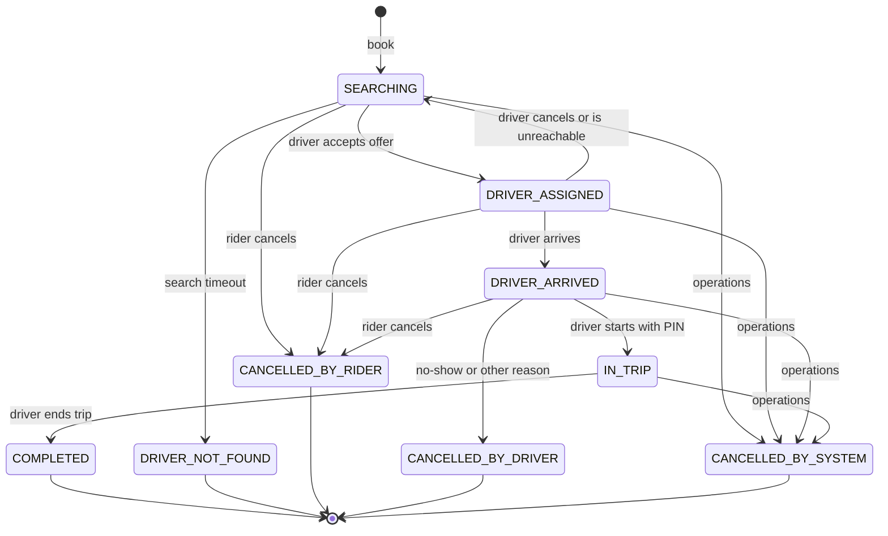
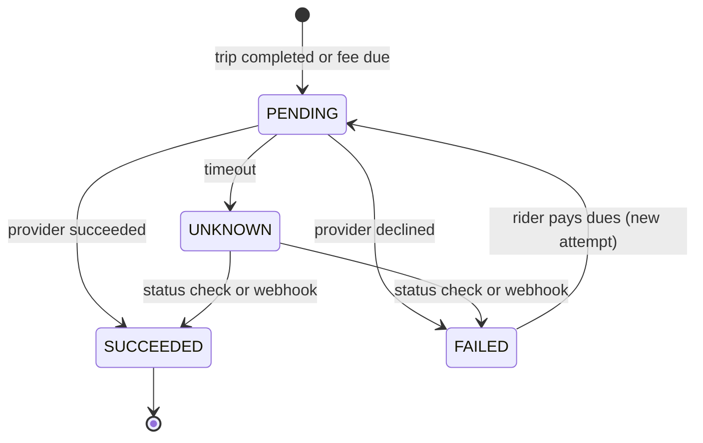

# Ride lifecycle

| | |
|---|---|
| Part of | [HLD](architecture.md) §7 |
| Status | Approved 2026-10-02 (lock-order rule refined by the [LLD](low-level-design.md#6-concurrency-rules)) |
| Decisions | [ADR-010](decisions/ADR-010-state-machines.md) (state machines), [ADR-009](decisions/ADR-009-idempotency-and-identifiers.md) (idempotency), [ADR-005](decisions/ADR-005-durable-timers.md) (timers), [ADR-011](decisions/ADR-011-dispatch-protocol.md) (dispatch), [ADR-014](decisions/ADR-014-payments.md) (payments) |
| Requirements | FR-RD1–FR-RD8, FR-DS3–FR-DS5, FR-PY1–FR-PY6, §5 policies |

## 1. Principles

1. **One explicit state machine per ride.** State changes only through a command (from a rider, driver or operations) or a timer, never because a GPS reading crossed a threshold. "Almost there" is a notification, not a state.
2. **One transaction per transition** containing:
   - the state change, guarded by status and version;
   - the transition log row;
   - outbox events;
   - timers created or deleted;
   - the audit entry;
   - the idempotency record.
3. **Illegal transitions are rejected** with `409 INVALID_TRANSITION` and the current status and version.
4. **Payment isn't a ride state.** A completed trip stays completed whatever happens to its charge; charges have their own state machine (§6).
5. **Fixed lock order:** ride → driver → offer → driver availability. Search tasks and timers are claimed by their pollers first and removed by everyone else without waiting ([LLD §6](low-level-design.md#6-concurrency-rules)). Concurrent transitions therefore wait for each other instead of deadlocking.

## 2. States

| State | Meaning | Driver availability | Live timers | Who can act |
|---|---|---|---|---|
| `SEARCHING` | Looking for a driver; at most one pending offer | The offered driver is `OFFERED` | Search timeout (3 min); offer timeout (15 s) while an offer is pending | Rider (cancel), dispatch, operations |
| `DRIVER_ASSIGNED` | A driver accepted and is driving to the pickup | `ASSIGNED` | None; the sweeper watches the driver's updates | Driver (arrive, cancel), rider (cancel), operations |
| `DRIVER_ARRIVED` | The driver is at the pickup, waiting | `ASSIGNED` | None; a no-show becomes possible 5 min after arrival | Driver (start, no-show, cancel), rider (cancel), operations |
| `IN_TRIP` | The rider is on board | `ON_TRIP` | None | Driver (complete), operations |
| `COMPLETED` | Trip finished; the fare is final | Released | — | — |
| `CANCELLED_BY_RIDER`, `CANCELLED_BY_DRIVER`, `CANCELLED_BY_SYSTEM`, `DRIVER_NOT_FOUND` | Ended without a trip | Released | — | — |

Once in the trip, the rider can't cancel; they ask the driver to end it, and operations can cancel if needed.

## 3. Transitions

Each row is one transaction. "Release" means the driver's availability returns to `AVAILABLE` and the status mirror and GEO set are updated after commit ([location §6](location-system.md#6-live-index-and-status-mirror)).

| # | From → to | Trigger (actor) | Preconditions | Effects in the same transaction | Events |
|---|---|---|---|---|---|
| T1 | — → `SEARCHING` | `BookRide` (rider) | Quote belongs to the rider, unexpired, unused; no active ride; no dues | Consume quote; insert ride; search task due now; 3-min search timer | `RideRequested` |
| T2 | `SEARCHING` → `DRIVER_ASSIGNED` | `AcceptOffer` (driver) | Offer pending for this driver and not expired; ride version unchanged | Offer `ACCEPTED`; availability `ASSIGNED`; generate PIN; record promised pickup ETA; delete offer timer, search timer and search task | `OfferAccepted`, `DriverAssigned` |
| T3 | `SEARCHING` → `DRIVER_NOT_FOUND` | Search timer (system) | Still `SEARCHING` | Withdraw any pending offer and release its driver; delete search task | `RideNotMatched` |
| T4 | `SEARCHING` → `CANCELLED_BY_RIDER` | `CancelRide` (rider) | — | Withdraw any pending offer and release its driver; delete task and timers; no fee | `RideCancelled` |
| T5 | `DRIVER_ASSIGNED` → `DRIVER_ARRIVED` | `Arrive` (driver) | Caller is the assigned driver | Record `arrived_at`; if the live position is more than 300 m from the pickup, flag `arrived_far` for operations **(assumed)** | `DriverArrived` |
| T6 | `DRIVER_ASSIGNED` → `SEARCHING` | `CancelRide` (driver) | Caller is the assigned driver | Release driver; exclude them from this ride; count the cancellation; search task due now with priority; new 3-min search timer | `DriverUnassigned` (reason `DRIVER_CANCELLED`) |
| T7 | `DRIVER_ASSIGNED` → `SEARCHING` | Sweeper (system) | No update from the assigned driver for 2 min **(assumed)** | As T6, but the driver goes `OFFLINE` | `DriverUnassigned` (reason `DRIVER_UNREACHABLE`) |
| T8 | `DRIVER_ASSIGNED` or `DRIVER_ARRIVED` → `CANCELLED_BY_RIDER` | `CancelRide` (rider) | — | Release driver; fee decision (§5) | `RideCancelled` (with fee) |
| T9 | `DRIVER_ARRIVED` → `IN_TRIP` | `StartTrip` (driver, with PIN) | PIN matches; fewer than 5 wrong attempts on this ride **(assumed)** | Availability `ON_TRIP`; record `started_at` | `TripStarted` |
| T10 | `DRIVER_ARRIVED` → `CANCELLED_BY_DRIVER` | `NoShow` (driver) | At least 5 min since `arrived_at` | Release driver; no-show fee | `RideCancelled` (reason `NO_SHOW`) |
| T11 | `DRIVER_ARRIVED` → `CANCELLED_BY_DRIVER` | `CancelRide` (driver, with reason) | — | Release driver; no fee; flagged for operations review | `RideCancelled` |
| T12 | `IN_TRIP` → `COMPLETED` | `CompleteTrip` (driver) | Caller is the assigned driver | Release driver; final fare = quoted fare; record `completed_at` | `TripCompleted` |
| T13 | Any non-terminal → `CANCELLED_BY_SYSTEM` | `OpsCancel` (operations) | A reason is given | Withdraw offer, release driver, delete task and timers; fee per operations decision (default none) | `RideCancelled` |

## 4. Commands that don't fit the current state

| Case | Response |
|---|---|
| Same idempotency key as an earlier request | The stored response, unchanged (ADR-009) |
| New key, but the same actor's earlier command already moved the ride to this command's target state (for example a second `arrive`) | `200` with the current ride: natural idempotency |
| Accept for an offer that expired, was withdrawn, or whose ride moved on | `409 OFFER_NO_LONGER_AVAILABLE` |
| Driver command for a ride reassigned away from them | `409 RIDE_REASSIGNED` |
| Any other command the state doesn't allow | `409 INVALID_TRANSITION` with the current status and version |

## 5. Fees

| Situation | Fee |
|---|---|
| Rider cancels while `SEARCHING` | None |
| Rider cancels after assignment, within 2 min of `assigned_at` | None |
| Rider cancels after assignment and the driver is late: more than 5 min past `assigned_at` + promised ETA, the driver hadn't arrived by then | None |
| Rider cancels after assignment in any other case | Cancellation fee for the city and category |
| Driver ends the ride as a no-show (T10) | No-show fee |
| Driver cancels (T6, T11) | None for the rider |
| Operations cancel (T13) | None unless operations choose one |

- A fee is a charge with purpose `CANCELLATION_FEE` or `NO_SHOW_FEE`, unique per ride and purpose. The decision and the rule that produced it travel in the `RideCancelled` payload.
- Fees go to the driver's earnings, minus commission **(assumed)**.

## 6. Charges and refunds

Charges belong to the payment module ([ADR-014](decisions/ADR-014-payments.md)). They are created by consumers of `TripCompleted` and `RideCancelled`.

- **Cash rides** create the charge directly as `SUCCEEDED` with method `CASH`, recorded for earnings.
- **One charge per ride and purpose** (`FARE`, `CANCELLATION_FEE`, `NO_SHOW_FEE`). Each provider call is an attempt whose idempotency key is the attempt ID. Retrying an `UNKNOWN` attempt is never a new attempt: it is a status check.
- **Rider dues** are the charges in `FAILED`. Booking is refused while any exist (FR-R4). Paying dues starts a new attempt on the same charge.
- **Late success:** if the provider confirms an attempt after a newer attempt also succeeded, the extra money is refunded automatically.
- **Refunds** (FR-PY5) have their own records: `PENDING → SUCCEEDED | FAILED | UNKNOWN`. The non-failed refunds of a charge never add up to more than the charge.

## 7. Offline driver commands (FR-RD8)

- The driver app queues `StartTrip` and `CompleteTrip` while offline, each with a client-generated command ID (sent as the idempotency key) and the device time. It sends them in order when it reconnects.
- The server applies a queued command if the ride's state still allows it, and stores both device and server time. Fares don't depend on either, because they're upfront.
- **Server state wins conflicts.** For example: the driver started the trip offline, but in the meantime the ride was reassigned for silence (T7).
  - The late start gets `409 RIDE_REASSIGNED`.
  - Because a physical trip may be under way, an operations case is opened automatically with both drivers and the device times.
- The app resyncs the ride after every rejected command.

## 8. Races on a ride

| Race | What happens |
|---|---|
| **Rider cancels while the driver accepts** (brief scenario 4) | Both transactions lock the ride row first. If the cancel commits first, the accept's conditional update finds the ride no longer `SEARCHING`, rolls back and returns `409 OFFER_NO_LONGER_AVAILABLE`; the cancel already withdrew the offer and released the driver. If the accept commits first, the cancel sees `DRIVER_ASSIGNED` and applies T8, usually free because it's inside the 2-minute window |
| **Driver cancels or marks a no-show while starting the trip** (scenario 5) | Both leave `DRIVER_ARRIVED`; the version check lets the first commit win; the other gets `409` with the current state |
| **Completion retried after the charge succeeded** (scenario 6) | Same key: stored `200`. New key: the ride is already `COMPLETED` by this driver, so `200` with the current ride. A redelivered `TripCompleted` is dropped by the inbox, and the charge is unique per ride and purpose |
| **Two components update the same ride** (scenario 8) | Only the ride module writes rides; others call its API. Versions serialize concurrent calls, for example an operations cancel racing a completion |
| **Driver loses connectivity after accepting** (scenario 10) | After 2 min without updates the sweeper triggers T7. If the driver reconnects first, nothing happens; if later, their commands get `409 RIDE_REASSIGNED`, they resync, and they must go online again |
| **Accept at the moment the search times out** | The timer handler acts only if the ride is still `SEARCHING` at the expected version. The accept checks the offer hasn't expired. Whichever commits first wins; the other does nothing or gets `409` |
| **Accept at the moment the offer expires** | The accept's conditional update requires `expires_at > now()` on the offer; the expiry handler requires the offer still `PENDING`. Exactly one succeeds |

## 9. Recovery

- **Nothing to rebuild:** everything in flight (rides, offers, search tasks, timers) is in PostgreSQL. After a crash, other nodes claim the tasks and timers (ADR-005, ADR-011).
- **Stuck-ride detector:** every minute, the `worker` role reports rides that have stayed in one state longer than expected, raising an alert and putting them in the operations queue. Thresholds **(assumed)**:

  | State | Reported after |
  |---|---|
  | `SEARCHING` | 4 min |
  | `DRIVER_ASSIGNED` | 60 min |
  | `DRIVER_ARRIVED` | 30 min |
  | `IN_TRIP` | 6 h |
- **Timeline:** every ride's transition log, dispatch decisions and events form its operations timeline (FR-O1).
